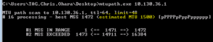
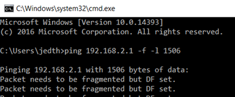
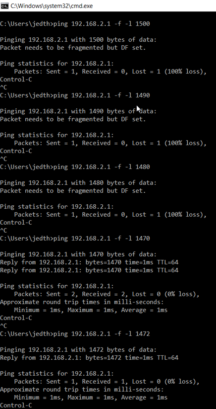
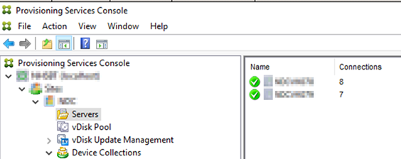
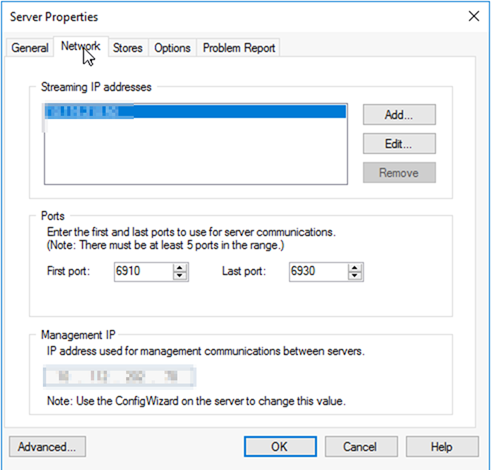

### **\--------Update 07.10.19**

I was reliably informed by a nice gent called Chris Ohara who came across my article that there is a better way to work out the MTU for PVS. The below method I outlined actually finds the MSS (Maximum Segment Size). Later versions of PVS above version 6.1 include the header in their MTU setting so the setting of 1506 may actually be correct.

There is a tool that can be used to work this out called MTU Path that can be used. Here is the link and a screenshot below:

[http://www.iea-software.com/products/mtupath/](http://www.iea-software.com/products/mtupath/)

The above shows the MSS and with an estimated MTU.

Thank you Chris.

### **\--------****Update 07.10.19**

So, let's start with provisioning services and what the product does. Known as PVS to people that know it; it's a product produced by Citrix to aid in the delivery of the Operating System to a Virtual/Physical machine.

PVS is pretty cool because it has the ability to stream the Operating System at boot time using a VHD(X) file access via the PVS Server. I've deployed PVS many times and it can be a little tricky sometimes to get good stability; there's a very common reason to instability which I'd like to touch on.

If you have deployed PVS and seeing the below symptoms, this article is for you:

- Slow boot time
- Poor performance
- Excessive vDisk retries

It's really important to remember that PVS is an extremely network sensitive product due to the nature of what it does. Tweaking a few network settings is pretty critical before deploying it on scale.

So things to check:

**MTU (Maximum Transmission Unit)**

This is incredibly important and won't become apparent until you start to scale out and exert load on the environment.

Log onto a PVS server and run the following command:

**"ping <IP Address of VM or Gateway for VLAN> -f –l 1506"**

If you see this message: - **"Packet needs to be fragmented but DF set."** Then you have a problem or at least will have.

What did we do – we sent a ping to another address **–f** tells ping to not allow fragmentation of the packet and **–l** tells ping the size of the packet in bytes.

What does it mean? And why is it relevant?

PVS has a streaming service which is responsible for streaming the Virtual Disks to the clients, this particular service has its own MTU, if you see the above it means that the service is having to fragment each packet that is streamed to a client; ordinarily it's no big deal – it happens. When you start to scale this you soon start to see issues with you Target Session Servers.

To work out what you should be using, run the ping command again but reduce the packet size bit by bit until it does not fragment.

You will see I receive a ping response with 1470 – then slightly increasing to 1472 gives me my limit before packets are fragmented.

If you have an in-house network team they will be able to tell you what the MTU is set to on your switches as a rough guideline but I'd always recommend the above approach to work out what your maximum is in a Virtual Environment.

Now What? We know the MTU – Great.

Open the PVS console, Expand the Farm, Expand the Site, Select Servers.

Your Servers are displayed on the right handside, Right click and select "Properties".

Select the "Advanced" button in the bottom left.

You will be presented with the Steam Service MTU – Amend this to the value you have above and select "OK".

You will be prompted to restart the streaming service; you don't have to do this right away and this can be done later but nothing will change until the "PVS Streaming Service" is restarted.

Perform these same steps on your second provisioning server and you should be good to go and have minimal vDisk retries with a much faster and more reliable boot time.
