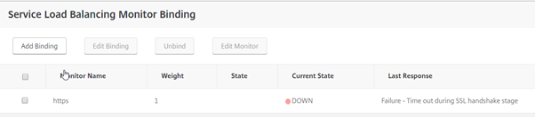
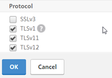
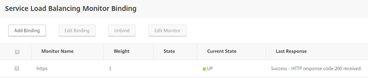

I came across this error the other day when trying to load balance a couple of Skype for Business servers. These servers were 2012 R2 based and there wasn't anything special about the certificate. After scratching my head thinking of things for a while and trying this and that, I resolved myself to using Wireshark to capture packets and review. Wireshark did not show me much; the connection was always reset by the backend server. OK….. but why????

2012 R2 is up to date and patched, the certificate being used on the services is installed on both the NetScaler and the server. All services running on these backend boxes can be accessed directly so they are definitely up. The below is what I did to remedy this problem and I'd encourage anyone to look at the below as some troubleshooting steps in nailing down the problem.

**The mystery, SSL Profiles within the netscaler!**

I came to the conclusion that it is a NetScaler issue due to the services being directly accessible by other devices.

I decided to try switching up various SSL settings within the SSL profile and finally hit the nail on the head.

Go to System, Profile, and the "SSL Profiles" tab.

Open the "ns\_default\_ssl\_profile\_backend" profile (or whichever one is assigned to your service) and edit the "Basic Settings", scroll down to the "Protocol" section.

In later firmware it looks like this:

Untick TLSv12 and select "OK".

Review your load balanced service monitor now and it should show something like this.

**Note: Remember that a Virtual NetScaler will only support a maximum of a 2048 bit certificate - the same error is received if a 4096 bit certificate is used.**
