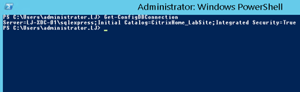

XenDesktop and its database connection is a tricky one, back in the old days of 6.5 you had a single connection. Now you have each service instance registered in the database with multiple connections from these services.

When you've complete a farm upgrade and you can no longer log into Studio or when a single service starts to flap and you see errors in the event viewer it can be a little nail biting.

So what do you do when it goes a bit wobbly, there are some nice steps in PowerShell to ensure you are able to connect to the database, view the service status and if necessary re-register all the services.

There is a XenDesktop tool for checking the database (XDDBDiag): [https://support.citrix.com/article/CTX128075](https://support.citrix.com/article/CTX128075)

Feel free to try this but beware, I've seen it go wrong when this tool is used on newer version occasionally.

We'll be moving forward with PowerShell, Let's do it!

Fire up PowerShell as an administrator on a controller or a machine with Studio installed.

_Asnp Citrix\*_

This will load all the Citrix snap-ins.

Get-ConfigDBConnection

This will display the current database connection in use by your farm.

So just for fun, let's check the connection is fine

Test using the below script, replace the variables from what you see above:

_\## Replace with the New SQL server, and instance if present_

_\## Replace with the name of your restored Database ## ##_

_$ServerName="LJ-XDC-01\\sqlexpress"_

_$SiteDBName="CitrixHome\_LabSite"_

_$cs="Server=$ServerName; Initial Catalog=$SiteDBName; Integrated Security=True"_

_Test-AcctDBConnection -DBConnection $cs_

_Test-AdminDBConnection -DBConnection $cs_

_Test-AnalyticsDBConnection -DBConnection $cs # 7.6 and newer_

_Test-AppLibDBConnection -DBConnection $cs # 7.8 and newer_

_Test-BrokerDBConnection -DBConnection $cs_

_Test-ConfigDBConnection -DBConnection $cs_

_Test-EnvTestDBConnection -DBConnection $cs_

_Test-HypDBConnection -DBConnection $cs_

_Test-LogDBConnection -DBConnection $cs_

_Test-MonitorDBConnection -DBConnection $cs_

_Test-OrchDBConnection -DBConnection $cs # 7.11 and newer_

_Test-ProvDBConnection -DBConnection $cs_

_Test-SfDBConnection -DBConnection $cs_

_Test-TrustDBConnection -DBConnection $cs # 7.11 and newer_

If all goes to plan, you'll get some "OK" feedback.

So the Database connection is OK.

If you see that a particular connection is not OK this will be your problem. My recommendation would be to directly restore from a backup. Don't hack and slash the Citrix Site DB, you can end up with bigger problems.

Let's check the services are all fine.

_Get-AcctServiceStatus_

_Get-AdminServiceStatus_

_Get-AnalyticsServiceStatus # 7.6 and newer_

_Get-AppLibServiceStatus # 7.8 and newer_

_Get-BrokerServiceStatus_

_Get-ConfigServiceStatus_

_Get-EnvTestServiceStatus_

_Get-HypServiceStatus_

_Get-LogServiceStatus_

_Get-MonitorServiceStatus_

_Get-OrchServiceStatus # 7.11 and newer_

_Get-TrustServiceStatus # 7.11 and newer_

_Get-ProvServiceStatus_

_Get-SfServiceStatus_

These command will ask the Controller to check all its services for a status.

Again, you will get some "OK" feedback.

If for any reason the feedback is not that great, you can re-register these service instances with the database.

So, let's take a look at the registered service instances.

_Get-ConfigRegisteredServiceInstance_

To re-register a specific service you can filter:

_Get-ConfigRegisteredServiceInstance -ServiceType "Admin" | Unregister-ConfigRegisteredServiceInstance_

Or to simply re-register all services

_Get-ConfigRegisteredServiceInstance | Unregister-ConfigRegisteredServiceInstance_

_Get-BrokerServiceInstance | Register-ConfigServiceInstance_

Run this on each controller in the farm and you should get some feedback.

If you compare the ServiceInstanceUid Before and After you will see a difference in how its registered.

**BEFORE:**

_Address : https://lj-xdc-01.lj.local/scripts/ctxadmin/ctxadmin.dll_

_Binding : XML\_HTTPS_

_InterfaceType : XML.SSL.Admin_

_Metadata : {}_

_MetadataMap : {}_

_ServiceAccount : LJ\\LJ-XDC-01$_

_ServiceAccountSid : S-1-5-21-699119681-375327193-915452706-1660_

_ServiceGroupName : Home\_Lab_

_ServiceGroupUid : dc3f5b0c-b38c-4ad0-89a7-b85a7bf5e10d_

**_ServiceInstanceUid : 5d9a21e3-7b8c-4bbb-8f7f-54a2733737e9_**

_ServiceType : Broker_

_Version : 1_

**AFTER:**

Address : http://lj-xdc-01.lj.local/Citrix/BrokerEnvTests/v1

Binding : wcf\_HTTP\_kerb

InterfaceType : EnvironmentTest

Metadata :

MetadataMap :

ServiceAccount : LJ\\LJ-XDC-01$

ServiceAccountSid : S-1-5-21-699119681-375327193-915452706-1660

ServiceGroupName : Home\_Lab

ServiceGroupUid : dc3f5b0c-b38c-4ad0-89a7-b85a7bf5e10d

**ServiceInstanceUid : 09b1753c-fb26-41a4-a5e0-d3d80c2f2317**

ServiceType : Broker

Version : 1

Thank to Citrix for the awesome articles:

[https://support.citrix.com/article/CTX140319](https://support.citrix.com/article/CTX140319)

[https://support.citrix.com/article/CTX200446](https://support.citrix.com/article/CTX200446)

[https://docs.citrix.com/en-us/xenapp-and-xendesktop/7-6/cds-sdk-wrapper-rho/xad-commands/citrix-configuration-admin-v2-wrapper-xd76/register-configserviceinstance-xd76.html](https://docs.citrix.com/en-us/xenapp-and-xendesktop/7-6/cds-sdk-wrapper-rho/xad-commands/citrix-configuration-admin-v2-wrapper-xd76/register-configserviceinstance-xd76.html)
