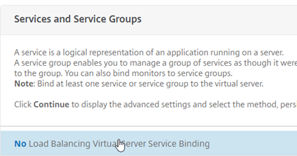

To start – This is aimed at Small to Medium businesses that need something better than Microsoft NLB but cannot afford an expensive enterprise solution. I want to add before I get into details that the paid version of Citrix NetScaler are awesome and worth the money you pay for them. They're not just load balancers and Citrix remote access; the possibilities really are endless; here's some off the top of my head:

1. _Forward Proxy_
2. _Reverse Proxy_
3. _VPN Routing_
4. _NAT and Large Scale NAT_
5. _Content Switching_
6. _URL Transform / Rewrite / Responder Engine_
7. _VPN Server_
8. _Content Caching / Frontend Compress and Optimisation_
9. _SSO – (AAA Server)_
10. _N-Factor support_
11. SAML IDP (Identity Provider)

So enough about the product and how absolutely awesome it is.

I'm getting at a little known feature called DSR (Direct Server Return), so what does that do?

DSR is a feature for NetScaler Load Balancing and intercepts traffic and diverts the client directly to the end point its load balancing. This is useful for low end VPX NetScaler because they are not taking the load of streaming the traffic and handling all the requests but; they are handling the initial intelligence of what's is up and what's down and where you should be going.

So typical Load Balancing looks like this:

But with DSR it looks like this:

So as you can see here DSR will give you all of the load balancer intelligence but without the need for high bandwidth.

**There are some caveats here though, the response sent to the client device will contain the MAC address of the backend server, from then on the communication is from client to backend server direct. To achieve this, the backend server needs to be able to accept communication on the IP address of the VIP. Changes to the backend server are required to get this working, a loopback adapter must be added.**

So, why the post?

There is a version of NetScaler called "Express" this is completely free and available for download; this appliance is however limited to 5MB bandwidth – for an SME this may be fine to facilitate simple load balancing utilising DSR.

[https://www.citrix.com/downloads/NetScaler-adc/virtual-appliances/NetScaler-vpx-express.html](https://www.citrix.com/downloads/netscaler-adc/virtual-appliances/netscaler-vpx-express.html)

(You will need to create a Citrix account to login)

This can be deployed on most class 1 Hypervisors; VMWare Workstation works but you are better off with a proper Virtual Environment to play in for this.

Let's dig into the details and start setting up a DSR load balanced service.

Login to your NetScaler UI

First we need to enable MAC Based Forwarding on the NetScaler. This is so that the NetScaler can forward the response to the client device and replace the MAC address of the load balanced server with the backend server MAC address.

Select "System", "Settings", "Configure Modes"

Select "MAC based forwarding"

Select "Traffic Management", "Load Balancing" and "Servers"

We'll add a single backend server for this example, select "Add"

Fill in the relevant sections:

1. Name – Name for the backend server
2. IP Address - <IP of the Server you want to Load Balance>

_<Repeat for each server>_

Select "Traffic Management", "Load Balancing" and "Services"

Select "Add"

Fill out the necessaries:

1. Service Name – Service name for the backend server
2. Existing Server - <Server we just added>
3. Protocol – ANY
4. Port – The port number the service will respond on

**Note: Service must be any as MAC based forwarding is used and therefore the NetScaler does not track sessions.**

Select "OK"

You will be presented with a confirmation that the service is created.

As long as the service is up, we can proceed. (For the purposes of this post we will not look at Service Monitors)

Edit the "Settings" section of the load balanced service.

Ensure the field "Use Source IP Address" is ticked.

Select "Traffic Management", "Load Balancing" and "Virtual Servers"

Select "Add"

Fill out the necessaries:

1. Name – Load Balanced server name
2. Protocol – ANY
3. IP Address Type – IP Address
4. IP Address – IP of the load balancer
5. Port – The port number the service will respond on (Must matched the service created earlier)

Select "No Load Balancing Virtual Server Service Binding"

We will now bind a service

Select the service you made earlier and hit "Select" back up at the top of the list.

Select "Bind" to complete the process and then "Continue" to apply the change.

Now we need to edit some settings so that the MAC based forwarding comes into effect.

Select "Edit" on the "Basic Settings", select "More" to show further options, under redirection mode, select MAC Based.

So far, so good. We now need to look at the backend server changes to add the loopback adapter, this is done in two standard ways:

**Windows:**

For Windows, Open Control Panel, Add New Hardware, Select the type of Network Adapter and install - Microsoft KM-TEST Loopback Adapter

It's very important that for this adapter you do the following:

- Rename it to – LBVS\_Loopback (or something similar)
- Set its IP to the IP of the load balanced vServer (VIP) and its subnet to 255.255.255.0 (This will restrict it to its IP only and make sure there is no gateway.
- Disable DNS registration and NetBIOS over TCP/IP in the advanced settings of the adapter.
- Run the following command in command prompt: -
- netsh int ipv4 set int "LBVS\_Loopback" weakhostreceive=enabled weakhostsend=enabled

**Linux:**

For Linux machines the following commands can be run.

- ifconfig dummy0 up
- ifconfig dummy0:0 inet <VIP> netmask 255.255.255.255 up
- echo 1 > /proc/sys/net/ipv4/conf/dummy0/arp\_ignore
- echo 2 > /proc/sys/net/ipv4/conf/dummy0/arp\_announce

**My Case:**

I was using a Raspberry Pi for my Webserver(Raspbian), I had to add a few additional steps to get a dummy adapter installed:

- edit /etc/modules and add new line "dummy", save the file
- modprobe dummy
- ifconfig dummy0 up
- ifconfig dummy0:0 inet 10.0.0.10 netmask 255.255.255.255 up
- echo 1 > /proc/sys/net/ipv4/conf/dummy0/arp\_ignore
- echo 2 > /proc/sys/net/ipv4/conf/dummy0/arp\_announce

You should now be able to browse to <Your IP> and see you HTTP website. Awesome!

Wireshark without DSR and with DSR just to show:

Without DSR:

With DSR:

Kudos to Citrix for the following articles:

[https://docs.citrix.com/en-us/netscaler/11/traffic-management/load-balancing/load-balancing-dsrmode.html](https://docs.citrix.com/en-us/netscaler/11/traffic-management/load-balancing/load-balancing-dsrmode.html)

[https://docs.citrix.com/en-us/netscaler/11/traffic-management/load-balancing/load-balancing-dsrmode-linux.html](https://docs.citrix.com/en-us/netscaler/11/traffic-management/load-balancing/load-balancing-dsrmode-linux.html)
