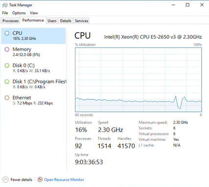
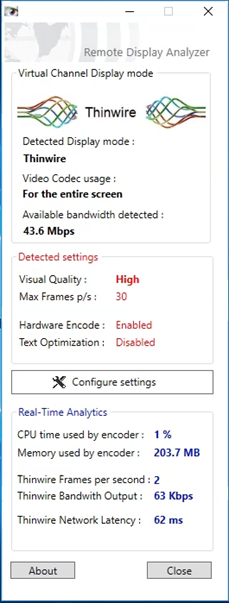

So many of us are being asked a simple question by our clients:-Please can we reuse our existing thin clients / PCs with the latest iteration of Citrix XenApp and XenDesktop.

The answer is usually yes, with the latest tranche of changes in Web Technology and everything shifting away from Flash to HTML5 for video I have come across a few scenarios recently where this causes issues and I wanted to clarify my experience and share.

In order for Citrix to support full screen video smoothly resources are necessary on the backend server to encode the screen in in H264 and send it down to the end client, the end client then needs to be able to decode this H264 stream in order to display screen updates.

So what is the big deal? Older thin clients will not have dedicated chips for decoding H264; this means you need a beefy thin client (Fast Dual or Quad Core) to do this job. Also on the server side you need a method of encoding that H264 stream, this by default is done with the CPU, the hit on performance when a user is watching a YouTube video online sits at around 16% CPU usage with a single user, this is huge with the emergence of HTML5 video players. **We cannot offload this video to the end point.**

_Single user on Session Server with 6vCPU_

So, whats the current solution? Hardware encoding with NVIDIA or IRIS – Yes and No!

If you plan to use Pooled or Dedicated Virtual Machine Desktops then it's not an issue. NVIDIA HVENC will encode the video on the server side and then the endpoint will decode giving lightning fast performance and awesome scalability.

The only downside and it's a big one – **HVENC does not working with Server Based OS, we are reliant on Citrix providing a solution for HTML5 redirection.**

Please bear this in mind when you are specifying solutions.

A quick shout out to Remote Display Analyser - [https://www.rdanalyzer.com/](https://www.rdanalyzer.com/), Well done Bram and Barry. Great tool.

This tool allows you to play with screen codecs in action at the time you are in a session and will show you if the Hardware encoding is active.

The screenshot here is of a Windows 10 Virtual Machine running a full screen video with an NVIDIA GRID K2 card performing on the fly H264 encoding.

The playback is extremely smooth.

**Just to summarise:**

If fullscreen video is a requirement for your clients now, you are looking at VDI and Windows Desktops with graphics cards and potentially endpoints capable of H264 decode (like a raspberry Pi).

PS: Bear this article in mind if you are looking at NVIDIA, there is a current limit on the frame buffer memory in order for HHVENC to kick in.

[https://support.citrix.com/article/CTX217781?\_ga=2.217409622.1908960628.1503514510-470772483.1500063667](https://support.citrix.com/article/CTX217781?_ga=2.217409622.1908960628.1503514510-470772483.1500063667)
