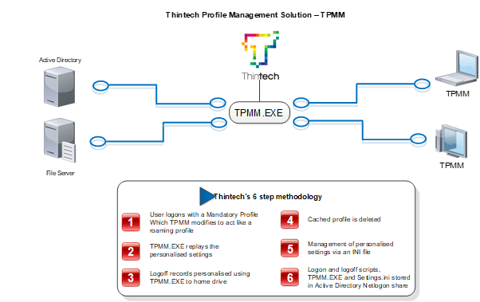

Profile Management is a big subject; there are so many different solutions out there that cater to "profiles". Before we get into it, let us discuss what a profile is.

You are a user; you use Outlook, OneNote, Chrome and Excel. You select preferences within these products, you select windows preferences to organise your icons, choose which your default printer etc… is and these are your settings. You want to log in to your Virtual Desktop and you want these options to stick with you. This is what is defined as a user profile.

This description of a profile is actually all the settings that make up the User Experience and the important thing to remember is that, its personal, Users like to set things up and work the way they want to work.

As an administrator, there are options for maintaining this experience, along with each option there are pros and cons. Some examples below:

<table style="border-collapse: collapse;" border="0"><colgroup><col style="width: 183px;"> <col style="width: 166px;"> <col style="width: 114px;"> <col style="width: 138px;"></colgroup><tbody valign="top"><tr><td style="padding-left: 7px; padding-right: 7px; border: solid 0.5pt;">Solution</td><td style="padding-left: 7px; padding-right: 7px; border-top: solid 0.5pt; border-left: none; border-bottom: solid 0.5pt; border-right: solid 0.5pt;">Description</td><td style="padding-left: 7px; padding-right: 7px; border-top: solid 0.5pt; border-left: none; border-bottom: solid 0.5pt; border-right: solid 0.5pt;">Cons</td><td style="padding-left: 7px; padding-right: 7px; border-top: solid 0.5pt; border-left: none; border-bottom: solid 0.5pt; border-right: solid 0.5pt;">Pros</td></tr><tr><td style="padding-left: 7px; padding-right: 7px; border-top: none; border-left: solid 0.5pt; border-bottom: solid 0.5pt; border-right: solid 0.5pt;">Microsoft Roaming Profiles</td><td style="padding-left: 7px; padding-right: 7px; border-top: none; border-left: none; border-bottom: solid 0.5pt; border-right: solid 0.5pt;">Synchronise your entire profile to a network share on logoff and pull the profile down on logon</td><td style="padding-left: 7px; padding-right: 7px; border-top: none; border-left: none; border-bottom: solid 0.5pt; border-right: solid 0.5pt;">Slow and gets slower as the user profile grows, Free</td><td style="padding-left: 7px; padding-right: 7px; border-top: none; border-left: none; border-bottom: solid 0.5pt; border-right: solid 0.5pt;">Easy to configure</td></tr><tr><td style="padding-left: 7px; padding-right: 7px; border-top: none; border-left: solid 0.5pt; border-bottom: solid 0.5pt; border-right: solid 0.5pt;">Microsoft Profile Disks</td><td style="padding-left: 7px; padding-right: 7px; border-top: none; border-left: none; border-bottom: solid 0.5pt; border-right: solid 0.5pt;">Keep your profile on a VHD that is dynamically attached at Logon</td><td style="padding-left: 7px; padding-right: 7px; border-top: none; border-left: none; border-bottom: solid 0.5pt; border-right: solid 0.5pt;">Difficult to scale, large in size, Free</td><td style="padding-left: 7px; padding-right: 7px; border-top: none; border-left: none; border-bottom: solid 0.5pt; border-right: solid 0.5pt;">Easy to configure</td></tr><tr><td style="padding-left: 7px; padding-right: 7px; border-top: none; border-left: solid 0.5pt; border-bottom: solid 0.5pt; border-right: solid 0.5pt;">Citrix Profile Management</td><td style="padding-left: 7px; padding-right: 7px; border-top: none; border-left: none; border-bottom: solid 0.5pt; border-right: solid 0.5pt;">Citrix capture everything and are able to amalgamate settings from multiple published apps</td><td style="padding-left: 7px; padding-right: 7px; border-top: none; border-left: none; border-bottom: solid 0.5pt; border-right: solid 0.5pt;">Profiles grow very large over time.</td><td style="padding-left: 7px; padding-right: 7px; border-top: none; border-left: none; border-bottom: solid 0.5pt; border-right: solid 0.5pt;">Easy to configure, low maintenance, good manageability.</td></tr><tr><td style="padding-left: 7px; padding-right: 7px; border-top: none; border-left: solid 0.5pt; border-bottom: solid 0.5pt; border-right: solid 0.5pt;">Ivanti - AppSense Personalisation and Environment Manager</td><td style="padding-left: 7px; padding-right: 7px; border-top: none; border-left: none; border-bottom: solid 0.5pt; border-right: solid 0.5pt;">Store profiles in an SQL Database, enable multiple OS roaming and synchronisation</td><td style="padding-left: 7px; padding-right: 7px; border-top: none; border-left: none; border-bottom: solid 0.5pt; border-right: solid 0.5pt;">Learning curve, Expensive</td><td style="padding-left: 7px; padding-right: 7px; border-top: none; border-left: none; border-bottom: solid 0.5pt; border-right: solid 0.5pt;">Fully flexible and adaptable</td></tr></tbody></table>

These are just a couple of examples I have had the pleasure of working with. All of these solutions are valid and some have more drawbacks than others do.

Roaming profiles don't play nice with published applications as the last application you log out of with overwrite your profile on the profile store, same with the Profile Disks. AppSense is a great alternative, it is just a little pricy but genuinely gives a lot of flexibility including logic around settings and roaming of settings between different OS versions.

I want to talk about something we have at Thintech called TPMM. A while ago we realised that there is more to profile management than just the paid for solutions out there. We came up with our own free offering of profile management.

TPMM is a small suite of scripts and an .ini file that will guarantee you only collect user settings that are necessary at the same time as ensuring a very fast logon and logoff.

With the emergence of Office 365 and OneDrive there have been further adaptions made to the software with only a small impact to logon performance.

Outlook caching can be enabled for a 3-day period and then TPMM configured to capture the Outlook .ost folder and restore upon logon enabling full retention of a small user cache.

For anyone using OneDrive I recommend this script for a WebDAV Mapping in Terminal Services:

[http://www.lieben.nu/liebensraum/onedrivemapper/](http://www.lieben.nu/liebensraum/onedrivemapper/)

Feel free to download TPMM free here:

[https://thintech.sharefile.com/d-s7758c6372524abc9](https://thintech.sharefile.com/d-s7758c6372524abc9)
