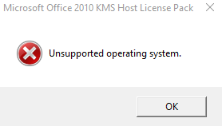

You may have recently or are in a situation where you are building a new KMS Server to service your 2016 Server estate. The issue is that you don't want multiple KMS Servers and still have some Office 2010 floating around.

Office 2010 KMS Service will not install out right on Server 2016 but… it does actually work.

Here's how to get it installed.

Download the Office 2010 KMS Host License Pack here:

[https://www.microsoft.com/en-gb/download/details.aspx?id=25095](https://www.microsoft.com/en-gb/download/details.aspx?id=25095)

When you run the executable on your new shiny KMS server you will see this:

Don't worry, navigate to "C:\\Program Files (x86)\\MSECache\\OfficeKMS"

Edit the kms\_host.vbs file and find this section:

folder = "unknown"

For Each objOS in GetObject("winmgmts:").InstancesOf("Win32\_OperatingSystem")

Ver = Split(objOS.Version, ".", -1, 1)

' Win2K3

If (Ver(0) = "5" And Ver(1) = "2" And (objOS.ProductType = 2 Or objOS.ProductType = 3)) Then

'Check for supported OS flavor

intPosition = InStr(UCase(objOS.Caption),FlavorEnterprise)

If intPosition = 0 Then intPosition = InStr(UCase(objOS.Caption),FlavorStandard)

If intPosition = 0 Then intPosition = InStr(UCase(objOS.Caption),FlavorDataCenter)

If intPosition <> 0 Then folder = "win2k3" : CheckSPP(objWMIService) : Exit For

End If

' win7/r2

If (Ver(0) = "6" And Ver(1) = "1") Then

folder = "win7"

Exit For

End If

' win8 or greater

If (Ver(0) = "6" And Ver(1) >= "2") Or (Ver(0) >= "7") Then

folder = "win8"

Exit For

End If

Next

Remove the following lines and change the folder variable as stated below:

folder = "win8"

For Each objOS in GetObject("winmgmts:").InstancesOf("Win32\_OperatingSystem")

Ver = Split(objOS.Version, ".", -1, 1)

' Win2K3

If (Ver(0) = "5" And Ver(1) = "2" And (objOS.ProductType = 2 Or objOS.ProductType = 3)) Then

'Check for supported OS flavor

intPosition = InStr(UCase(objOS.Caption),FlavorEnterprise)

If intPosition = 0 Then intPosition = InStr(UCase(objOS.Caption),FlavorStandard)

If intPosition = 0 Then intPosition = InStr(UCase(objOS.Caption),FlavorDataCenter)

If intPosition <> 0 Then folder = "win2k3" : CheckSPP(objWMIService) : Exit For

End If

' win7/r2

If (Ver(0) = "6" And Ver(1) = "1") Then

folder = "win7"

Exit For

End If

' win8 or greater

If (Ver(0) = "6" And Ver(1) >= "2") Or (Ver(0) >= "7") Then

folder = "win8"

Exit For

End If

Next

Now run the kms\_host.vbs manually using the run command:

"c:\\windows\\system32\\cscript.exe" "c:\\program files (x86)\\MSECache\\OfficeKMS\\kms\_host.vbs"

**(Don't copy and paste)**

You can then use the standard slmgr /dlv command to check on activations.
