NetScaler is a great product, the Virtual Appliances share the same code base as the physical appliances and are still powerful Application Delivery Controllers. But what if you didn't buy an ADC? What if you bought NetScaler Access Gateway Edition?

This flavour of the appliance is primarily for Citrix ICA Proxy and is designed for remote access. Due to the fact that it's a basic appliance I come across a lot of implementations where people put the same level of effort is design and deployment.

This basically means a non-resilient solution. A few things should be remembered when deploying NetScaler Access Gateway Edition.

Access Gateway Edition supports:

- H/A (Two Appliances for resilience and failover)
- Reverse proxy still works for basic uses
- Support active/failover within load balancing

The main point highlighted here is the load balancing piece and active/failover. You cannot load balance in the traditional sense but you can perform an active/failover scenario for things like LDAP, DNS and StoreFront. It's important this is considered when deploying a Citrix environment so that maintenance can be undertaken on Domain Controllers and StoreFront servers without disruption.

How does this work?

**Standard NetScaler ADC Load Balancing:**

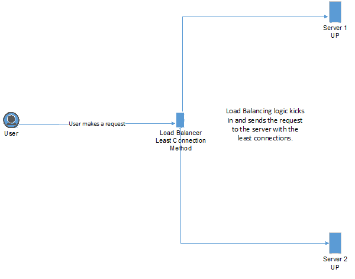

There is logic involved here to decide which server to send this request to. This is **NOT** included in the Access Gateway Edition.

**NetScaler Access Gateway Edition Active/Failover Load Balancing:**

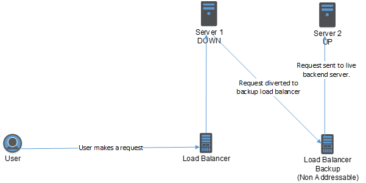

This method isn't really load balancing but as you can see, when the primary server goes down, the request will automatically be routed to the backup load balancer which is not addressable directly.

So what's the result? For resilience, the result is identical in both cases; a server goes down but without any impact to the user.

Here is how to do it:

For this scenario I'm going to assume we are creating a load balanced active/failover setup for StoreFront.

We'll have the following servers:

1. StoreFront Server 1
2. StoreFront Server 2
3. Both Servers will be HTTP on port 80

Fire up your NetScaler Management UI and login, select Traffic Management > Virtual Servers and Services > Servers

Here is where we add our actual backend servers. Select "Add" to kick the process off.

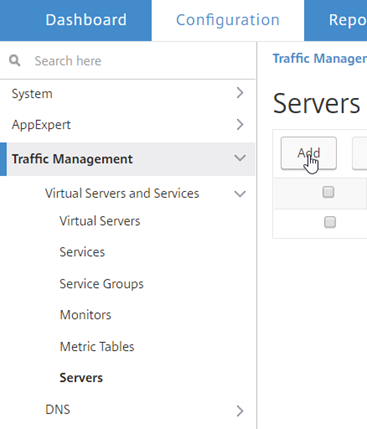

Fill in the relevant details for your first StoreFront server.

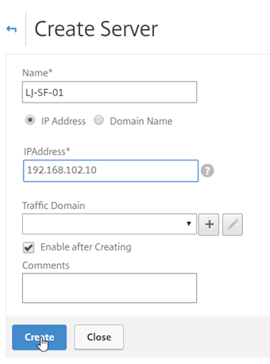

Repeat the process for the second StoreFront server and you should end up with this:

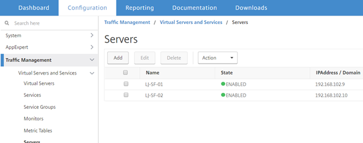

Now its time to link up services, Traffic Management > Virtual Servers and Services > Services. Select "Add" to create a new service.

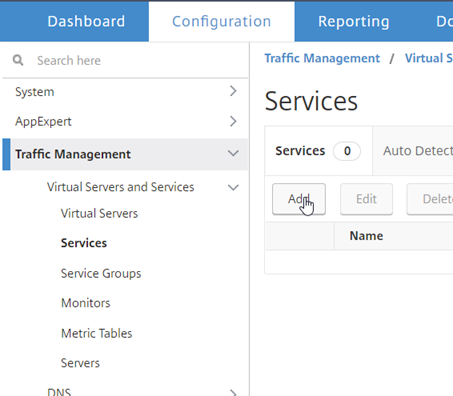

Fill out the relevant information to link the new service to your server as below:

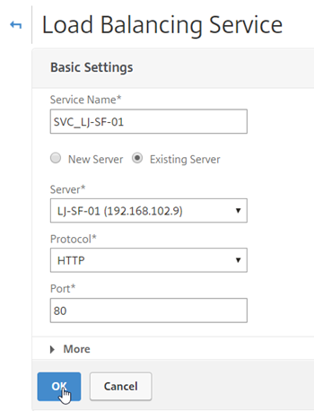

By default, your StoreFront service will use TCP as a monitor, this is not really sufficient for the NetScaler to know if StoreFront is operational or not but for this post we aren't going to cover setting up a StoreFront specific monitor.

Select "Done" on the Service screen to proceed.

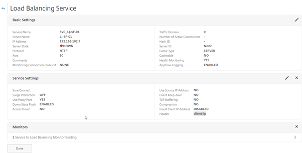

Repeat this process for the second StoreFront Service and then you should have two services up and running as per the below:

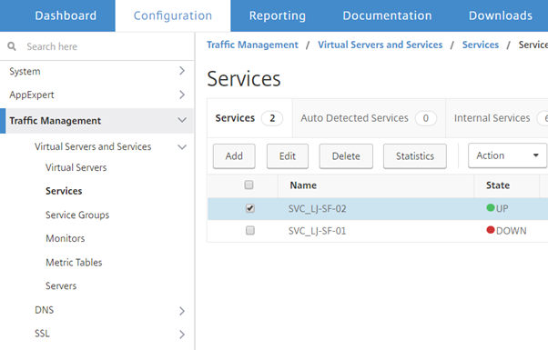

Note: SF-01 is purposefully down for this example.

Our next stop is to create out Virtual Servers that will provide the Active/Failover service. Traffic Management > Virtual Servers and Services > Virtual Servers. Select "Add" to create a new Virtual Server.

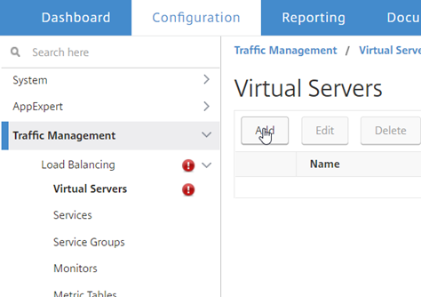

The first server we will create will be the failover node. Fill in the details as per the below, Please note that the failover node does not need an IP Address.

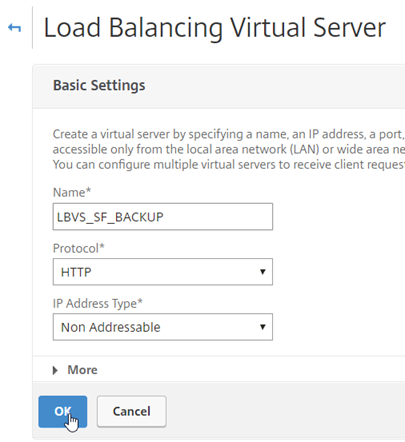

When you select OK, you will see this message

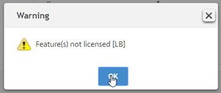

Don't worry about this message. You are technically not load balancing so just click okay any time you see this message.

Under Services and Service Groups select "Load Balancing Virtual Server Service Binding"

Select your drop down and pick the secondary node.

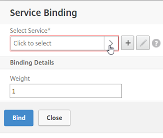

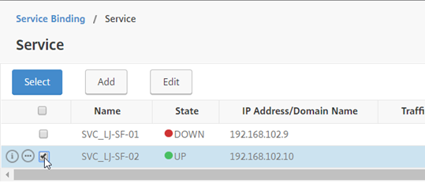

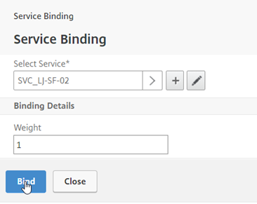

Select "Continue" under "Service and Service Groups"

Select "Done" at the bottom of the sreen for the load balanced service.

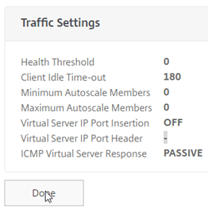

The second server we will create will be the addressable virtual server. Fill in the details as per the below but with your own IP address.

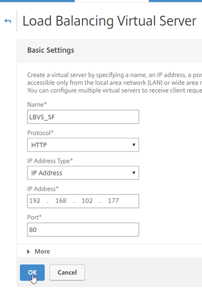

Under Services and Service Groups select "Load Balancing Virtual Server Service Binding"

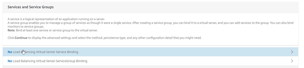

Select your drop down and pick the primary node.

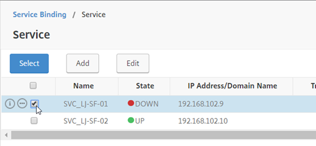

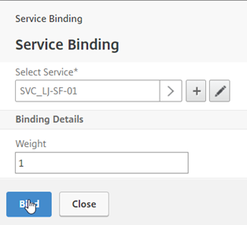

Select "Continue" under "Service and Service Groups"

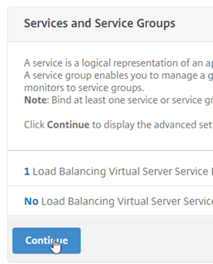

Here is where the failover happens, on the right hand-side of the screen select "Protection".

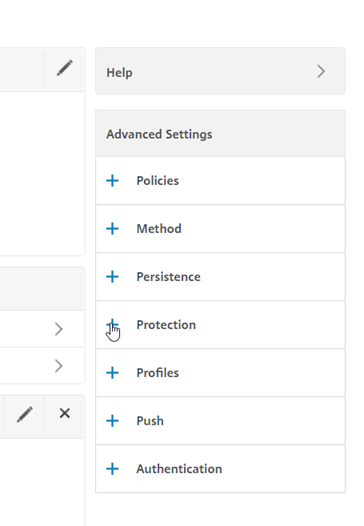

Fill in the settings are per the below to allow any requests to be delivered to the Backup Virtual Server when the primary is down.

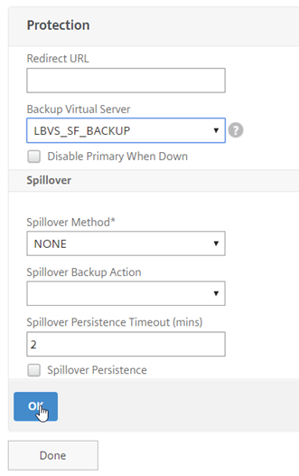

Select Ok, and Done; you should then see your list of Load Balanced Servers.

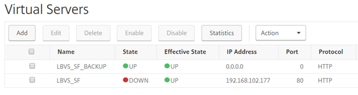

If I now navigate to 192.168.102.177 my request is still service by the backend PC connected to the non-addressable load balanced server.

Its magic!!!
