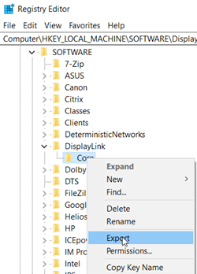
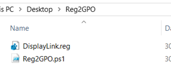
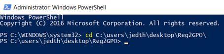
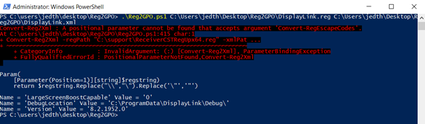
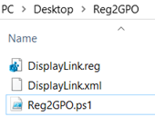
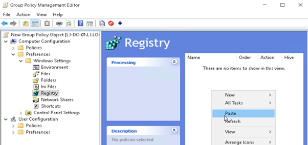
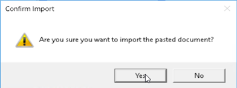
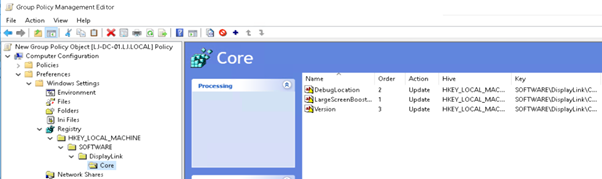
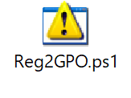

\---Update - 01.03.20

A very friendly fellow by the name of Dennis Mutsaers was kind enough to review the script code a tweak it a little to remove an error in one of my below screenshots. Thanks Dennis - @dennismutsaers

\---Update - 01.03.20

In some scenarios I've been passed a .reg file that needs to be applied to live running servers. I am a fan of deploying all settings possible using GPO's and so I was in a position where I needed a solution (rather than site and manually type) to import a .reg file into Group Policy.

There is currently no easy solution in order to achieve this, you can use the Registry Wizard inside Group Policy Management but that's only helpful if the registry files already exist and again still takes some time.

So… without further adieu the solution I found is explained below.

Group policy files are all XML based, as long as you can get your registry files into an XML format that Group Policy will understand then it will all work fine.

To do this, I used a script written by [Malcolm McCaffery](https://chentiangemalc.wordpress.com/about/) which allows you to export a .reg file from Regedit and then simply convert it to XML files to import.

Beware though, whatever you export you will need to split the different hives from the file – split your HKLM hive, HKCU hive and HK\_CLASSES hive into separate registry files after export.

To achieve this:

Open Regedit, find the specific registry key you want to export and right client – Export.

Save this file to a location of your choosing, I have placed all the files into the same folder location, just in a folder on my desktop as an example.

Fire up a powershell prompt and browse to the directory where your files sit.

Now run the following command to convert your reg file to xml.

.\\Reg2GPO.ps1 "<Path To Reg>" "<Path To XML>"

This envokes the powershell script. You will then be promoted for you paths to your .reg and .xml files.

Now you should have an xml file too.

Now simply right click your .xml file and select "copy". Now open up your Group Policy Editor and in the registry section select paste.

Confirm your Import as prompted and you will see your registry entries imported

Give it a go and let me know your feedback.

File attached.

