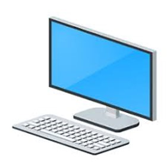
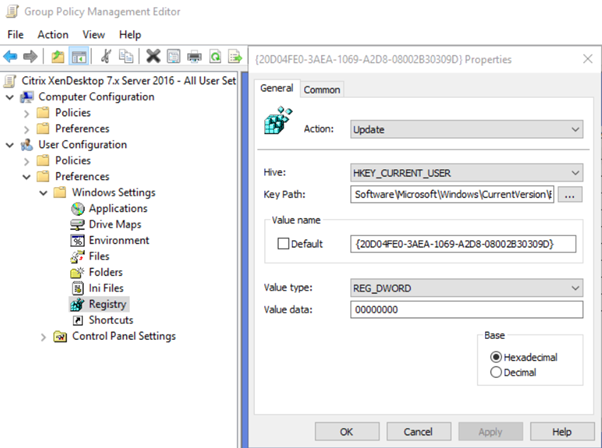

I ran into a query from a client recently:

"Please can you add a "This PC" shortcut to all user's desktop for me?"

If you have rolled out a Virtual Desktop on server 2016 and are being asked how to do this, here is how via Microsoft Group Policy.

Add an Entry to a user policy like this:

PATH: -HKEY\_CURRENT\_USER\\Software\\Microsoft\\Windows\\CurrentVersion\\Explorer\\HideDesktopIcons\\NewStartPanel

KEY: -{20D04FE0-3AEA-1069-A2D8-08002B30309D}

VALUE: - 0

This will allow a "This PC" desktop icon when the users logoff and back on again.
