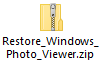
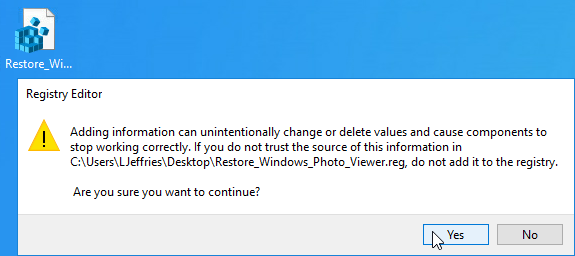
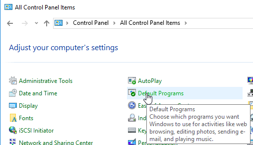
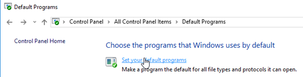
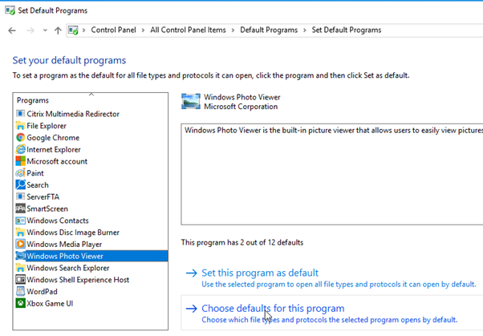
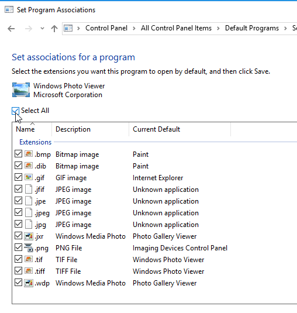
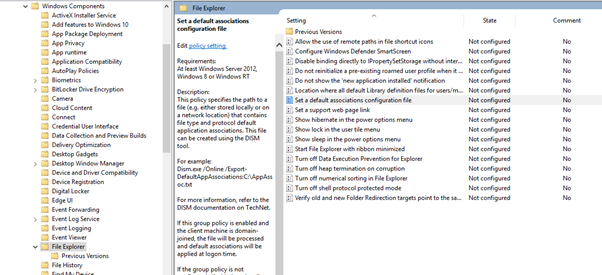
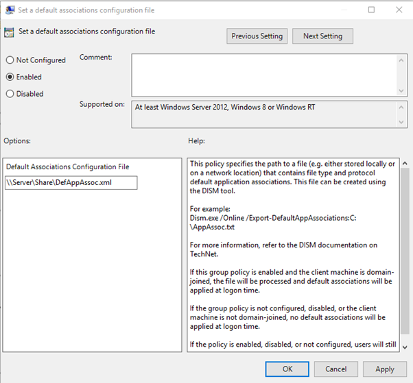

Some people really prefer the older style photo viewer from Windows 7/2008R2 and I have had a few requests for this to be re-instated in Windows 10/Server 2016.

I have compromised a guide below which outlines to necessary steps in order to be able to allow Photo Viewer to launch and then to create the relevant file associations and make them stick with all users in the environment.

The first think you will need to do is download the following zip file:

This contains the relevant .reg file to create the file associations for Windows Photo Viewer so that it appears in the list of programs within Windows.

Open your base image and run the .reg file to import the settings into the registry.

Now open the control panel within your base image, select "Default Programs", select "Set Your Default Programs".

Select "Windows Photo Viewer" on the left and then "Choose Defaults for this Program".

Select the relevant file extensions and select "Save".

Windows Photo Viewer is now the default application for these file extensions. Go ahead and test to make sure your changes all stuck.

Now, if this is an environment where end user machines are non-persistent you will need to re-present these file associations for users. To do this you can import some default file associations using Group Policy.

This is achieved by using DISM to export file associations and then getting them imported again for the user using Group Policy.

Open PowerShell and run the following command to export a file association document. Save this somewhere that can be referenced by users.

_Dism /Online /Export-DefaultAppAssociations:\\\\Server\\Share\\DefAppAssoc.xml_

The Group Policy Entry you are looking to set to allow the document to be imported is as follows:

- Computer Configuration > Administrative Templates > Windows Components > File Explorer

Now all users will have a default file association set for Windows Photo Viewer.

Happy Photo Viewing!
