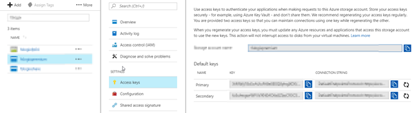

In Azure you can choose between 3 different types of storage for your virtual machines.

These 3 different types are:

- Standard Blob Storage
    
    - Capped to 500 IOPs per disk for a standard VM
    - 60MBps throughput rate per disk
    - [https://docs.microsoft.com/en-us/azure/virtual-machines/windows/standard-storage](https://docs.microsoft.com/en-us/azure/virtual-machines/windows/standard-storage)
- Premium Blob Storage
    
    - Capped at a specific IOPs rate based on size
    - Capped at a specific throughput rate per disk based on size
    - [https://docs.microsoft.com/en-us/azure/virtual-machines/windows/premium-storage#scalability-and-performance-targets](https://docs.microsoft.com/en-us/azure/virtual-machines/windows/premium-storage#scalability-and-performance-targets)
- Managed Disks
    
    - Here you can choose HDD/Standard or SDD/Premium and Azure will handle the storage accounts for you to ensure resilience during a potential failure.
    - The limits of managed disks still apply as above.
    - [https://docs.microsoft.com/en-us/azure/virtual-machines/windows/managed-disks-overview](https://docs.microsoft.com/en-us/azure/virtual-machines/windows/managed-disks-overview)

If you need more IOPs or Throughput than the above will provide you can attached multiple disks to a VM and bind them together using storage spaces.

Also bear in mind your VM size dictates if you can you premium storage and also what IOPs rate you will be capped at regardless of how many disks you stripe together.

Now having got all of that out the way as an introduction. You can migrate your Virtual Machines from standard to standard managed disks or premium to premium managed disks but the jump in between is not so fun.

In this particular scenario I had a VM on Azure Classic using Standard Storage and I needed to migrate it to Premium Storage for better performance. To do this I wrote a small powershell scripts that will copy the VHD from one storage account to the next.

Ensure that the VM is powered off in the Azure portal before running this script. Also, remember that you need the Azure classic connection via powershell so you'll be looking to connecting using Add-AzureAccount or similar.

Here is the powershell script I used:

\[cc lang=“powershell”\]

#List out the VHD's that need to be copied just for reference #VHD 1 P0 – VM\_VHD1.vhd #VHD 2 P1 - VM\_VHD2.vhd

#To login to the Azure Classic Portal #login - Add-AzureAccount Add-AzureAccount

\# VHD blob to copy # $blobName = "VM\_VHD1.vhd" $blobName1 = "VM\_VHD2.vhd"

\# Source Storage Account Information # $sourceStorageAccountName = "<SOURCE STORAGE ACCOUNT NAME>" $sourceKey = "<SOURCE STORAGE KEY>" $sourceContext = New-AzureStorageContext –StorageAccountName $sourceStorageAccountName -StorageAccountKey $sourceKey $sourceContainer = "<CONTAINER NAME>"

\# Destination Storage Account Information # $destinationStorageAccountName = "<DESTINATION STORAGE ACCOUNT NAME>" $destinationKey = "<DESTINATION STORAGE KEY>" $destinationContext = New-AzureStorageContext –StorageAccountName $destinationStorageAccountName -StorageAccountKey $destinationKey

\# Create the destination container # $destinationContainerName = "<CONTAINER NAME>" New-AzureStorageContainer -Name $destinationContainerName -Context $destinationContext#

\# Copy the blob # $blobCopy = Start-AzureStorageBlobCopy -DestContainer $destinationContainerName -DestContext $destinationContext -SrcBlob $blobName -Context $sourceContext -SrcContainer $sourceContainer $blobCopy1 = Start-AzureStorageBlobCopy -DestContainer $destinationContainerName -DestContext $destinationContext -SrcBlob $blobName1 -Context $sourceContext -SrcContainer $sourceContainer

#Get Status of the Job as it copies while(($blobCopy | Get-AzureStorageBlobCopyState).Status -eq "Pending") { Start-Sleep -s 10 $blobCopy | Get-AzureStorageBlobCopyState $blobCopy1 | Get-AzureStorageBlobCopyState }

#To Cancel a job if you decided you have waited too long #$blobCopy1 | Stop-AzureStorageBlobCopy #$blobCopy2 | Stop-AzureStorageBlobCopy

\[/cc\]

A few notes:

To get your storage key you go here:

The copy process does take some time so be patient.
