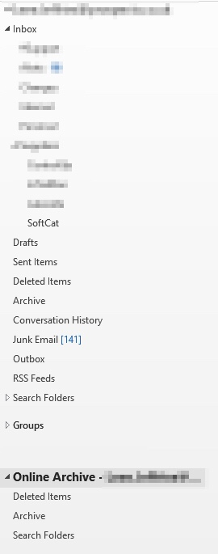
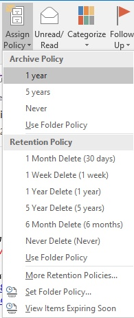

With Office 365 being “the” new way of email, it’s important to remember to keep your inbox quite clean so it still stays quick and speedy.

One of the tools that Microsoft gives us to do this is Exchange Online Archiving.

A new email mailbox is added to Outlook and all email is archived based on retention policies.

These retention policies are controlled centrally and it help administrators choose how much email will essentially remain in a user’s live mailbox. Users can also apply tags to folders in order to choose which retention method they would like to use for a folder.

You simple select the folder as a user and pick the retention policy you wish to use.

Below is a powershell script to turn on In-Place archiving for users on Exchange Online.

\[cc lang=“powershell”\] #Script to enable archive mailboxes for specified users #Current retention policies in Exchange Online specify x amount of days before committing to archive #1 Month Delete #1 Week Delete #1 Year Delete #5 Year Delete #6 Month Delete #Default 2 year move to archive #Junk Email #Never Delete #Personal 1 year move to archive #Personal 5 year move to archive #Personal never move to archive #Recoverable Items 14 days move to archive

#Edit log file location in log Function below

#Function to write a log file out function Write-Log { \[CmdletBinding()\] Param ( \[Parameter(Mandatory=$true, ValueFromPipelineByPropertyName=$true)\] \[ValidateNotNullOrEmpty()\] \[Alias("LogContent")\] \[string\]$Message, \[Parameter(Mandatory=$false)\] \[Alias('LogPath')\] \[string\]$Path='C:\\OfficeArchiving\\log', \[Parameter(Mandatory=$false)\] \[ValidateSet("Error","Warn","Info")\] \[string\]$Level="Info", \[Parameter(Mandatory=$false)\] \[switch\]$NoClobber ) Begin { # Set VerbosePreference to Continue so that verbose messages are displayed. $VerbosePreference = 'Continue'

#Append the date to the migration log file $FormattedDate = Get-Date -Format "yyyy-MM-dd" $Path = $Path + "\_" + $FormattedDate + ".log" } Process { # If the file already exists and NoClobber was specified, do not write to the log. if ((Test-Path $Path) -AND $NoClobber) { Write-Error "Log file $Path already exists, and you specified NoClobber. Either delete the file or specify a different name." Return } # If attempting to write to a log file in a folder/path that doesn't exist create the file including the path. elseif (!(Test-Path $Path)) { Write-Verbose "Creating $Path." $NewLogFile = New-Item $Path -Force -ItemType File } else { # Nothing to see here yet. } # Write message to error, warning, or verbose pipeline and specify $LevelText switch ($Level) { 'Error' { Write-Error $Message $LevelText = 'ERROR:' } 'Warn' { Write-Warning $Message $LevelText = 'WARNING:' } 'Info' { Write-Verbose $Message $LevelText = 'INFO:' } } # Write log entry to $Path $timeStamp = Get-Date -Format o | foreach {$\_ -replace ":", "."} "$timeStamp $LevelText $Message" | Out-File -FilePath $Path -Append } End { } } ##########################Functions preloaded at the top of the script##########################

#Set test mode on so we can specify users $testMode = 1

#Specify test users to run the script on - UPN should be supplied $testUsers = "leee.jeffries@prospects.co.uk"

#Grab current user credentials $UserCredential = Get-Credential

#Set the exchange powershell session allowing redirection of commands $Session = New-PSSession -ConfigurationName Microsoft.Exchange -ConnectionUri https://outlook.office365.com/powershell-liveid/ -Credential $UserCredential -Authentication Basic -AllowRedirection

#Import the Powershell session Import-PSSession $Session

#Evaluate test mode or not if ($testMode -eq 1) { #Loop through each test user and enable inplace archive foreach ($user in $testUsers) { $searchResult = Get-Mailbox -ResultSize "unlimited" -Identity $user -Filter {RecipientTypeDetails -eq "UserMailbox"} Write-Host "User Archive Status for $user = "$searchResult.ArchiveStatus if ($searchResult.archiveStatus -eq "Active") { Write-Log "Archiving already enabled for $user"

} else {

$user | Enable-Mailbox -Archive Write-Log " enabled archiving for this user $user"

} } } else { #Loop through all user mailboxes without Archiving turned on and enable it $searchResult = Get-Mailbox -ResultSize "unlimited" -Filter {RecipientTypeDetails -eq "UserMailbox"} foreach ($result in $searchResult) { if ($result.ArchiveStatus -eq "Active") { #Write out that archiving is already enabled Write-Log "Archiving already enabled for $result"

} else {

#Enable mailbox archive for this user $result | Enable-Mailbox -Archive Write-Log " enabled archiving for this user $result"

} } #Moving forwards this could be used for new user accounts, although templates should be setup to enable this to be enabled automatically #Get-Mailbox -Filter {ArchiveStatus -Eq "None" -AND RecipientTypeDetails -eq "UserMailbox"} | Enable-Mailbox -Archive

#Close connection to exchange Remove-PSSession $Session } \[/cc\]
