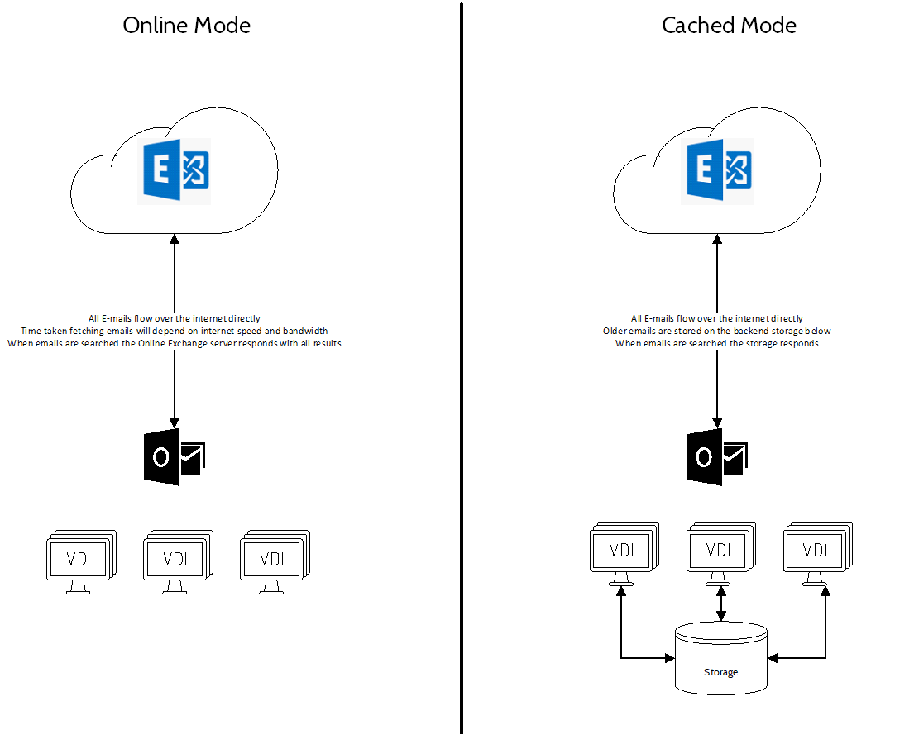
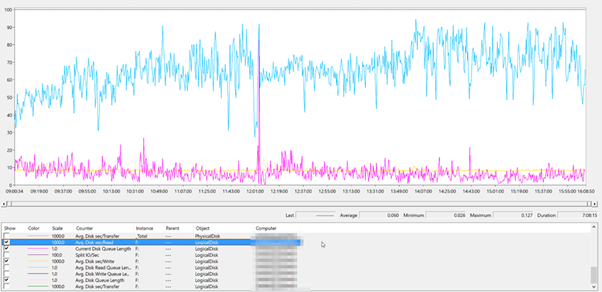
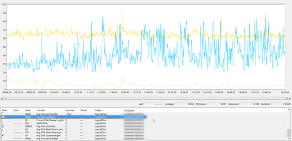
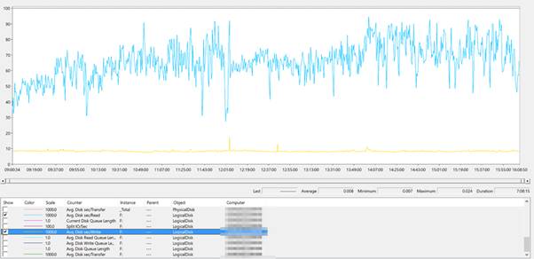
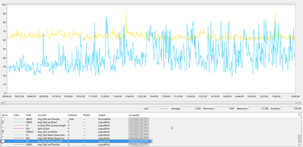
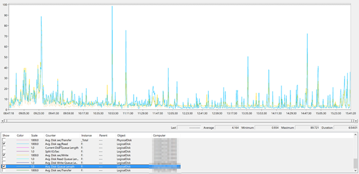
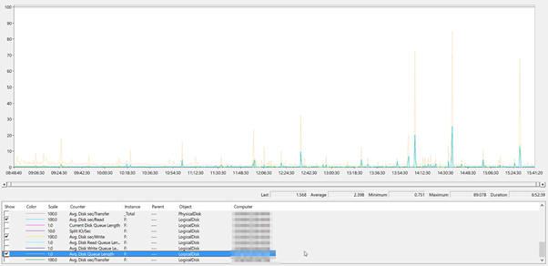

\--------------UPDATE--------------

Since this post was written I performed some work with FSLogix and drafted the below update. Please read that one.

https://www.leeejeffries.com/fslogix-o365-container-sizing-the-final-word/

\--------------UPDATE--------------

I've been doing some work with FSLogix, it's a good product and it's pretty simple to configure. The logs are quite easy to find but there are a few things missing from the offering in my opinion. One of the main things missing are recommendations on sizing metrics for backend storage.

But before we dive in, a bit of background.

Terminal Services does not play well with Outlook in cached mode, for those of you who do not know – cached mode is when your Outlook client pulls copies of all your emails down onto your computer for a specified period of time. This process uses quite a lot of disk space and increase the work of the disk a fair bit. On a single PC or Virtual Machine this is not too much of a problem. When you start looking at Multiple Virtual machines though with hundreds of users it does become a problem.

The solution to this problem has always been Outlook in Online mode, this is great when your exchange server is next door but right now with the rapid adoption of Office 365; Houston, we have a problem!

You have two choices – drag all your emails directly over your internet pipe in Online mode or implement some sort of storage location for an Outlook cache to be stored persistently. It's worth noting that Microsoft will not support issues of a performance related nature with Outlook .ost files stored on an SMB share so, unless you tread carefully it's not an option.

The solution! FSLogix Profile and Office 365 Containers, this software solution allows the users profile and the users Office Applications (Outlook, OneDrive, Skype GAL and Windows Search) to roam with the user on compatible OSes.

Due to the fact that the containers are VHD files stored on the network instead of the SMB shares there is only a single connection that is always active to the VHD meaning that there is a smaller overhead on the file transfers. This all makes sense but coming back to the point, what about sizing?

What sort of backend storage requirements are there for FSLogix? There is nothing on the website, what sort of metrics should you be looking at the gauge if your deployment is struggling? This is what this article is all about.

## Identifying an Issue:

If you are using Citrix/Terminal Services within your environment and your login is slow with FSLogix then I recommend you run perfmon and capture some keys indicators for a period of a day.

The metrics I captured in particular were as follows (Both Physical and Logical where applicable):

- Current Disk Queue Length
- Average Disk Queue Length
- Disk Reads/sec
- Disk Writes/sec
- Average Disk Reads/sec
- Average Disk Writes/sec

These metrics will give an indication if the disks in your machine hosting your container VHD's is having an issue. If anyone needs to know how to setup perfmon to do this, let me know and I'll write another post.

These are the metrics I got specifically displaying Avg Disk Reads and Writes, Average Queue Length and Current Queue Length.

### Profile Container Server

### Office 365 Container Server

You can see by these metrics that the average disk queue length sits at around 10 for both servers, these particular machine did have disks raided together, 4 in total. So to do the maths and work out what the real queue length is per disk, just divide the logical volume queue length by the number of disks.

That a queue length of 10 – 2.5 per disk. That's too high and will impact performance for sure.

In this particular example, concurrency sits at around 450 users during this busy period.

_Profile Container Server_

94 reads a second maximum and 24 writes a second maximum gives us 94+24 = 116 Input/Output operations per second. The I/O is not being dealt with quick enough so it's being queued.

This storage in particular is capped as it is hosted in a cloud DataCenter environment.

4 x 500 IOPs Disks with 60MB/s cap.

A Total of 2,000 IOPs and 240MB/s transfer rate.

_Office 365 Container Server_

95 writes a second maximum and 93 reads a second maximum gives us 94+93 = 187 Input/Output operations per second. The I/O is not being dealt with quick enough so it's being queued.

This storage in particular is capped as it is hosted in a cloud DataCenter environment.

4 x 500 IOPs Disks with 60MB/s cap.

A Total of 2,000 IOPs and 240MB/s transfer rate.

## Next Steps:

Two new file servers were built with more capable disks to enable a better experience. Comparing the metrics above with the new storage available yields the below information.

_New Profile Container Server_

The queue length stays consistently low for this new storage provisioned. The disks are able to process requests more quickly and the queue peaks and dives, that's how we like it.

This storage is also capped as it is hosted in a cloud DataCenter environment.

4 x 5,000 IOPs Disks with 200MB/s cap.

A Total of 20,000 IOPs and 600MB/s transfer rate.

_New Office 365 Container Server_

The queue length stays consistently low for this new storage provisioned. The disks are able to process requests more quickly and the queue peaks and dives, that's how we like it.

This storage is also capped as it is hosted in a cloud DataCenter environment.

4 x 5,000 IOPs Disks with 200MB/s cap.

A Total of 20,000 IOPs and 600MB/s transfer rate.

## Performance and Sizing Guidelines

Performance with these new servers is much faster, logins are quicker and Outlook is much much faster to respond when the cache is redirected to the FSLogix VHD.

So what's the user users profile:

1. Entire User Profile is redirected
2. Outlook cache is redirected (6 months)
3. OneDrive cache is redirected
4. Skype GAL is redirected

My recommendations are based on my own experience and nothing more.

I'd like FSLogix to come up with a more solid recommendation when it comes to backend storage sizing as at the moment there is none that I know of and I feel it's imperative when you sell software that you are able to specify what's needed to support it.

**FSLogix Profile Containers:**

Plan 12 IOPs per user

**FSLogix O365 Containers:**

Plan 44 IOPs per user

These recommendations are based on the above user profile and don't directly apply to .ost files redirected to an SMB share. The VHD(X) connection does elevate an overhead in the SMB connection.

I welcome queries or feedback. Thanks for reading.
