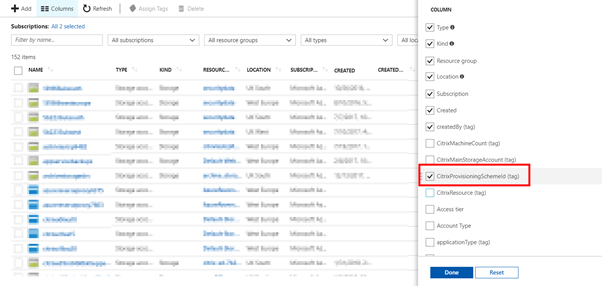
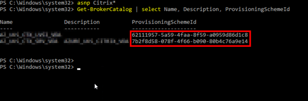

If you are working with Citrix XenApp and XenDesktop 7.16 MCS in Azure, you will be using On-Demand provisioning. If you're not sure what this means, check out this blog article from Citrix.

[https://www.citrix.com/blogs/2017/09/01/provisioning-xendesktop-on-azure-just-got-a-lot-faster/](https://www.citrix.com/blogs/2017/09/01/provisioning-xendesktop-on-azure-just-got-a-lot-faster/)

It's really important to understand the behaviour in the latest release as it is greatly different from previous releases when provisioning VM's in Azure.

I had a query earlier on this week about how to know which storage accounts are in use if you have not specified them and also which storage accounts are linked to which machine catalogs so I just wanted to put together a quick blog to explain this as I thought other may find this useful.

In Azure when you have machines provisioned you will have storage accounts created, to know which of these accounts are related to MCS you can add extra columns into your Azure view.

The column you need here is CitrixProvisioningSchemeId, we can then hop over to our controllers and do a bit of Powershell to line these two up.

Hop onto a controller and fire up powershell. Run the following commands to match the ProvisioningSchemeId value to your machine catalogs.

\[cc lang=powershell\]
asnp Citrix\*
Get-BrokerCatalog | Select Name, Description, ProvisioningSchemeId
\[/cc\]

