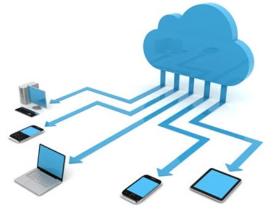

A common question I receive is how to convert existing workstations to thin clients, well….. there are solutions such as Igel Desktop Convertor, Thin Kiosk, Citrix Desktop Lock and Citrix Workspace Environment Manager Transformer; but what about a few windows tweaks to achieve a similar scenario?

In my experience, desirable behaviour from a thin client solution is as follows:

- No domain join
- User prompted for credentials
- Users able to launch Citrix applications or potentially use a web browser directly
- Logoff when a user closes a Citrix session
- Device automatically ready for another user's session

The big differentiator for any Thin Client solution, especially between Linux and Windows is the "Automatic logoff when closing a Citrix session". You want the Thin Client to automatically sever all connections relevant to the user's login details once they close the Citrix connection. Achieving this in a Windows Desktop machine can be a pain. This article covers my solution to reproducing the same Linux behaviour in a Windows environment using Citrix Receiver 4.9 LTSR, Local Group Policy and PowerShell Scripting with few prerequisites.

**Overview**

Firstly, an overview of the necessary changes and tools:

- Windows 7 or up Device (Doesn't matter if its iGel, HP, Wyse etc, A thin device or not capable of running receiver)
- Windows standard logon account configured to AutoLogon
- Windows configured to force a logon
- Group Policy configured to setup receiver for store access and to control behaviour
- PowerShell script to monitor receiver and control receiver start and logoff on receiver session close

Below is an overview of the process:

- Windows boots
- A standard windows account is configured to auto logon
- PowerShell fires up receiver and waits for a session to start
- Receiver connects to storefront and prompts for user credentials
- PowerShell script auto launches an app if configured to do so
- Receiver launches the application
    
    - PowerShell then catches that receiver is running and waits for receiver to stop
- On session close or disconnect PowerShell catches the event
    
    - Tweaks the user account on the device to mark it as temporary
    - Logs off the user and as the profile is temporary it is removed
- Windows is configured automatically logon the account again and the process begins again

**Windows Configuration and AutoLogon**

I'm using Windows 10 for this article

First, we create the standard logon account that we will configure to automatically logon. Launch computer management by right clicking the start menu.

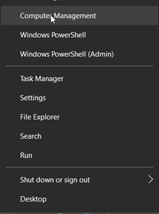

Expand the navigation "Local Users and Groups" > "Users", right click "Users" and select "New User"

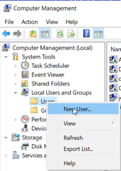

Fill out the details for the user, select that the user cannot change their password and that the password does not expire. My account is called Logon.

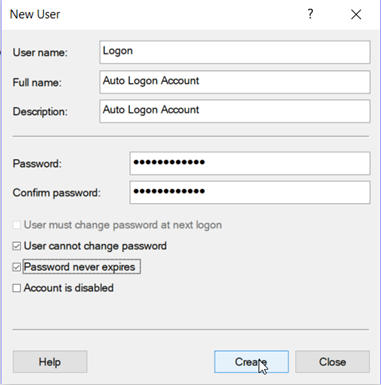

**Note: you may want to create a secondary account at this stage for admin purposes, so you are always able to access the machine if anything goes wrong, also enable Remote Access, so you can Remote Desktop if you need to.**

Close Computer Management, right click start and select "Run"

Type netplwiz and press Enter, untick the box "Users must enter a username and password to use this computer" and select OK.

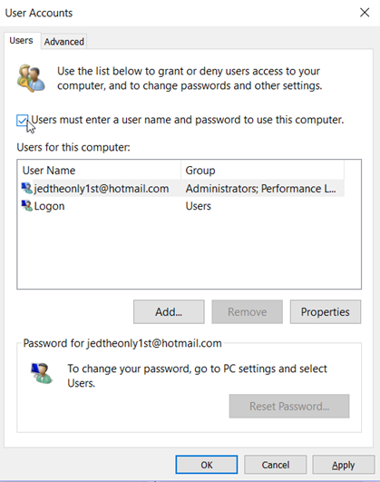

You will now be prompted to place the details in for the Logon account that will AutoLogon to the machine.

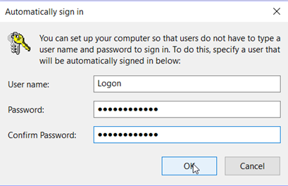

Select okay and reboot your machine. You should now see that the machine automatically logs on this user without any intervention.

The last setting to complete the process is to ensure that this user is automatically forced to logon even after a logoff.

Right click start and select "Run"

Type regedit and press Enter, navigate to :-HKEY\_LOCAL\_MACHINE\\SOFTWARE\\Microsoft\\Windows NT\\CurrentVersion\\Winlogon

Create a new string called "ForceAutoLogon" with a value of 1.

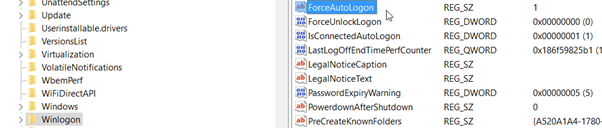

**Recommended to be done as a last step otherwise this users logon will continually loop making it difficult to complete the other steps.**

**Citrix Receiver Install and Configuration**

Now, we need to install Citrix Receiver, this is something you can obtain from the [Citrix Website](https://www.citrix.co.uk/downloads/citrix-receiver/windows-ltsr/receiver-for-windows-ltsr_4_9_1000.html)

Once installed you need to update your policy definitions for Group Policy on this machine. To do this open Windows Explorer and browse to C:\\Program Files (x86)\\Citrix\\ICA Client\\Configuration – 64 bit or C:\\Program Files\\Citrix\\ICA Client\\Configuration – 32bit.

Copy the following selected files and folders:

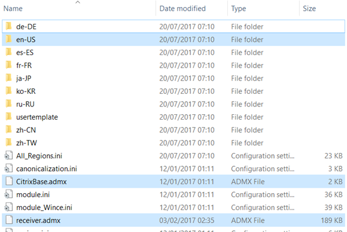

En-US is the English language folder, copy another one if your language is not English.

Open C:\\Windows\\PolicyDefinitions and paste these item into this folder allow overwrites where prompted to.

Now to configure local policy to configure receiver to connect to the farm, right click start and select "Run".

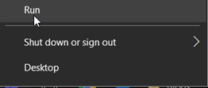

Type gpedit.msc and press Enter, the local Group Policy editor will fire up. Navigate down through the tree as follows "Computer Configuration > Administrative Templates > Citrix Components > Citrix Receiver"

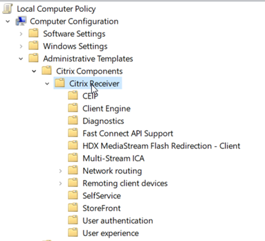

The settings to configure are as followings from the Citrix Receiver section of the document:

\> Storefront > NetScaler Gateway URL/Storefront Accounts List > Enabled > Show

**Entry** :<StoreName>;https://<Storefront URL>/<Storename>;On;<Description>

**Note: Remove the <> characters and ensure the <StoreName> matches the store name in storefront.**

\> User Authentication > Local Username and Password > Enabled > Allow Passthrough authentication for all ICA Connections

**Note: You may want to also configure other options here, but these are the basic settings.**

**PowerShell Script Configuration**

The PowerShell script can be downloaded at the bottom of this article and the source code is also displayed below.

Place this script in a folder "C:\\Scripts\\Logon.ps1"

Open the following location "C:\\Users\\Logon\\ AppData\\Roaming\\Microsoft\\Windows\\Start Menu\\Programs\\Startup"

Create a shortcut here to point to **powershell.exe -WindowStyle Hidden "C:\\Scripts\\Logon.ps1"**

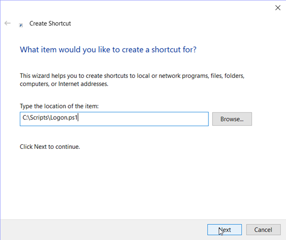

This will ensure that the logon script automatically runs for the Logon user when its automatically logged on.

Note: There are options within the script:

- $autoRunApp – this variable can be set to tell the script to automatically fire up an app
- $applicationName – this variable can be set to configure the name of the application to be launched automatically
- $removeUserProfile – this variable can be set to clear out the user's profile after each logoff, this alleviates the need to run any receiver clean up on logoff and is especially handy if it is a domain joined device with multiple user profiles.

\[cc lang=powershell\] #Auto Run Citrix Application or Not $autoRunApp = $true

#Remove User Profile on logoff $removeUserProfile = $true

#Name of Citrix Application $applicationName = "<Published App Name>"

#Allow script execution to take place Set-ExecutionPolicy -ExecutionPolicy UnRestricted

#Get receiver to poll for application updates Invoke-expression -Command:("C:\\Program Files\\Citrix\\ICA Client\\SelfServicePlugin\\selfservice.exe -init -ipoll")

#Launch the published desktop If ($autoRunApp) { Invoke-expression -Command:("C:\\Program Files\\Citrix\\ICA Client\\SelfServicePlugin\\SelfService.exe -qlaunch $applicationName") }

#Wait for a citrix receiver session to launch aand then monitor until logoff is necessary while(!(Get-Process wfica32 -ErrorAction SilentlyContinue)) { echo "Waiting for wfica32 to start" Start-Sleep -Seconds 5 } while(Get-Process wfica32 -ErrorAction SilentlyContinue) { echo "Waiting for wfica32 to end" Start-Sleep -Seconds 5 }

If ($removeUserProfile) { #Get User SID for Registry Profile Tweak $userSID = \[System.Security.Principal.WindowsIdentity\]::GetCurrent().User.Value $tempFolder = $env:TEMP

#Write out a registry file to import the relevant settings "Windows Registry Editor Version 5.00" | Out-File -FilePath "$tempFolder\\temp.reg" " " | Out-File -Append "$tempFolder\\temp.reg" "\[HKEY\_LOCAL\_MACHINE\\SOFTWARE\\Microsoft\\Windows NT\\CurrentVersion\\ProfileList\\$userSID\]" | Out-File -Append "$tempFolder\\temp.reg" """State""=dword:00000800" | Out-File -Append "$tempFolder\\temp.reg"

#Run regedit to silently import the reg file Invoke-expression -Command:("C:\\Windows\\Regedit.exe /s $tempFolder\\temp.reg") }

#Log the user off Invoke-expression -Command:("C:\\Windows\\System32\\logoff.exe") \[/cc\] 
