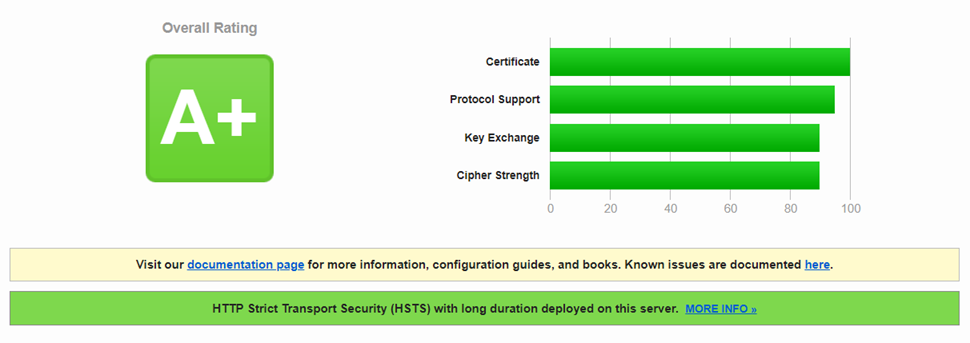

If you think you have a NetScaler A+ rating on SSL labs, re-try your test and you might not anymore.

The new AEAD Ciphers have been added to NetScaler as of build 12.0.56.20.

To maintain an A+ Rating you need to modify your cipher suite to include these ciphers.

Here is a code snippet for you, change the cipher group name to match your own or create a new one.

\[cc\]add ssl cipher VPX\_APLUS\_CIPHER\_23.03.16
bind ssl cipher VPX\_APLUS\_CIPHER\_23.03.16 -cipherName TLS1.2-DHE-RSA-CHACHA20-POLY1305 -cipherPriority 1
bind ssl cipher VPX\_APLUS\_CIPHER\_23.03.16 -cipherName TLS1.2-ECDHE-RSA-CHACHA20-POLY1305 -cipherPriority 2
bind ssl cipher VPX\_APLUS\_CIPHER\_23.03.16 -cipherName TLS1-ECDHE-RSA-AES256-SHA -cipherPriority 3
bind ssl cipher VPX\_APLUS\_CIPHER\_23.03.16 -cipherName TLS1-ECDHE-RSA-AES128-SHA -cipherPriority 4
bind ssl cipher VPX\_APLUS\_CIPHER\_23.03.16 -cipherName TLS1-DHE-RSA-AES-256-CBC-SHA -cipherPriority 5
bind ssl cipher VPX\_APLUS\_CIPHER\_23.03.16 -cipherName TLS1-DHE-RSA-AES-128-CBC-SHA -cipherPriority 6
bind ssl cipher VPX\_APLUS\_CIPHER\_23.03.16 -cipherName TLS1-AES-128-CBC-SHA -cipherPriority 7
bind ssl cipher VPX\_APLUS\_CIPHER\_23.03.16 -cipherName TLS1-AES-256-CBC-SHA -cipherPriority 8
bind ssl cipher VPX\_APLUS\_CIPHER\_23.03.16 -cipherName SSL3-DES-CBC3-SHA -cipherPriority 9
\[/cc\]

If you don't understand this, look at this blog article from George Spiers on generating a Qualsys SSL Labs A+ rating on your NetScaler and just replace the ciphers with the above.

[http://www.jgspiers.com/get-an-a-score-netscaler-11/](http://www.jgspiers.com/get-an-a-score-netscaler-11/)
