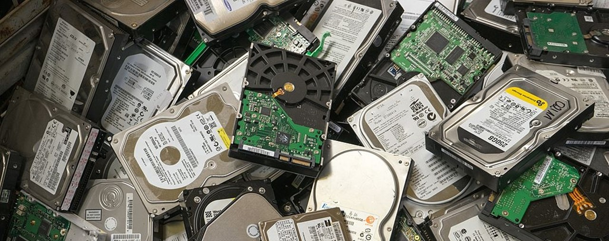

Recently I've had the privalege of working with FSLogix Profile and 365 Containers to support user personalisation on Virtual Desktops. Whilst working with this solution I've gone through iterations of various storage solutions and recently landed (with a little help on the design areas) on a Scales-Out-File-Server (SOFS). The SOFS allow us to host files that are meant to be continuously available.

This setup is hosted in Azure so I'm providing a reference to an article I found when running through this setup, I will aim to provide a full blog on deploying FSLogix on a Virtual Desktop using SOFS as storage later on this year. Time is a little short now.

Microsoft's Implementation Guide for SOFS: [https://docs.microsoft.com/en-us/windows-server/remote/remote-desktop-services/rds-storage-spaces-direct-deployment](https://docs.microsoft.com/en-us/windows-server/remote/remote-desktop-services/rds-storage-spaces-direct-deployment)

During the implementation approach and reviewing all the operational consideration on SOFS I quickly realised there is next to no information on backup solutions. Microsoft's own Data Protection Manager doesn't backup the files on the SOFS, well… of course not. They are continuously available; we come to the root of the reason for this post.

I wrote a script to copy the contents of VHD files over night during server reboot windows. The contents are copied to a separate server with Volume shadow copies enabled and then this server is the actual backup target for DPM.

Prerequisites:

- A D3 Series machine in Azure or you cannot install the Hyper-V role
- Permissions on your VHD files so that a user/service account can access them
- Separate server/storage as a backup location or a backup location

The Script Process:

- Mounts a drive (Y:) to the fslogix file share
- Creates a list of all folders in fslogix share
- Loops through each folder and gets a list of vhds in the folder
    
    - Mounts each vhd in a folder (MountFolder) and copys the contents excluding system volume information and .ost files
    - Runs through the removal files text document and loops through each line searching for a folder / file inside the vhd and if found removes it
    - Optimises the vhd to shrink it if possible
    - Unmounts the VHD
- Deletes the mount folder
- Loops back around to the next vhd

The Script Variables and Parts that need changing:

- Line 56 - Change the path for the log file
- Line 116 - Drive letter for the mapped drive
- Line 121 - Root share location for all the FSLogix folders
- Line 126 - Backup location for the VHD contents
- Line 131 - Folder which will be created to host the contents of a VHD for backup
- Line 136 - Robocopy Log folder
- Line 146 - Removal list file, all entries must be relative to the VHD root
- Line 150 - Number of hours you want the script to run for from the time the scheduled tasks runs

The script also writes to the EventLog on the machine it is running on so that Monitoring solution can feedback on backup results and then logs can be reviewed.

Event Log IDs:

- Event ID 9000 – VHD in use and will be skipped – Warning
- Event ID 9001 – VHD shrink failed, there was a problem – Warning
- Event ID 9999 – VHD Mountfolder is still writeable even after a dismount, script execution will stop – Error

Scheduled Task Settings:

- RunAs – FSLogix Service Account (With access to VHD's)
- Timed Trigger - Daily at 01:00
- Action
    
    - Program – powershell.exe
    - Arguments - -ExecutionPolicy Unrestricted -NonInteractive -NoProfile -File "<Path To>\\FSLogix Backup Script.ps1"

FileRemoval.txt Usage:

- Profile\\Desktop\\File.txt – Removes file.txt from the profile disk when the like is located on the desktop
- ODFC\\OneDrive\\User\\File.txt - Removes file.txt from the office disk when the like is located in the OneDrive folder
- ODFC\\OneDrive\\User\\Attachments– Removes the entrie Attachments folder from the office VHD located in the OneDrive folder

The Source Code (Zip file for download [**here**](https://www.leeejeffries.com/wp-content/uploads/2018/04/FSLogix-Backup-Script.zip)):

\[cc lang="powershell"\] #Checks for a file lock function checkFileStatus($filePath) { $fileInfo = New-Object System.IO.FileInfo $filePath try { $fileStream = $fileInfo.Open( \[System.IO.FileMode\]::Open, \[System.IO.FileAccess\]::Read, \[System.IO.FileShare\]::Read ) $filestream.Close() return $false } catch { return $true } } #Gets user ID from Folder Path Function GetUid($uidString) { $uidStart = $uidString.LastIndexOf("\_") $userID = $uidString.Substring($uidStart+1) return $userID } #Gets the type of VHD from the name of the VHD file Function GetVhdType($vhdString) { $vhdTypeFinish = $vhdString.IndexOf("\_") $vhdType = $vhdString.Substring(0,$vhdTypeFinish) return $vhdType } #Function to write a log file out ######CHANGE LOCATION OF LOGFILE BELOW###### function Write-Log { \[CmdletBinding()\] Param ( \[Parameter(Mandatory=$true, ValueFromPipelineByPropertyName=$true)\] \[ValidateNotNullOrEmpty()\] \[Alias("LogContent")\] \[string\]$Message, \[Parameter(Mandatory=$false)\] \[ValidateSet("Error","Warn","Info")\] \[string\]$Level="Info", \[Parameter(Mandatory=$false)\] \[switch\]$NoClobber ) Begin { # Set VerbosePreference to Continue so that verbose messages are displayed. $VerbosePreference = 'Continue' #Set the log location and Append the date to the migration log file $FormattedDate = Get-Date -Format "yyyy-MM-dd" $Path = "Drive:\\Folder\\Log\\VHD\_Backup" + "\_" + $FormattedDate + ".log" } Process { # If the file already exists and NoClobber was specified, do not write to the log. if ((Test-Path $Path) -AND $NoClobber) { Write-Error "Log file $Path already exists, and you specified NoClobber. Either delete the file or specify a different name." Return } # If attempting to write to a log file in a folder/path that doesn't exist create the file including the path. elseif (!(Test-Path $Path)) { Write-Verbose "Creating $Path." $NewLogFile = New-Item $Path -Force -ItemType File } else { # Nothing to see here yet. } # Write message to error, warning, or verbose pipeline and specify $LevelText switch ($Level) { 'Error' { Write-Error $Message $LevelText = 'ERROR:' } 'Warn' { Write-Warning $Message $LevelText = 'WARNING:' } 'Info' { Write-Verbose $Message $LevelText = 'INFO:' } } # Write log entry to $Path $timeStamp = Get-Date -Format o | foreach {$\_ -replace ":", "."} "$timeStamp $LevelText $Message" | Out-File -FilePath $Path -Append } End { } } #Script Execution Started Write-Log "##########Script Execution Started##########" -Verbose -Level Info

##########################Functions preloaded at the top of the script########################## #Get the time as the script starts to run and add x amount of hours to set the time limit $now = Get-Date #Get the date time for the log $FormattedDate = Get-Date -Format "yyyy-MM-dd" ############CHANGE ME############ #Network Drive Letter $networkLetter = "X" Write-Log "Network Drive Letter - $networkLetter" -Verbose -Level Info ############CHANGE ME############ #Location for VHD Files $vhdLocation = "\\\\server\\share" Write-Log "Location for VHD Files - $vhdLocation" -Verbose -Level Info ############CHANGE ME############ #Backup Location $backupLocation = "drive:\\folder" Write-Log "Location for VHD Backups - $backupLocation" -Verbose -Level Info ############CHANGE ME############ #Mount Folder for VHD $mountFolder = "drive:\\folder" Write-Log "VHD Mount Folder - $mountFolder" -Verbose -Level Info ############CHANGE ME############ #Robocopy log location $robocopyLog = "Drive:\\Folder\\Log\\RoboCopy\\" $origRoboCopyLog = $robocopyLog Write-Log "Robocopy log folder - $robocopyLog" -Verbose -Level Info #Add custom Windows EventLog Source if (-not (Get-EventLog -LogName "Application" -Source "FSLogix Backup Script" -Newest 1)) { New-EventLog -LogName "Application" -Source "FSLogix Backup Script" } ############CHANGE ME############ #File and Folder Removal List $removalList = "Drive:\\Folder\\RemovalList.txt" ############CHANGE ME############ #Get the time at script start and add 5 hours $limit = Get-Date($now).AddHours(5) #Map a network drive to use as the location try { if (Test-Path "$networkLetter\`:\\") { Get-PSDrive $networkLetter | Remove-PSDrive -Force net use "$networkLetter\`:" /delete New-PSDrive –Name $networkLetter –PSProvider FileSystem –Root $vhdLocation –Persist Write-Log "Network drive already in use, attempting removal and remapping" -Verbose -Level Error } New-PSDrive –Name $networkLetter –PSProvider FileSystem –Root $vhdLocation –Persist } catch \[System.Management.Automation.ParameterBindingException\]{ $ErrorMessage = $\_.Exception.Message $ErrorMessage Write-Log "Network drive not mounted" -Verbose -Level Error Write-Log $ErrorMessage -Level Error Break } #Check network drive mapped properly if (-not (Test-Path "Y:")) { Write-Log "Network drive not mounted, script stopped" -Verbose -Level Error Exit } else { Write-Log "Network drive mapped successfully" -Verbose -Level Info } #Get all folders in the FSLogix folder $folderItems = Get-ChildItem -Path "$networkLetter\`:\\" -Recurse | ?{ $\_.PSIsContainer } #For each folder, loop through and find all VHD files and perform tasks foreach ($folderItem in $folderItems) { #Get userID from folder name $userID = GetUid($folderItem.Name) Write-Log "Beginning backup process for user - $userID" -Level Info $vhds = Get-ChildItem "$networkLetter\`:\\$folderItem" -Recurse -Include \*.vhdx #Loop through each VHD found :vhdloop foreach ($vhd in $vhds) { #Check if the time is ok, exit the script if its 5 hours after start time (1:30AM) $current = Get-Date if ($current -ge $limit) { Write-Log "The time is $current and the limit was $limit so the script is exiting" -Level Info Write-Log "######Script ended on time limited######" -Level Info Start-Sleep -s 20 \[Environment\]::Exit(1) } #Test the VHD to see if it is locked $vhdPath = $vhd.FullName $locked = checkFileStatus -filePath $vhdPath #If the file is locked, skip it if ($locked -eq $true) { Write-Log "$UserID VHD file in use - skipping $vhdPath" -Level Error Write-EventLog -LogName "Application" -Source "FSLogix Backup Script" -EventID 9000 -EntryType Warning -Message "$UserID VHD file in use - skipping $vhdPath" #Jumps back to the top of the loop skipping this vhd file continue }

#Get the type of VHD $vhdType = GetVhdType($vhd.Name) Write-Log "Beginning backup process for VHD Type - $vhdType - $userID" -Level Info #Create the mountpoint folder access path mkdir $mountFolder #Mount the VHD and get back the drive letter $mountPoint=Mount-VHD $vhd -Passthru -Verbose | Get-Disk | Get-Partition | Add-PartitionAccessPath -AccessPath $mountFolder -PassThru -Verbose | get-volume | select \* #Create the backup folder for the user if (-Not (Test-Path "$backupLocation\\$userID\\$vhdType")) { New-Item -ItemType directory -Path "$backupLocation\\$userID\\$vhdType" } #Set the robocopy log folder per user $robocopyLog = $robocopyLog + $userID + "\_" + $vhdType + ".log" #Robocopy excluding the OST file and exluding the System Volume Information Folder robocopy $mountFolder "$backupLocation\\$userID\\$vhdType" /XO /XF \*.ost /XD "System Volume Information" /E /W:0 /R:0 /MT:100 /LOG:$robocopyLog #Run through a text file to delete folders and files from the VHD files foreach($line in Get-Content $removalList) { $filePath = $mountFolder + "\\" + $line if (Test-Path $filePath) { Remove-Item -Path "$filePath" -Recurse -Force Write-Log "Remove the following file/folder from $userId $vhdType VHD - $filePath" -Level Info } } #Remove Drive Letter from the mounted VHD Get-Volume -FilePath $vhd | Get-Partition | Remove-PartitionAccessPath -accesspath $mountFolder -Verbose #Log that disk backup is complete Write-Log "Finished backup process for VHD Type - $vhdType" -Level Info #Give the Storage Sub-System time to catch up Start-Sleep -Seconds 2 #Starting VHD shrink cycle #Get VHD size before $sizeBefore = \[math\]::Round((gi $vhd | select -expand length)/1mb,2) try { Optimize-VHD $vhd -Mode Full -ErrorAction SilentlyContinue #Get VHD size after $sizeAfter = \[math\]::Round((gi $vhd | select -expand length)/1mb,2) Write-Log "The VHD was successfully shrunk Before Size - $sizeBefore | After Size - $sizeAfter" -Level Info } catch { Write-Log "There was an error shrinking VHD - $vhdPath, this VHD will not be shrunk" -Level Warn Write-EventLog -LogName "Application" -Source "FSLogix Backup Script" -EventID 9001 -EntryType Warning -Message "There was an error shrinking VHD - $vhdPath, this VHD will not be shrunk" } #Dismount the VHD Dismount-VHD -Path $vhd -Passthru -Verbose #Test and Remove the mount folder $directoryInfo = Get-ChildItem $mountFolder | Measure-Object $directoryInfo.count #Returns the count of all of the files in the directory If ($directoryInfo.count -eq 0) { Remove-Item $mountFolder -Recurse -Force } else { Write-Log "Files still exist in the mountFolder, Script exiting, possible risk to overwrite VHD contents, $userID VHD file type $vhdType still potentially mounted" -Level Error Write-EventLog -LogName "Application" -Source "FSLogix Backup Script" -EventID 9999 -EntryType Error -Message "Files still exist in the mountFolder, Script exiting, possible risk to overwrite VHD contents, $userID VHD file type $vhdType still potentially mounted" Exit } #Give the storage sub-system a second to catch up Start-Sleep -Seconds 2 #Empty Varibales within loop and move to the next VHD $vhdLetter = $null $mountPoint = $null $robocopyLog = $origRoboCopyLog } } #Test and Remove the mount folder If (Test-Path $mountFolder) { Remove-Item $mountFolder -Recurse -Force Write-Log "Removed Mount Folder as it was still existing" -Verbose -Level Info } Write-Log "##########Script Execution Finished##########" -Verbose -Level Info \[/cc\]
