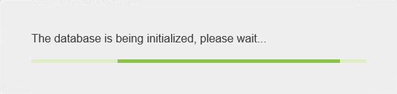
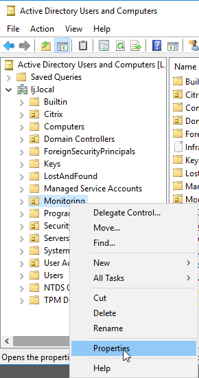
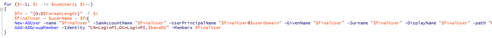

If you are supporting any sort of remote desktop platform then you know the pain when you start getting calls flooding in about slow performance or unavailable desktops/apps and then the barrage of software packages you then have to open to see the real status of your server estate.

Well, what if you could be notified as the problems starts to arise rather than after its risen and started affecting your users. Yes, that's right, clairvoyant monitoring, well; almost.

LoginPI is a true proactive monitoring solution, rather than working on the basis of performance counters to judge the health of a machine it actually records application responsiveness using a virtual user, this user is literally logged into a Citrix/RDSH/View session and from there an agent runs performing tasks on behalf of the virtual user and feeding back the results to a console which you can monitor. Each time response times fall below the norm you will be alerted that things are starting to get sluggish.

LoginPI currently supports some of the most popular remote desktop solutions:

- Citrix XenApp / XenDesktop
- Microsoft RDS
- VMware Horizon View
- any other VDI solution (as long as you can script a connection)

This blog post is going to walk you through the process of getting LoginPI installed and configured for a basic trial. You can head right to the LoginVSI website in order to download a trial of the product.

- [LoginPI Architecture](#_LoginPi_Architecture)
- [Downloading the Software](#_Downloading_the_Software_1)
- [Requirements](#_Requirements_1)
- [Installing the Management Roles](#_Installing_the_Management_1)
- [Configuring Your First Profile](#_Configuring_Your_First_1)
- [Configuring your Citrix Environment](#_Configuring_your_Citrix_1)
- [Installing the Launcher Role](#_Installing_the_Launcher_1)
- [Reviewing the Dashboard](#_Reviewing_the_Dashboard_1)
- [Web Interface Access Control](#_Web_Interface_Access)
- [Summary](#_Summary)

## LoginPI Architecture

## Downloading the Software

[https://www.loginvsi.com/downloads/login-pi](https://www.loginvsi.com/downloads/login-pi)

## Requirements

LoginPI Management Server:

- Prerequisites
    
    - Domain Admin Access to AD to run the configuration powershell script
    - SQL Server 2012 or onwards (Express is okay but will fill up the database limit within a year or less)
    - To create the SQL database and SQL login, we require a user account that contains both dbcreator and securityadmin server-level-roles
- Specification
    
    - 2(v)CPUs
    - 4GB RAM

LoginPI Launcher

- Prerequisites
    
    - Microsoft .NET Framework 4.5.2
    - Lock screen turned off
    - Screensaver turned off
    - When testing Citrix XenApp/XenDesktop, the Citrix Receiver is required
    - When testing VMware Horizon, the Horizon Client is required
        
        - Latency metrics data capture is only supported by XenApp/XenDesktop 7.x and higher
        - To capture latency metrics when testing Microsoft RDP, RDP version 8.0 or higher is required
        - Windows 7 does not support the capture of latency metrics with the RDP protocol
        - Port 8080 must be open between the launcher and the management server
- Specification
    
    - 2(v)CPUs
    - 4GB RAM
    - Windows 7 and upwards (64-bit)
    - Windows Server 2012 and upwards

Target Device

- Microsoft .NET Framework 3.5

## Installing the Management Roles

First things first, we need to get an SQL Server release installed. I'll being using SQL Server 2017 Express Edition.

Head over to the [SQL Express download page](https://www.microsoft.com/en-gb/download/details.aspx?id=29062), I'm also grabbing the management studio just for good measure and incase we need to pear into the database later.

I'm not running through the SQL install in this post but I've dug a post out that can be followed - [https://www.hivelocity.net/kb/how-to-install-sql-server-2012-express-on-windows-server-2012/](https://www.hivelocity.net/kb/how-to-install-sql-server-2012-express-on-windows-server-2012/)

This can also be used on 2016 Server which I happent to be using.

With the SQL Server installed we can proceed, I've paced a folder on the desktop with the necessary software and license file.

**Note: Best to install chrome for access to the management interface, IE does work but is very clunky.**

We'll start by running PISetup\_2\_1\_2\_6

Agree the license terms and select Install

You'll see the setup running through and installing the required roles

Hit restart to complete the setup

Once the restart is complete, open the start menu and you will see "Login PI Management Interface", select this and it will open in internet explorer, copy and paste the URL and open it in Chrome.

The first step is to configure the database, I found the best way to do this is to create a dedicated SQL user account, when using a windows account I had issues with the database creation. This is logged and will be fixed.

I've used the SA account, but you should not do this in a production environment.

Hit Apply

The database will now be configured, sit back and wait.

Once completed, we need to apply a license, request a license by selecting "No license installed, request your trial license here"

Select the gear icon and then "License Information".

Select Browse license.

Select your license and select Open.

Select Upload, to check your license go back to the cog icon and License Information again.

Next we'll need to configure our AD objects.

Select AD Script Generator

We'll need to grab out BASE OU for the windows her, you can write in the DN or hop over to Active Directory Users and Computers.

Select the view menu, Advanced Features, this will show additional information. I have an OU for monitoring so I'll right click that and select properties.

Select the "Attribute Editor" tab and double click Distinguised Name in the list, you'll see the value you need and can copy it.

Paste that value into the Base OU and fill out a username for your Virtual Users and a Password, fully qualified domain name and the number of users that are required. Select Generate.

The script will be downloaded, I'm saving this into my Software folder on the desktop.

Let's take a quick look at the script, we should always check before running a script against AD.

The script is setting the variables specified that we typed and then getting its working directory.

Importing the AD module, Creating the OU structure specified and then creating a group for out LoginPI users.

A loop to create the users we asked for in the OU that's been created.

A login script variable is created and then written to a file in the netlogon share (this script is assigned to the users created in AD)

Now that we are happy we can run that with an account that has the correct permissions in AD and on a machine that has the RSAT tools installed or if necessary; a Domain Controller directly.

 

Reviewing the structure created we can see the OU's are created as specified and the login script is added to the user's login and the script is created in the netlogon share.

Lastly, we'll look at email alerts, back to the Pi management console.

Select Email Notifications.

Fill out your recommended details and select Send A Test Email to ensure all is working.

You have an option here to "Send email on alert" or to have a 5 minute digest.

That's the management server piece installed, we'll now move over to the launcher.

## Configuring Your First Profile

A profile is really a site that you are monitoring from or a farm you are logging onto. Keep in mind that the launchers can be placed in remote offices running on a standard desktop PC and will track actualy response times and latency from that location.

Select the configuration tab from the top navigation area. You're now presented with the profile manager. Lets create a profile.

Give the profile a name, I'm logging in to my lab so I've put that, I'm also logging into Citrix Storefront but RDP and VMWare Horizon View is also supported.

Select your workload, its good practice to stick with native windows apps to start with. Select the office version you expect to use for later.

You now need to define a connection to Storefront. Select the + icon.

Give is a name and select save.

Select the person icon and enter the login name and password for one of the Virtual Users we created earlier, select create.

We now define the Storefront URL, Domain, Domain FQDN and the server Desktop or App Name that we wish to launch. Select Save.

We'll come back to Launchers shortly, this is where we will download the agent for our launcher.

We define a schedule for the workload to run here. Its best to put a gap in for this like reboot schedules, I don't have any in the lab so tick Enable and set the time inbetween launchs.

Thresholds are interesting. If you don't override the settings thn LoginPI will create its own baseline of how long tasks take and then simply alert you when the task run takes longer than it did before.

I prefer to specify how long is too long, using the override tab we can specify how long we think a task should take.

That's the profile created, now we just need to get a launcher setup.

## Configuring your Citrix Environment

Your Citrix Application needs to be published to the LoginPI user in order for the workload to run correctly. I'm not going into huge detail here as it's a little out of the way of the post.

Using Citrix Studio, amend permissions on your Delivery Group/Application/Desktop so that the LoginPI user group has the correct resource published that is stated in the Profile we created on the LoginPI Server.

## Installing the Launcher Role

To install the launcher software we'll hop across to the Launcher directly.

Fire up Internet Explorer/Chrome and navigate to <loginpimanagementserver>:8080

Select the configuration tab on the navigation bar, this shows you the profile just created. Click the profile Name.

You'll see the Launcher Section, select the relevant download link for your launcher

Run the setup for the launcher and select Next

Accept the terms and select Next

Select a location and select Next

Place the name of your LoginPI server in the box and select Next

Select Install

The installer will run through and confirm when finished. Select Finish

Now, before the Launcher can do its job we do need the client software installed for our remote solution, Citrix Receiver in my case. Make sure you have the relevant client installed.

Lastly, start up the Launcher software.

You will see a message saying that the Launcher has not been approved. We need to do this.

Fire up Internet Explorer/Chrome and navigate to <loginpimanagementserver>:8080

Select the launcher icon in the top right, you will see your launcher here with a status of "Pending", select the launcher and then select Accept.

The launcher state will now be approved.

The launcher window now states that it is succesfully connected.

The workload will start to run and a receiver window should launch to show the Virtual User running the workload.

You will see the login script start to run for the Virtual User and from here on you can just watch the magic.

## Reviewing the Dashboard

The Dashboard shows all sorts of useful metrics which are fed in from the agents running on the target environment. Below is an example of what this might look like once information has been collated.

## Web Interface Access Control

Web Interface Access is controlled through the use of local group on the LoginPI management server.

Fire up Computer Management on the LoginPI management server.

Select "Local Users and Groups", Select "Groups", you will see two groups. Login PI Administrators and Login PI Users.

Administrators can configure all settings

Users can view the dashboard and run reports

Add any users/groups you wish to have access to these groups and the they will be able to login to the Web Interface.

## Summary

LoginPI is an awesome tool and adds real value for Admins that are monitoring Virtual Desktops. The metrics reported back can be from practically any location as long as the endpoint Launcher can reach the Management Server on port 8080. When you start thinking about replacing your MPLS network with an SDWAN solution, give the very friendly guys at LoginVSI a call to get LoginPI to give you some real baseline metrics across a period of time.

I must stress, LoginPI is not a replacement for monitoring solutions like Control-Up, SCOM, Nagios, GFI, etc. its to complement existing solutions with the benefit of being able to be more proactive and knowing when users are affected. When the Virtual/Hardware is affected its already too late, users are feeling the pain. The reports here are also able to review if you breached SLA's based on thresholds of your profiles. This is powerful stuff for managers and directors, to be able to state that the user experience has not dropped, login speed is on good, Office performance is good. Be a nice admin and give LoginPI a trial.
