In my last blog post about LoginPi I covered the full installation and configuration of the product. In this next instalment I want to cover how to add custom workload actions and a few simple tweaks that can add to help troubleshooting workload items.

Assuming you have followed the previous post, you should have LoginPi running right now and efficiently monitoring your application response times in your virtual environment.

- [Workload Customisation](#_Workload_Customisation)
- [Storefront Connection Tweaks and References](#_Storefront_Connection_Tweaks)
    

## Workload Customisation

We'll start off by remoting onto the desktop of the LoginPi Management server. As per my previous post, my architecture is the same.

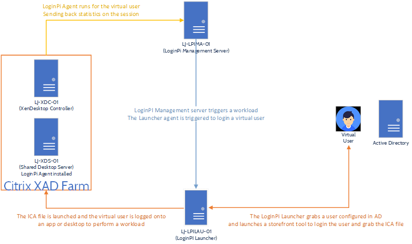

I've logged into LJ-LPIMA-01 and opened the "C:\\Program Files\\Login VSI\\Login PI Server\\target\\workloads" folder.

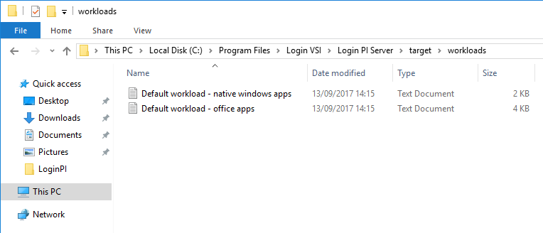

You'll see here that the folder contains the workloads that were earlier represented in the UI of the configuration editor on the dashboard.

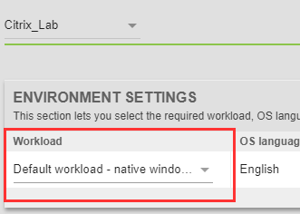

We'll simply copy one of these existing workloads and rename it.

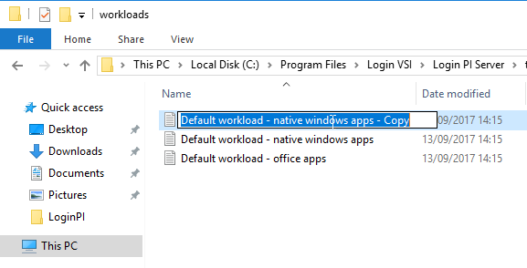

I'll rename this file into something a little more readable.

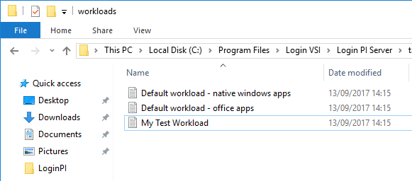

My Test Workload seems like a reasonable name to give it, let's take a look into the contents of the file.

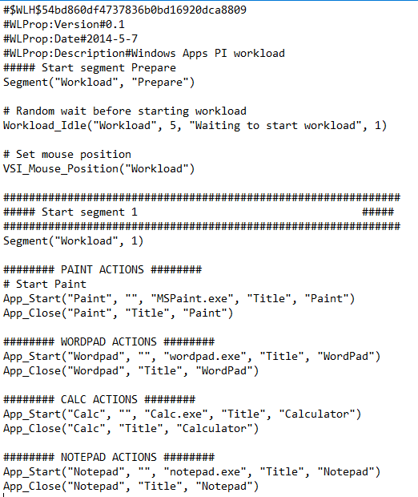

We can see here that the workload initially waits for a period of 5 seconds and then fires into action with segment 1.

Here the application "Paint" is launched as well as "Wordpad", "Calculator" and "Notepad". Remember, the response times of each action are reported.

So, what if we want to monitor the availability of something like a file share? And at the same time, know when there is a little lag here?

Let's dive in and remove the lines so we're left with this:

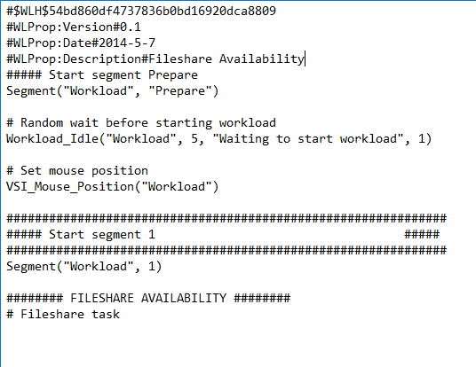

You can see I've removed the current tasks in preparation for adding one.

\[cc\] # Open the text file App\_Start("Fileshare File", "", "\\\\lj.local\\Citrix\\TSHOME\\FileshareTest.txt", "Title", "Fileshare Test") # Type Fileshare File into the text file VSI\_Type( "Fileshare Test","Fileshare File") # Save the text file VSI\_Save("Fileshare File", "{CTRLDOWN}s{CTRLUP}", "\\\\lj.local\\Citrix\\TSHOME\\FileshareTest.txt") # Revert the typing in the text file VSI\_Type("Fileshare File", "{CTRLDOWN}z{CTRLUP}") # Save the text file VSI\_Save("Fileshare File", "{CTRLDOWN}s{CTRLUP}", "\\\\lj.local\\Citrix\\TSHOME\\FileshareTest.txt") # Close the text file App\_Close("Fileshare File", "Title", "Fileshare Test") \[/cc\]

I've now added the above lines to the workload file.

From the top to bottom the following is a breakdown:

- Open a file in [\\\\lj.local\\Citrix\\tshome called FileshareTest.text](file:///\\lj.local\Citrix\tshome%20called%20FileshareTest.text)
- Type the words "Fileshare File" into the text file
- Save the text file
- Back out the words
- Save the text file
- Close the text file

**Remember to create the text file in the location initially.**

Pretty simple stuff but quite powerful at the same time, the longer it takes to perform these actions, the better the indication that the server of file share server is potentially struggling. If the file share is unavailable the action will fail and an alert will be raised.

There is a well-documented guide on the meta language used and it is similar to LoginVSI if you have ever used that too.

[https://www.loginvsi.com/documentation/index.php?title=Login\_PI\_Workload\_Meta\_Language](https://www.loginvsi.com/documentation/index.php?title=Login_PI_Workload_Meta_Language)

So, now to implement this in the LoginPi configuration and test it.

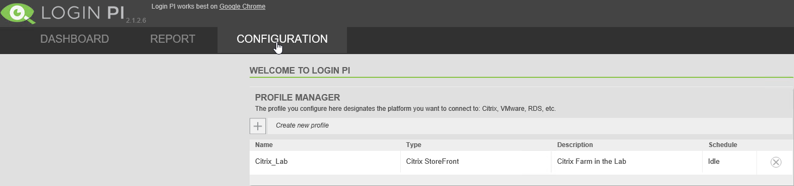

Now login to your LoginPi dashboard and select "Configuration" from the navigation tab. Select your workload "Citrix\_Lab" for me.

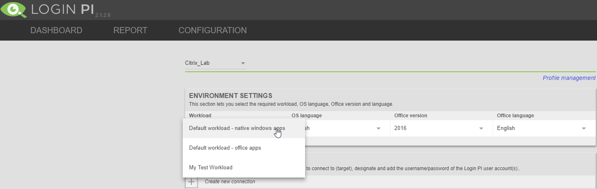

You will now see your "My Test Workload" custom workload presented which we can select.

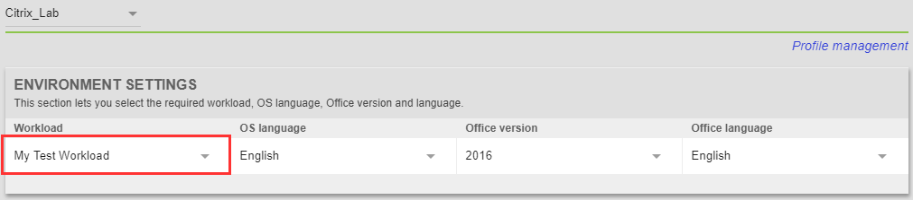

With this selected, lets scroll down to the threshold settings and make sure our task is represented.

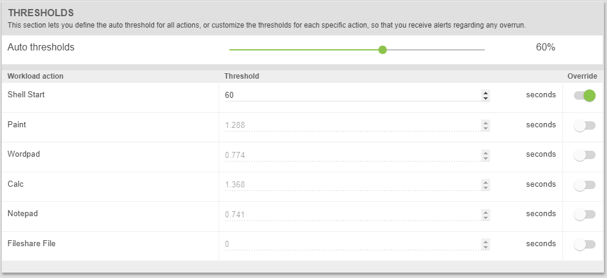

We can now see that the Fileshare task is represented and on the Launcher machine we can see the workload running

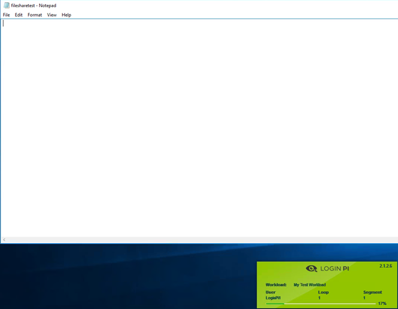

Notepad has been used to open the text file and the LoginPi agent is running and performing the automation.

After a few successful runs you will receive some metrics on the LoginPi Dashboard.

## Storefront Connection Tweaks and References

Something I found a little frustrating in production environments was when you want to watch the workload run, you would usually have the receiver launching in full screen mode. Now this makes it more difficult to watch your workload run, especially if your launcher is a virtual machine.

Jump into your Configuration Profile once more and we'll add a few parameters to launch the session in windowed mode.

Now login to your LoginPi dashboard and select "Configuration" from the navigation tab. Select your workload "Citrix\_Lab" for me.

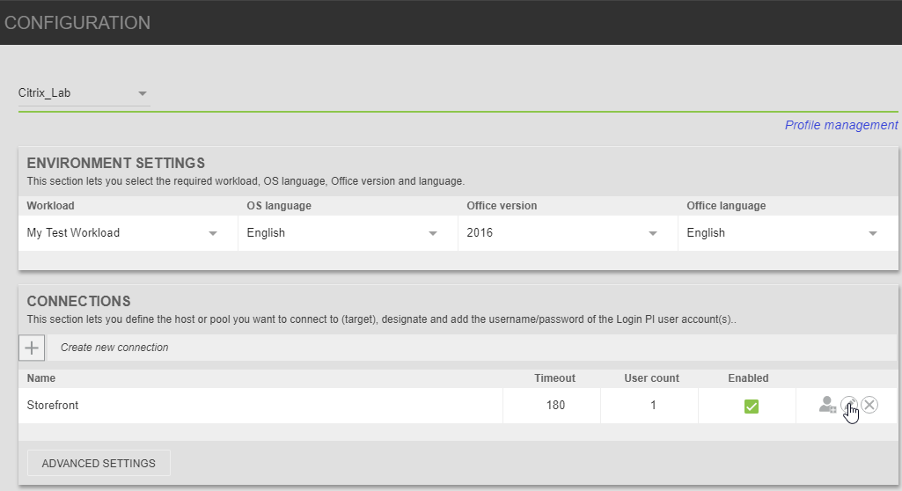

Select the edit icon on the Connections section.

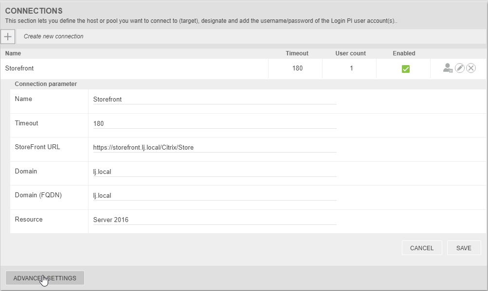

Select "Advanced Settings" in the bottom left.

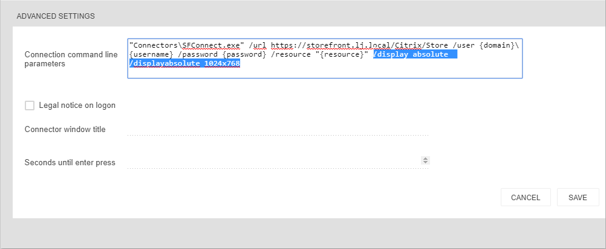

Another section will open to show the command being used to launch the receiver session. I've added here "/display absolute /displayabsolute 1024x768" to ensure the receiver window is a fixed size.

Select save and you will see on the next run that your receiver window will be a fixed size.

A full list of commands available for all connection agents is displayed below:

[https://www.loginvsi.com/documentation/index.php?title=Login\_VSI\_Connectors\_Reference#Citrix\_StoreFront\_connector\_options](https://www.loginvsi.com/documentation/index.php?title=Login_VSI_Connectors_Reference)
