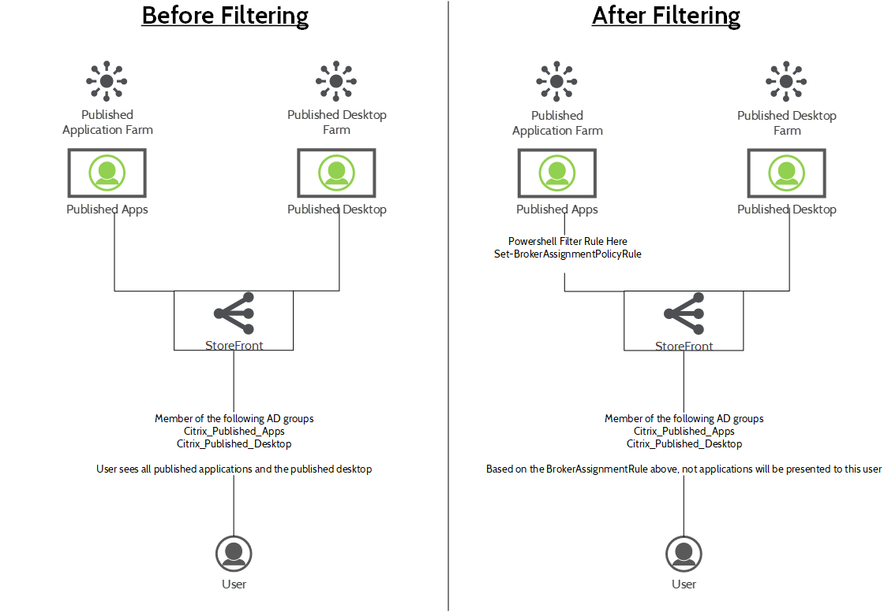
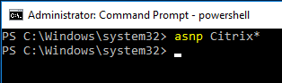
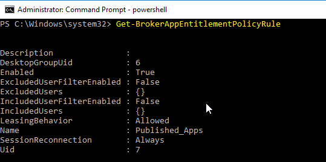
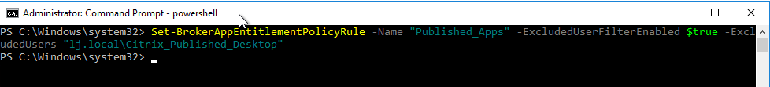
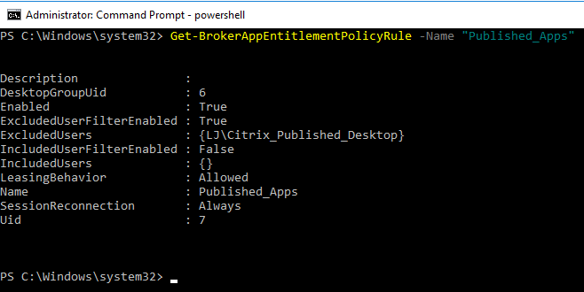

I was in a situation recently where a migration was necessary between two separate Citrix Farms, one being live and long standing with published applications and another being a published desktop. Migrating users between these two environments was straight forward using some powershell scripting to apply some filtering to the old farm. In earlier releases of Xenapp and XenDesktop the exclusion was not available in the GUI which is the main reason for this post.

The aim here was relatively simple, when a user is placed in a specific group and therefore has access to the new published desktop, the published apps are no longer displayed to the user. This means rollback is as simple as taking a user out of a single group (not that any of us ever have to rollback, right?)

The below diagram describes the scenario.

In this scenario the user is in both groups, what we want to achieve in on the right handside, when the user is placed in the new "Citrix\_Published\_Desktop" group, the user will no longer see published applications in Storefront.

To achieve this, we use some Powershell Magic, Hop on your delivery controller and fireup Powershell.

First, we'll add the necessary Citrix Snap-ins.

_asnp Citrix\*_

_Get-BrokerAppEntitlementRule_

This will display the current assignment policies. (I filtered on Uid because I had a few)

We can now create a new filter based on this. Note the name for the next part.

_Set-BrokerAppEntitlementPolicyRule -Name "<Name of the Delivery Group>" -ExcludedUserFilterEnabled $true -ExcludedUsers "<AD Group to exclude Domain\\Group Name>"_

**Note: The AD Group name must be exact.**

My specific command to run is as follows:

_Set-BrokerAppEntitlementPolicyRule -Name "Published\_Apps" -ExcludedUserFilterEnabled $true -ExcludedUsers "lj.local\\Citrix\_Published\_Desktop"_

This now means that when a user logs into Storefront and are part of the Citrix\_Published\_Desktop Group they will be excluded from the Published Applications delivery group.

To remove a group from the Entitlement Policy Rule the following can be used:

_Set-BrokerAppEntitlementPolicyRule -Name "Published\_Apps" -RemoveIncludedUsers "lj.local\\Citrix\_Published\_Desktop"_

The Policy can then be set to not have exclusions like this:

_Set-BrokerAppEntitlementPolicyRule -Name "Published\_Apps" -ExcludedUserFilterEnabled $false_

These rules can also be configured to include users over the exclusion groups. For full information on how these rules work, have a review of the info below:

[https://docs.citrix.com/ja-jp/xenapp-and-xendesktop/7-6/cds-sdk-wrapper-rho/xad-commands/citrix-broker-admin-v2-wrapper-xd76/set-brokerentitlementpolicyrule-xd76.html](https://docs.citrix.com/ja-jp/xenapp-and-xendesktop/7-6/cds-sdk-wrapper-rho/xad-commands/citrix-broker-admin-v2-wrapper-xd76/set-brokerentitlementpolicyrule-xd76.html)
