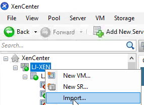
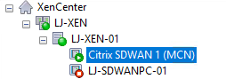
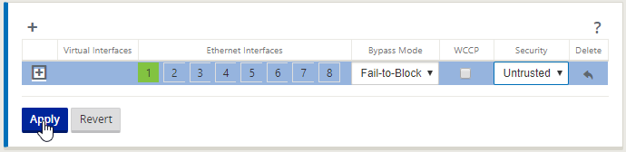
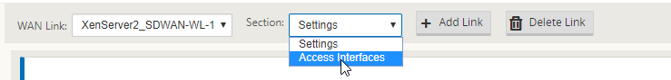

A lot of organisations today use an expensive MPLS network to connect all their branch offices. With the fast emergence of online services and consumer driven products like Office 365, these networks are becoming increasingly strained. Where an MPLS network was originally designed for Thin Client and more traditional share-based access, we are now seeing end users bringing in their own laptops, downloading large files and creating pinch points on the network. So, with all this in mind, how do we combat these issues?

The answer is a simple one, Software Defined Networking or SDN. Specifically, in this post I am looking at Citrix Software Defined Wide Area Network; recently rebranded from NetScaler SDWAN. This product comes in various form and can be deployed almost anywhere; AWS, Azure, On-Prem VPX or Physical appliance. These devices form a dynamic and intelligent link between each other creating a mesh network using multiple inexpensive physical links like ADSL, FTTC and 4G etc…

The datasheet for the product can be viewed here:

[https://www.citrix.co.uk/products/netscaler-sd-wan/netscaler-data-sheet.html](https://www.citrix.co.uk/products/netscaler-sd-wan/netscaler-data-sheet.html)

An overview of the product can be found here:

[https://www.youtube.com/watch?time\_continue=1&v=Vllfj7xUW8g](https://www.youtube.com/watch?time_continue=1&v=Vllfj7xUW8g)

If you are here though it's because we're going to run through setting up two appliances in a lab environment to talk with one another and provide a tunnel between two private networks where a VM will reside in each. These VM's will then be able to communicate with each other across the SDWAN Virtual Path.

- [Logical Layout](#_Logical_Layout)
- [Appliance Import and Basic Configuration](#_Appliance_Import_and)
- [Configuring the Sites and Routing](#_Configuring_the_Sites)
- [Test Private VM Communication](#_Test_Private_VM)

## Logical Layout

All IP details I will be using are referenced above. The Internal Networks are just a private network localised to each XenServer Host.

Each SDWAN appliance has at least 3 connections, Management, WAN and LAN. These definitions will become quite important moving forwards.

## Appliance Import and Basic Configuration

First think is first, we need to download the Virtual Appliance, I'm using XenServer here in my lab so I'm going to head to the download for that appliance. (There are also images for Hyper-V and ESX)

[https://www.citrix.com/downloads/netscaler-sd-wan/standard-enterprise-edition/vpx-release-100237.html](https://www.citrix.com/downloads/netscaler-sd-wan/standard-enterprise-edition/vpx-release-100237.html)

With the appliance downloaded we'll head right over to XenCenter to begin the import process, I'll be importing 2 virtual appliances to create a tunnel between the two of them across a standard routed vlan. The LAN side of the appliance will be a private network on each XenServer, these will act as isolated branch offices.

We start off by right clicking and selecting import.

Select the SD-WAN appliance image we just downloaded and select open.

Select Next

We want this appliance on the first XenServer, select that server and click Next.

Select the storage to store the appliance on and select Import.

Select the "Add" button to add 3 network adapters, Interface 0 will be Management, Interface 1 will be WAN, interface 2 will be LAN (private network on each XenServer).

Select "Finish" to complete the import process.

We'll now rename the VM to make it obvious that it's the primary SD-WAN node. Right click the VM, Select "Properties".

Amend the name of the VM in the "Name" field and select "OK".

We now have the initial appliance imported.

Select the console tab, press enter and login with "admin" and "password", we can now assign a management IP to the appliance.

Type:

- management\_ip
- set interface <ip address> <subnet> <gateway>
- apply (Confirm you want to apply)
- main\_menu

This will set an ip on the management interface. I'll now browse to that address to ensure all is working properly.

[https://192.168.101.11](https://192.168.101.11) takes me to my SD-WAN appliance interface. We'll now move on to the second node.

Repeat the above process for the second SD-WAN appliance but with the following changes:

- Select your second hypervisor as your import server (LJ-XEN-02)
- Select the second internal private network for interface 2 (Server\_Private\_LAN\_2)
- Rename the VM (Citrix SDWAN 2)
- Set the management ip with a second address (192.168.101.12)

It's now time to license each SD-WAN appliance, lets jump over to [https://mycitrix.com](https://mycitrix.com)

Select "All Licensing Tools" on the left-hand side.

You'll see some options here, I'm using the "Reallocate" option as it's my lab and these are partner use licenses. If you are an end user you'll want to request an evaluation license and select "single allocation", you will be provided with a serial number to place into this section which will add the license to the portal to be allocated. Once the license is added to the portal you can select "Allocate".

You can request a trial license here: [https://www.citrix.com/products/netscaler-sd-wan/get-started.html](https://www.citrix.com/products/netscaler-sd-wan/get-started.html) (Scroll down and fill in the form – or contact your Citrix Partner)

You can see here that there is a NetScaler SD-WAN VPX License on my portal here, I'm going to select this and hit continue.

I've changed the quantity to 1 and I now need to the Host ID to be able to apply this license. We're going to leave this browser tab where it is and fire up a new one.

Navigate to [http://192.168.101.11](http://192.168.101.11) (The management IP of our initial NetScaler SD-WAN appliance.

Login, the default credentials are admin and password.

You'll see the appliance is in grace mode, for the first appliance we are going to make this appliance our MCN appliance. Select MCN, Create New Package and select Next.

The appliance now wants a configuration, we create this on the MCN which is why it now wants us to proceed straight to this, we are first going to license this appliance.

Select the configuration tab.

Select Licensing in the left-hand menu, you will now see "Local License Server HostID" on the right. Copy this value and jump back to the Citrix licensing tab.

Place this value in the "Host ID" column and select "Continue". Select "Confirm" on the next window.

You license should be downloaded. But it not, select the appropriate license and download it.

Navigate back to the SD-WAN appliance browser tab.

Select "Choose File",

Browse to your license file and select "Open".

Select "Upload and Install"

Select "Apply Settings" to load the license into the appliance.

The appliance will now confirm that it is licensed.

Move across to the second appliance, [https://192.168.101.12](https://192.168.101.12), perform the following steps:

- Select the Configuration Tab
- Select Licensing from the left-hand menu
- Take note of the "Local License Server HostID"
- Navigate to the Citrix Licensing Portal and provision a license based on this ID
- Upload the license to be appliance
- Apply the settings
- Ensure the licensing has taken affect

### Other Configuration Steps:

- Time Zone Settings must be set on each appliance
    
    - Select "System Maintenance", "Date/Time Settings"
    - Set your NTP server if necessary and change each Time zone to be relevant to your organisation.
    - **This step is very important if you want to have correct reporting**
- Default admin credentials should be changed
    
    - Select "Appliance Settings", "Administrator Interface"
    - Change the current admin user password
    - **Mine will stay the default as this is a lab environment**

## Configuring the Sites and Routing

We are now going to create our initial device configuration on the Master Control Node (MCN).

Navigate to [http://192.168.101.11](http://192.168.101.11) (The management IP of our initial NetScaler SD-WAN appliance.)

Login with the credentials you have selected.

Select the configuration tab.

Select "Virtual WAN\\Configuration Editor".

This is where we will spend a lot of time, this is the configuration generator for the SDWAN appliances. We will generate a configuration and then be able to provision configuration packages for each appliance.

Select "New" to create a new configuration.

Now select "Save As" and we'll give our config a name.

Give your config a name and click "Save".

First, we need to add a site, the first site will be the MCN.

Select "+ Sites" to add a site.

Here we are putting in some fundamental details:

- The site name (It's in my lab so – XenServer1\_MCN)
- The Secure Key is auto generated and does not need to be changed
- Model – VPX for this example but if you had physical appliances you would select your appliance model
- Mode – Primary MCN because this node is the Master Control Node and will be responsible for distributing the configuration
- Site Location – Usually a geo-location but as it's a lab I've put the physical XenServer its located on
- Enabled Site as Intermediate Node – This tick box allows node sites to create tunnels with this site, this is mandatory for the MCN as all sites must have a connection

Select "Add" when you are done.

Select the "Sites" tab to start adding details about the MCN.

Select "Interface Groups" and then the " + " symbol, we are going to tell the configuration editor which interfaces are the WAN (Initiating a tunnel on) and LAN (Connection to local resources) connections on the appliance.

In XenServer we have the following:

Note that Device 0 is the MGMT port on the SDWAN appliance which does not display in the interface groups on the SDWAN configurator. The Management interface is a completely segregated port and is in no way joined to other ports on any SDWAN devices.

Despite the naming above, Interface 1 is serving as our WAN connection in the lab. Select "interface 1", Bypass Mode is "Fail-To-Block" and Security is "Untrusted"

- Interface 1 – Select because it's a routable VLAN in-between my XenServer
- Bypass Mode – On a physical appliance deployed in Inline mode (A bridge between devices) this can be configured to pass traffic if the SDWAN device fails
- Security – Untrusted because this would ordinarily be a WAN connection or Internet Connection

Select "Apply"

Now select the " + " icon on the beige pane for Interfaces.

We're going to name the interface on the SDWAN.

Select the " + " icon to add the interface, fill out the name and Select "Apply".

Now we'll add the LAN interface.

Select " + " to add another interface.

This is the same process as before, but we now select Security as being "Trusted". Select "Apply".

You should be left with something like this:

We now have a WAN and a LAN interface configured. Let's audit our config!

Scroll down to the bottom of the screen and you'll see the "Audit Now" button.

Click "Audit Now"

Select one of the warning symbols here and you will see a list of things that must still be completed to proceed / are in conflict. Errors must be resolved before being able to Export the configuration to any appliances.

This is ok because we are only starting the configuration right now. My advice here though, run an Audit after each configuration step, the Audit reveals additional options in the configuration based on options you've chosen in some sections.

Select "Virtual IP Addresses" and then the " + " icon on the right.

Fill out the IP address for the WAN interface in CIDR format and select the WAN interface we defined earlier. Select "Apply" This is how we bind an ip address to an interface and tell the SDWAN appliance which interface is external and internal.

Follow the same process, select the " + " icon input an IP for LAN and select the LAN interface, select "Apply".

Now Audit your config, you'll see some different issues, but a few will have disappeared.

Now select "DHCP" and select the " + " icon.

Here DHCP will be handled on the SDWAN appliance for each LAN/VLAN it has connected. Virtual Interface is the LAN interface defined earlier, domain supplied by DHCP, DNS servers for be handled, I've place external servers here, but these would be your own DNS servers.

**Note: Under "Section" at the top, Relay can be selected to relay DHCP request to a separate DHCP server.**

Select "Apply".

Select the " + " symbol next to the routing domain to drop down the scope. Select the " + " icon next the "Ranges" to add a range.

Populate your DHCP start address, end address and the gateway is the IP address for the interface – 10.1.0.1, select "Apply".

Select "WAN Links" and then "Add Link" on the right.

You're presented with an options dialogue. Under Access type there are a few options but for this example we will select "Public Internet". Select "Add".

Fill out the metrics for your connection (LAN to WAN – Upload) and (WAN to LAN – Download) then input your public IP. The MCN must have a fixed IP, all nodes sites can be DHCP if necessary but there some earlier steps for this which I'll explain in another post.

For this example, I am not placing an external IP as the tunnel will be initiated on a private VLAN IP address.

Scroll down and hit "Apply". Audit your config. You'll see some different error messages.

Scroll back up again.

Select the "Section drop-down, Access Interfaces".

Select the " + " symbol to add an interface. Populate the name, the interface is the WAN interface, IP Address is 192.168.102.11 (internal IP being natt'ed to, so in the WAN link we have external but here the internal DMZ address), select "Apply".

Audit your config and let's save the package.

Select "Save" to save the package. We'll now move onto adding site 2.

Select " + Site" to add the next site.

We're now following the same process for the second node. Input the Site Name, SDWAN Model, Mode is client, and Site Location. Select "Add".

#

Select "Interface Groups" and the " + " on the right.

I've kept the interfaces the same on XenServer 2 but with the LAN being a private LAN only present on XenServer 2.

Fill out the relevant details for the WAN and select "Apply".

Fill out the relevant details for the LAN and select "Apply".

Select "Virtual IP Addresses" and the " + " icon.

Fill out the IP information for each adapter and select "Apply".

Select "DHCP" and select the " + " icon.

Fill out the relevant DHCP details as before and select "Apply".

Remember to Audit as you go.

Select "WAN Links" and the "Add Link" button on the right.

Again, we are using "Public Internet", select "Add" (Note: Access Types must match between appliances for appliances to form a tunnel.

Fill out the details for the second sites WAN link. Because this is in a lab I've set the links at 100Mbps the external IP is excluded because I am using a LAN link for this example. The public IP would be the IP address on the firewall that you are Natt'ing.

Scroll down and select "Apply".

Scroll back up to the top.

Select "Section: Access Interfaces".

Fill out the details for the WAN interface internal IP address and gateway. Select "Apply". Audit your config.

You should now see no errors.

Save your configuration.

Select "Save".

Select "Export".

Select "Change Management Inbox" and Select "Export".

From the navigation menu on the left select "Change Management".

On the right, select "Begin".

For the MCN to be able to fully manage devices it requires the firmware for each appliance type to be uploaded first.

Select he "Choose Files" button and select the firmware packages that you have downloaded and select upload one at a time.

**Download Link:**

[**https://www.citrix.com/downloads/netscaler-sd-wan/standard-enterprise-edition/appliance-software-release-100237.html**](https://www.citrix.com/downloads/netscaler-sd-wan/standard-enterprise-edition/appliance-software-release-100237.html) **(Physical)**

[**https://www.citrix.com/downloads/netscaler-sd-wan/standard-enterprise-edition/vpx-release-100237.html**](https://www.citrix.com/downloads/netscaler-sd-wan/standard-enterprise-edition/vpx-release-100237.html) **(VPX)**

**You must download the firmware for each appliance type the MCN will support before you can push the configuration.**

You'll notice here that the CBVPX software package is now displayed.

Select your config file from the "Configuration" dropdown and select "Stage Appliances".

This will automatically push the configuration to your MCN appliance and generate all the configuration we just put together to be supplied as an initial install package to the second node.

Accept the license agreement and select "Ok".

**Note: Wait for the UI to update, it does take its time.**

You'll now see a progress meter at the top and a status table at the bottom. The state allows you to see what is happening and the Traffic Interruption section will estimate if pushing the configuration will cause any disruption.

Once the progress bar is at 100% select "Next".

You'll now be able to activate the config, if you wish during production you can delay a config deployment to be activated at a different time. Select "Activate Staged".

Wait patiently for this initial configuration, the UI will update slowly to let you know what is happening in the status table.

Once the configuration has been pushed to the MCN you will be redirected to its "Local Change Management" to do the initial package installation.

Select "Activate Staged" once more.

This will initialise the MCN and perform its configuration. Wait patiently for the countdown.

Once completed, select "Done"

You will be presented with this message, just select the "Enable/Disable/Purge Flows" link.

Select "Enable" to activate the services.

Okay, now we have the MCN configured and ready, we need download the configuration package for the second node and apply it manually for the first time. After the configuration is applied initially all updates are performed over the VPN tunnel via the MCN.

Navigate to "Virtual WAN\\Change Management" and select the "Active" link in the bottom right to the right of the XenServer2 site.

This will download a zip file of the configuration for the second SDWAN appliance.

Open a new browser tab and navigate to the Management IP of the second node – 192.168.101.12 for me.

Login as before.

Select the "Choose File" button and browse to the configuration file downloaded.

Select the file and select "Open".

Select "Upload and Install".

You'll receive this message. We are already licensed now though so we can select "Monitoring" in the top navigation bar.

We get the same message as before, select "Enable/Disable/Purge Flows".

Select "Enable" to activate the services.

Now select "Monitoring" once more.

We now see that the Path State between the two appliances is good.

There are two paths listed here, one for upload and one for download.

To Summarise:

- We've created the configuration for the appliances
- We have prepared the packages using Change Management
- We have applied the configuration and Activated it.

## Test Private VM Communication

Now we need to test some Virtual Machine configuration across the tunnel. Let's look at our VM's.

I can see straight away here that my Win 10 VM has been given an IP Address via DHCP from the SDWAN device.

Hopping onto the VM I can ping the gateway of the other SDWAN Device and the IP of the other Win 10 VM.

Now the reverse from the other VM.

XenServer Configuration.

We have the same communication.

## Summary and Close

This guide is enough to get a tunnel created between two appliances and to start to allow expansion of a network across an internal VLAN.

This guide simple demonstrates the ability of the device, there is loads more to be done on top of this which I hope to expand upon in future posts.

Please leave feedback on what you'd like to see next.
