So you've got some DNS Zones on your Domain Controllers and you're building a test lab or another domain that you want to copy these to. Easy right – not so easy if they are AD integrated zones. This means the files for these zones are not stored in C:\\Windows\\System32\\dns an normal, they are actually stored and replicated to all DCs inside AD.

I had a requirement to move an integrated forward lookup zone from one domain to another so I'm sharing what I did below.

Logon to your DC with the integrated zone and fireup our friend Powershell.

**Get-DNSServerZone**

You'll see your zones listed out.

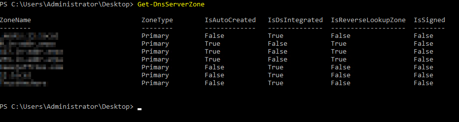

You'll see here which zones are integrated and which are not.

The ZoneName column is key for the next bit, make a note of the ZoneName you want to export.

**Export-DNSServerZone -Name <ZoneName from the above> -Filename <Yourzone.dns>**

There's no confirmation for this command, but this will export the zone to a file that can be resuable.

Open up **C:\\Windows\\System32\\dns** in explorer.

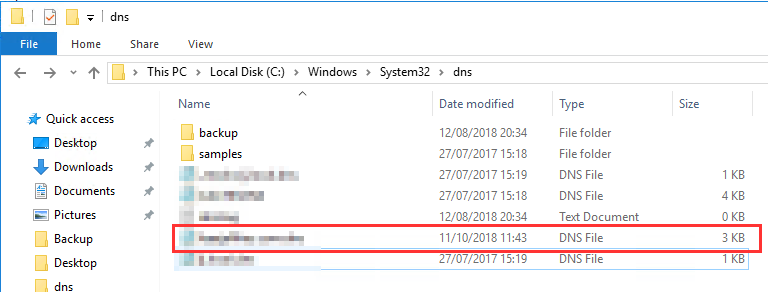

You'll see here you DNS zone file. Take a copy of this and place it somewhere.

Log in to your new DNS server where the zone will be imported.

Open up **C:\\Windows\\System32\\dns** in explorer and copy the file you just exported into this folder.

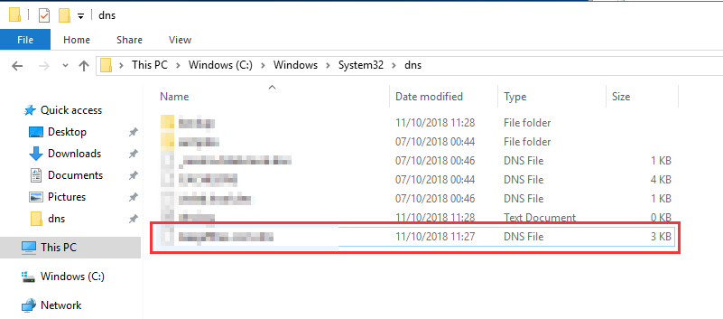

Now open the DNZ Management Console.

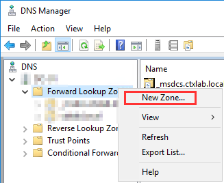

Right click "Forward Lookup Zones" and select "New Zone", Select "Next" to get started.

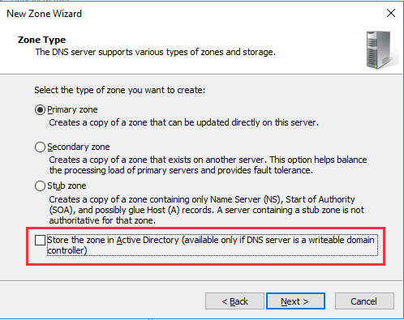

Select the zone type and remember to untick the "Store the zone in Active Directory" option.

I know, I know, we want it to be in AD; don't worry. It will still be once we are done.

Select "Next".

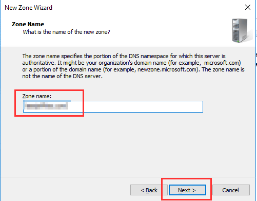

Populate the Zone Name and select "Next".

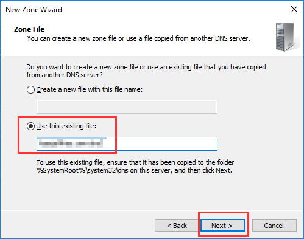

Select "Use the existing file" and enter the name of the file you copied into "C:\\Windows\\System32\\dns", select "Next".

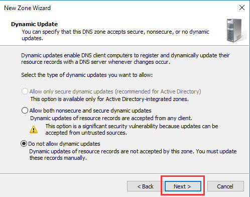

Select "Next" on the dynamic update options. Note: The secure option will be available once we convert this zone to an AD integrated zone.

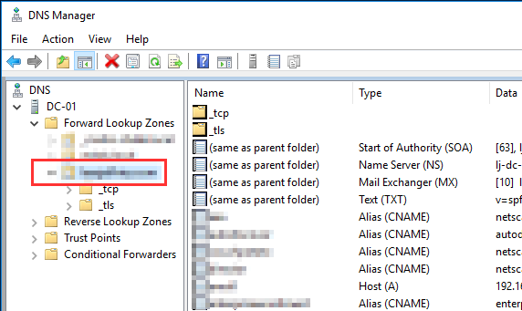

The zone should now appear fully populated in the DNS console. Now time to convert this zone back to an AD integrated zone.

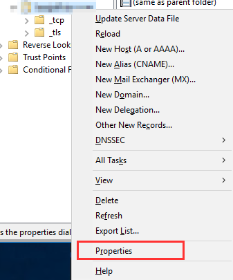

Right click the zone and select "Properties".

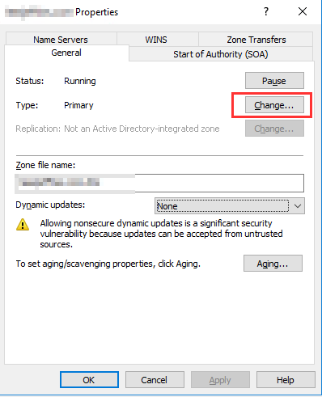

Select "Change" on the right of "Type".

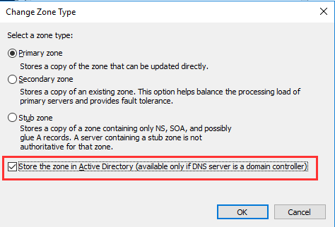

You might recognise this screen, Select "Store the zone in Active Directory" and click "OK". Confirm you want to move the zone to AD.

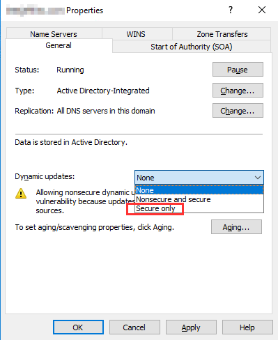

You now have the option to change the dynamic updates to this zone, select as per your preference.

This wraps up the zone import, the whole process could be easily scripted with Powershell. Happy to take a crack at it if anyone is interested.
