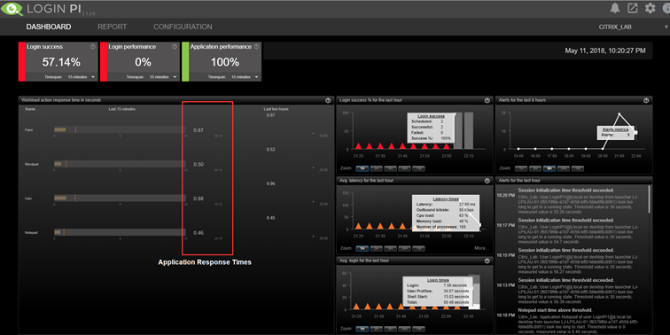
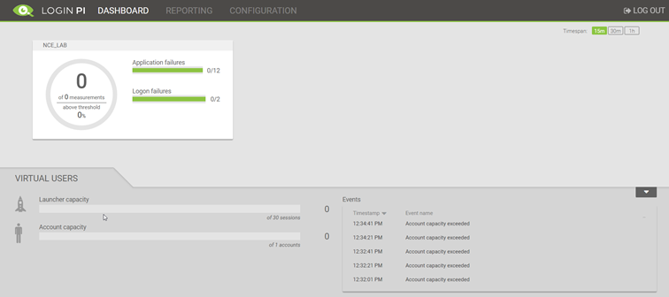
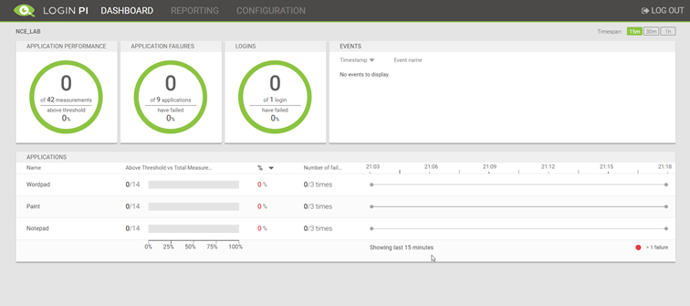
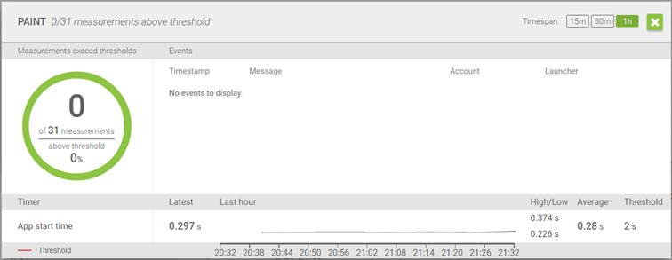
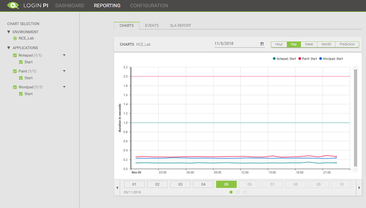

So today the new version of LoginPI is released, personally I loved LoginPI2 and thought that the proactive monitoring aspect had a lot of scope for businesses running Virtual Desktops, helping to ensure up-time, performance and availability was maintained. We all know, you build your nice new desktop image; its quick and fast and you're proud. After a good few months of updates and changes its starts to slow a little. Wouldn't you like to know just how much? Wish there for a tool for this? You need LoginPI!

My main highlights:

## Appliance Install

The lasts release has an appliance, whereas before this was a windows server and a software install its now a nice neat OVA. I tested this on Nutanix CE and it worked fine. The HDD comes in the form of a VMDK which is easily imported into the image factory.

So, what does this mean?

- Its secure
- Takes about 5 minutes to setup
- No prerequisites
- No database setup
- Less of a footprint on your virtual hardware

I'd say all this was a plus.

## UI Overhaul

The UI has had an overhaul, the new look is sleek if you ask me. Below is a screenshot of the dashboard page originally and what it looks like now.

**Before:**  

**Now:**  

## Configuration and Reporting

The configuration is now slightly different but using the same premise as LoginPI2.

The Environment Setup is now all on the same page, including the applications that are attached to that environment, the thresholds for the launch times are also set here.

There is the ability to write custom workloads for application in C# now too, the kit is included.

A snapshot of the Dashboard reporting for an app is shown below:

App Start times can be graphed and predicted very easily.

Lastly SLA reports can be scheduled to ensure data can always be reviewed and shared.

## Current Gotchas and Install Summary

When setting up I hit a through roadblocks, I was able to work these out by logging on the launcher side and then some additional support from the LVSI team.

These are the basic steps for deployment:

1. Pull in the OVA
2. Spin up the management server and IP it
3. Create a DNS entry for the LoginPI management server at the same address and hostname you setup, or a hosts entry in the launcher. (Important as the launcher program will use this)
4. Spin up a windows server/desktop and grab the launcher software from the PI Management Server
5. Install the launcher software
6. Create AD Accounts and Publish Resources
7. Configure the Environment in the LoginPI Management Server

Although the steps are not identical the theory is the same as the original LoginPI. I wrote a full installation blog post entitled "[Truly Proactive Monitoring with LoginPI]()"

## Summary and Final Thoughts

This new release of LoginPI seems a lot more joined up to me, the interface sleekly provides a good experience when using all different areas. Its lighter and has a lot more click throughs; or at least it feels that way.

There is an option to be able to create a custom connector which can be a script of such placed on the launcher, this opens some great possibilities; imagine having a test that will run a PowerShell script to upgrade your Golden Image, snapshot it and then push out an MCS update before connecting the virtual user. You can have an automatic indication of the impact on your latest image, better still. Roll it into preproduction and compare it with production ongoing.

As [@XenAppBlog](https://twitter.com/xenappblog){@target="_blank"} would say – be the Automator not the automated!

If you haven't tried it, try it!
