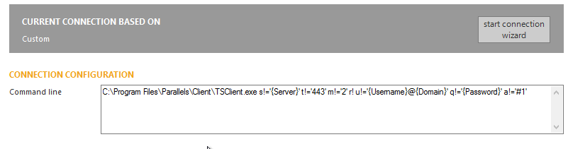

I was doing some load testing and needed to also connect to a Parallels RAS hosted desktop.

This can be ahieved by installing the RAS client on your LoginVSI Launcher and editing the connection string as follows in the Management console:

\[cc\]C:\\Program Files\\Parallels\\Client\\TSClient.exe s!='{Server}' t!='443' m!='2' r! u!='{Username}@{Domain}' q!='{Password}' a!='#1'\[/cc\]

The full syntax for the connection string can be found here:

[https://kb.parallels.com/en/123825](https://kb.parallels.com/en/123825)
