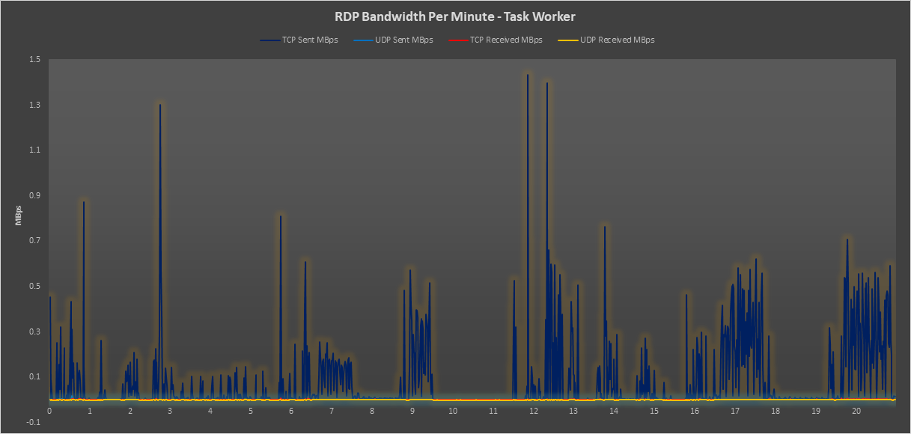
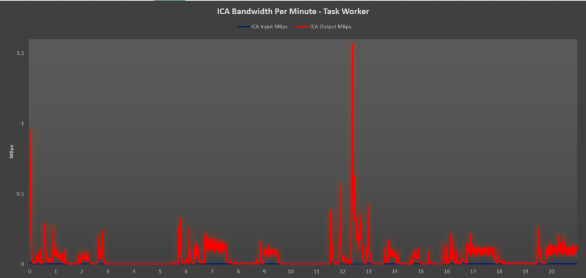
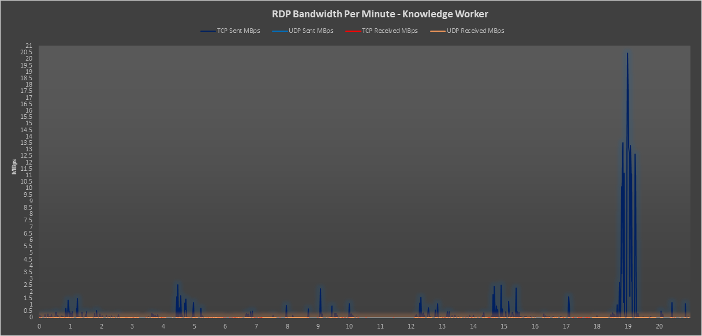
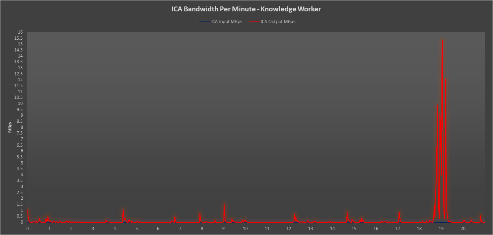

With the rise of Windows Virtual Desktop I wanted to do a bit of preliminary testing on the obvious thing that's going to matter, is RDP good enough? We all know WVD will be based on a number of different Microsoft Windows Desktop/Server OSes but what we don't know, is if there will be additional RDP goodies in Windows 10 Multi-User. I've heard rumours that there may be some enhancements bundled there that will make RDP even better over higher latency connections and low bandwidth links.

Citrix has for a long time been the leader in the remoting protocol arena, I would have added Horizon View into the testing environment, but VMWare lets me sign up for a View trial on the website but does not present a download link for the ISO/installation packages so unfortunately, it's been excluded.

So, I'm aiming for a bunch of bandwidth tests that can be compared using standard RDP/ICA on a LAN which should provide a little insight into how the two protocols stack out with plenty of bandwidth.

I've used LoginVSI and Perfmon to generate all the statistics necessary for the following results.

What I have performed are the following tests:

- Parallels Client – Windows Server 2016 Published Desktop – LoginVSI Task Worker
- Citrix Receiver – Windows Server 2016 Published Desktop – LoginVSI Task Worker
- Parallels Client – Windows Server 2016 Published Desktop – LoginVSI Knowledge Worker
- Citrix Receiver – Windows Server 2016 Published Desktop – LoginVSI Knowledge Worker

The reason I went with Parallels as the client was purely because the feature sets of products to present items in a fairly similar way and in my experience, I find a lot more clients going with parallels than just standard RDP with Gateways and Brokers.

The workloads used here were identical with repeatable websites etc… to ensure the tests were completely comparable.

Before we jump in, a little background.

**RDP**

Microsoft released a lot of updates to RDP over the last few years – notably:

- RDP Version 8 (Windows 8 and Server 2012)
    
    - Introduction of UDP Transport
        
        - UDP doesn't suffer from TCP's enforcement of its congestion-avoidance algorithm
        - UDP Allow 2-8x more data to be transferred even over high latency links
- RDP Version 10 (Windows 10 and Server 2016)
    
    - Introduction of AVC/H264 compression for images and text

So…. That being said, lets take a look at the test results.

**RDP – LoginVSI Task Worker**

You can see here that the RDP bandwidth on the Task Worker profile doesn't really peak above 1.5 MBps during the workload. Most modern internet connections would handle this scale of demand without too much of an issue.

Average Bandwidth across the test was 0.07MBps.

**ICA – LoginVSI Task Worker**

We see here that the ICA protocol manages to keep the utilisation a lot less peaky, but we still use the same bandwidth as RDP at around the same period of the test peaking at around 1.5 MBps. Again, this type of utilisation is easily scalable on a modern connection.

Average Bandwidth across the test was 0.046MBps.

**RDP – LoginVSI Knowledge Worker**

This is where it gets interesting, we see a large spike for around 1 minute of testing during video playback where RDP will demand almost 20MBps from a connection.

Average Bandwidth across the test was 0.22MBps.

**ICA – LoginVSI Knowledge Worker**

ICA shows the same spike as RDP but manages to keep the bandwidth utilisation a little lower and the standard workload traffic much lower.

Average Bandwidth across the test was 0.17MBps.

**Summary:**

In my opinion, RDP has come a long way and in a lot of scenarios is probably good enough, considering it is effectively free its not actually bad at all.

Factually, from the test results, ICA still has a lower and more consistent footprint.

I've purposefully not tweaked any settings for either protocol, I know ICA can be tweaked down to lower the footprint further as can RDP a little, all of these tests were out of the box and testing on VM's without any hardware acceleration available. I specifically mention this because graphics cards are not considered here; they completely change the playing field.

**What about WVD, is RDP Good Enough?**

In my opinion RDP is good enough, if you are not looking for a remote video playback solution and for users to perform standard business tasks then the solution will be scalable. It will be interesting to see and test WVD Win10 Multi-User under the same scenarios and see what sort of bandwidth measurements are received.

**Thanks**

Thanks for reading, please do fire away with queries and I'll reply when I can, I'm happy to share my results.
