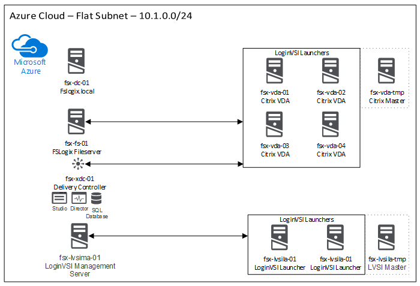

Recently I've been working with FSLogix on producing some storage sizing metrics for Office 365 VHD containers.

I'm happy to announce that this testing is now complete, and we have produced some conclusions for scalability and sizing.

A white paper is available here:

[FSLogix Office 365 Contrainer Scalability and Sizing.pdf](https://www.leeejeffries.com/wp-content/uploads/2019/03/FSlogix-Office-365-Container-Scalability-and-Sizing-V1.0.pdf)

For those interested in the summary results, keep reading.

**Testing Environment:**

The environment used for testing is depicted below.

This environment was built in an automated fashion using AzureRM Templates which I created in VSCode. These templates are available for re-use and can be found in the [FSLogix GitHub Repository](https://github.com/FSLogix/Storage.Testing/).

I won't go into detail on how these templates are used as there is an introductory document within the repo that explains how the solution works.

The environment utilises Citrix as the delivery method for desktops and LoginVSI for testing purposes.

**Running the Tests:**

The simple aim of this testing was to determine the necessary storage IOPS required to support an FSLogix Office 365 Container solution.

I performed testing on Task and Knowledge Worker Workloads using LoginVSI with the Search Index Roaming enabled and disabled on the FSLogix side.

3 tests were run in each scenario and an average of the results taken for each test type.

Storage metrics are based on a standard industry formula:

Recommended IOPS = Average IOPS + (Standard Deviation of IOPS \* 2)

**Testing Results:**

Overall testing results across all tests are shown below, these are the figures to use if you are sizing an FSLogix O365 Container solution.

<table style="border-collapse: collapse;" border="0"><colgroup><col style="width: 328px;"><col style="width: 183px;"><col style="width: 176px;"></colgroup><tbody valign="top"><tr style="height: 20px;"><td style="padding-left: 7px; padding-right: 7px; border: solid 0.5pt;">
<strong>Row Labels</strong>
</td><td style="padding-left: 7px; padding-right: 7px; border-top: solid 0.5pt; border-left: none; border-bottom: solid 0.5pt; border-right: solid 0.5pt;">
<strong>Mean Write IOPS</strong>
</td><td style="padding-left: 7px; padding-right: 7px; border-top: solid 0.5pt; border-left: none; border-bottom: solid 0.5pt; border-right: solid 0.5pt;">
<strong>Mean Read IOPS</strong>
</td></tr><tr style="height: 20px;"><td style="padding-left: 7px; padding-right: 7px; border-top: none; border-left: solid 0.5pt; border-bottom: solid 0.5pt; border-right: solid 0.5pt;">FSLogix_Caching_Indexing_Off_KnowledgeWorker</td><td style="padding-left: 7px; padding-right: 7px; border-top: none; border-left: none; border-bottom: solid 0.5pt; border-right: solid 0.5pt;">5.1</td><td style="padding-left: 7px; padding-right: 7px; border-top: none; border-left: none; border-bottom: solid 0.5pt; border-right: solid 0.5pt;">7.8</td></tr><tr style="height: 20px;"><td style="padding-left: 7px; padding-right: 7px; border-top: none; border-left: solid 0.5pt; border-bottom: solid 0.5pt; border-right: solid 0.5pt;">FSLogix_Caching_Indexing_Off_TaskWorker</td><td style="padding-left: 7px; padding-right: 7px; border-top: none; border-left: none; border-bottom: solid 0.5pt; border-right: solid 0.5pt;">4.8</td><td style="padding-left: 7px; padding-right: 7px; border-top: none; border-left: none; border-bottom: solid 0.5pt; border-right: solid 0.5pt;">8.3</td></tr><tr style="height: 20px;"><td style="padding-left: 7px; padding-right: 7px; border-top: none; border-left: solid 0.5pt; border-bottom: solid 0.5pt; border-right: solid 0.5pt;">FSLogix_Caching_Indexing_On_KnowledgeWorker</td><td style="padding-left: 7px; padding-right: 7px; border-top: none; border-left: none; border-bottom: solid 0.5pt; border-right: solid 0.5pt;">5.7</td><td style="padding-left: 7px; padding-right: 7px; border-top: none; border-left: none; border-bottom: solid 0.5pt; border-right: solid 0.5pt;">8.1</td></tr><tr style="height: 20px;"><td style="padding-left: 7px; padding-right: 7px; border-top: none; border-left: solid 0.5pt; border-bottom: solid 0.5pt; border-right: solid 0.5pt;">FSLogix_Caching_Indexing_On_TaskWorker</td><td style="padding-left: 7px; padding-right: 7px; border-top: none; border-left: none; border-bottom: solid 0.5pt; border-right: solid 0.5pt;">4.5</td><td style="padding-left: 7px; padding-right: 7px; border-top: none; border-left: none; border-bottom: solid 0.5pt; border-right: solid 0.5pt;">7.8</td></tr></tbody></table>

**Examples of Sizing:**

The below table shows examples of sizing taking an average of all tests and multiplying that out by the number of users.

<table style="border-collapse: collapse;" border="0"><colgroup><col style="width: 219px;"><col style="width: 447px;"><col style="width: 457px;"><col style="width: 354px;"><col style="width: 364px;"></colgroup><tbody valign="top"><tr style="height: 25px;"><td style="padding-left: 7px; padding-right: 7px; border: solid 1.0pt;" valign="middle"><strong>Total Users</strong></td><td style="padding-left: 7px; padding-right: 7px; border-top: solid 1.0pt; border-left: none; border-bottom: solid 1.0pt; border-right: solid 1.0pt;" valign="middle">
<strong>Recommended Read IOPS Per User</strong>
</td><td style="padding-left: 7px; padding-right: 7px; border-top: solid 1.0pt; border-left: none; border-bottom: solid 1.0pt; border-right: solid 1.0pt;" valign="middle">
<strong>Recommended Write IOPS Per User</strong>
</td><td style="padding-left: 7px; padding-right: 7px; border-top: solid 1.0pt; border-left: none; border-bottom: solid 1.0pt; border-right: solid 1.0pt;" valign="middle">
<strong>Total Required Read IOPS</strong>
</td><td style="padding-left: 7px; padding-right: 7px; border-top: solid 1.0pt; border-left: none; border-bottom: solid 1.0pt; border-right: solid 1.0pt;" valign="middle">
<strong>Total Required Write IOPS</strong>
</td></tr><tr style="height: 25px;"><td style="padding-left: 7px; padding-right: 7px; border-top: none; border-left: solid 1.0pt; border-bottom: solid 1.0pt; border-right: solid 1.0pt;" valign="middle">100</td><td style="padding-left: 7px; padding-right: 7px; border-top: none; border-left: none; border-bottom: solid 1.0pt; border-right: solid 1.0pt;" valign="middle">8</td><td style="padding-left: 7px; padding-right: 7px; border-top: none; border-left: none; border-bottom: solid 1.0pt; border-right: solid 1.0pt;" valign="middle">5</td><td style="padding-left: 7px; padding-right: 7px; border-top: none; border-left: none; border-bottom: solid 1.0pt; border-right: solid 1.0pt;" valign="middle">800</td><td style="padding-left: 7px; padding-right: 7px; border-top: none; border-left: none; border-bottom: solid 1.0pt; border-right: solid 1.0pt;" valign="middle">500</td></tr><tr style="height: 25px;"><td style="padding-left: 7px; padding-right: 7px; border-top: none; border-left: solid 1.0pt; border-bottom: solid 1.0pt; border-right: solid 1.0pt;" valign="middle">200</td><td style="padding-left: 7px; padding-right: 7px; border-top: none; border-left: none; border-bottom: solid 1.0pt; border-right: solid 1.0pt;" valign="middle">8</td><td style="padding-left: 7px; padding-right: 7px; border-top: none; border-left: none; border-bottom: solid 1.0pt; border-right: solid 1.0pt;" valign="middle">5</td><td style="padding-left: 7px; padding-right: 7px; border-top: none; border-left: none; border-bottom: solid 1.0pt; border-right: solid 1.0pt;" valign="middle">1600</td><td style="padding-left: 7px; padding-right: 7px; border-top: none; border-left: none; border-bottom: solid 1.0pt; border-right: solid 1.0pt;" valign="middle">1000</td></tr><tr style="height: 25px;"><td style="padding-left: 7px; padding-right: 7px; border-top: none; border-left: solid 1.0pt; border-bottom: solid 1.0pt; border-right: solid 1.0pt;" valign="middle">300</td><td style="padding-left: 7px; padding-right: 7px; border-top: none; border-left: none; border-bottom: solid 1.0pt; border-right: solid 1.0pt;" valign="middle">8</td><td style="padding-left: 7px; padding-right: 7px; border-top: none; border-left: none; border-bottom: solid 1.0pt; border-right: solid 1.0pt;" valign="middle">5</td><td style="padding-left: 7px; padding-right: 7px; border-top: none; border-left: none; border-bottom: solid 1.0pt; border-right: solid 1.0pt;" valign="middle">2400</td><td style="padding-left: 7px; padding-right: 7px; border-top: none; border-left: none; border-bottom: solid 1.0pt; border-right: solid 1.0pt;" valign="middle">1500</td></tr><tr style="height: 25px;"><td style="padding-left: 7px; padding-right: 7px; border-top: none; border-left: solid 1.0pt; border-bottom: solid 1.0pt; border-right: solid 1.0pt;" valign="middle">400</td><td style="padding-left: 7px; padding-right: 7px; border-top: none; border-left: none; border-bottom: solid 1.0pt; border-right: solid 1.0pt;" valign="middle">8</td><td style="padding-left: 7px; padding-right: 7px; border-top: none; border-left: none; border-bottom: solid 1.0pt; border-right: solid 1.0pt;" valign="middle">5</td><td style="padding-left: 7px; padding-right: 7px; border-top: none; border-left: none; border-bottom: solid 1.0pt; border-right: solid 1.0pt;" valign="middle">3200</td><td style="padding-left: 7px; padding-right: 7px; border-top: none; border-left: none; border-bottom: solid 1.0pt; border-right: solid 1.0pt;" valign="middle">2000</td></tr><tr style="height: 25px;"><td style="padding-left: 7px; padding-right: 7px; border-top: none; border-left: solid 1.0pt; border-bottom: solid 1.0pt; border-right: solid 1.0pt;" valign="middle">500</td><td style="padding-left: 7px; padding-right: 7px; border-top: none; border-left: none; border-bottom: solid 1.0pt; border-right: solid 1.0pt;" valign="middle">8</td><td style="padding-left: 7px; padding-right: 7px; border-top: none; border-left: none; border-bottom: solid 1.0pt; border-right: solid 1.0pt;" valign="middle">5</td><td style="padding-left: 7px; padding-right: 7px; border-top: none; border-left: none; border-bottom: solid 1.0pt; border-right: solid 1.0pt;" valign="middle">4000</td><td style="padding-left: 7px; padding-right: 7px; border-top: none; border-left: none; border-bottom: solid 1.0pt; border-right: solid 1.0pt;" valign="middle">2500</td></tr><tr style="height: 25px;"><td style="padding-left: 7px; padding-right: 7px; border-top: none; border-left: solid 1.0pt; border-bottom: solid 1.0pt; border-right: solid 1.0pt;" valign="middle">600</td><td style="padding-left: 7px; padding-right: 7px; border-top: none; border-left: none; border-bottom: solid 1.0pt; border-right: solid 1.0pt;" valign="middle">8</td><td style="padding-left: 7px; padding-right: 7px; border-top: none; border-left: none; border-bottom: solid 1.0pt; border-right: solid 1.0pt;" valign="middle">5</td><td style="padding-left: 7px; padding-right: 7px; border-top: none; border-left: none; border-bottom: solid 1.0pt; border-right: solid 1.0pt;" valign="middle">4800</td><td style="padding-left: 7px; padding-right: 7px; border-top: none; border-left: none; border-bottom: solid 1.0pt; border-right: solid 1.0pt;" valign="middle">3000</td></tr><tr style="height: 25px;"><td style="padding-left: 7px; padding-right: 7px; border-top: none; border-left: solid 1.0pt; border-bottom: solid 1.0pt; border-right: solid 1.0pt;" valign="middle">700</td><td style="padding-left: 7px; padding-right: 7px; border-top: none; border-left: none; border-bottom: solid 1.0pt; border-right: solid 1.0pt;" valign="middle">8</td><td style="padding-left: 7px; padding-right: 7px; border-top: none; border-left: none; border-bottom: solid 1.0pt; border-right: solid 1.0pt;" valign="middle">5</td><td style="padding-left: 7px; padding-right: 7px; border-top: none; border-left: none; border-bottom: solid 1.0pt; border-right: solid 1.0pt;" valign="middle">5600</td><td style="padding-left: 7px; padding-right: 7px; border-top: none; border-left: none; border-bottom: solid 1.0pt; border-right: solid 1.0pt;" valign="middle">3500</td></tr><tr style="height: 25px;"><td style="padding-left: 7px; padding-right: 7px; border-top: none; border-left: solid 1.0pt; border-bottom: solid 1.0pt; border-right: solid 1.0pt;" valign="middle">800</td><td style="padding-left: 7px; padding-right: 7px; border-top: none; border-left: none; border-bottom: solid 1.0pt; border-right: solid 1.0pt;" valign="middle">8</td><td style="padding-left: 7px; padding-right: 7px; border-top: none; border-left: none; border-bottom: solid 1.0pt; border-right: solid 1.0pt;" valign="middle">5</td><td style="padding-left: 7px; padding-right: 7px; border-top: none; border-left: none; border-bottom: solid 1.0pt; border-right: solid 1.0pt;" valign="middle">6400</td><td style="padding-left: 7px; padding-right: 7px; border-top: none; border-left: none; border-bottom: solid 1.0pt; border-right: solid 1.0pt;" valign="middle">4000</td></tr><tr style="height: 25px;"><td style="padding-left: 7px; padding-right: 7px; border-top: none; border-left: solid 1.0pt; border-bottom: solid 1.0pt; border-right: solid 1.0pt;" valign="middle">900</td><td style="padding-left: 7px; padding-right: 7px; border-top: none; border-left: none; border-bottom: solid 1.0pt; border-right: solid 1.0pt;" valign="middle">8</td><td style="padding-left: 7px; padding-right: 7px; border-top: none; border-left: none; border-bottom: solid 1.0pt; border-right: solid 1.0pt;" valign="middle">5</td><td style="padding-left: 7px; padding-right: 7px; border-top: none; border-left: none; border-bottom: solid 1.0pt; border-right: solid 1.0pt;" valign="middle">7200</td><td style="padding-left: 7px; padding-right: 7px; border-top: none; border-left: none; border-bottom: solid 1.0pt; border-right: solid 1.0pt;" valign="middle">4500</td></tr><tr style="height: 25px;"><td style="padding-left: 7px; padding-right: 7px; border-top: none; border-left: solid 1.0pt; border-bottom: solid 1.0pt; border-right: solid 1.0pt;" valign="middle">1000</td><td style="padding-left: 7px; padding-right: 7px; border-top: none; border-left: none; border-bottom: solid 1.0pt; border-right: solid 1.0pt;" valign="middle">8</td><td style="padding-left: 7px; padding-right: 7px; border-top: none; border-left: none; border-bottom: solid 1.0pt; border-right: solid 1.0pt;" valign="middle">5</td><td style="padding-left: 7px; padding-right: 7px; border-top: none; border-left: none; border-bottom: solid 1.0pt; border-right: solid 1.0pt;" valign="middle">8000</td><td style="padding-left: 7px; padding-right: 7px; border-top: none; border-left: none; border-bottom: solid 1.0pt; border-right: solid 1.0pt;" valign="middle">5000</td></tr><tr style="height: 25px;"><td style="padding-left: 7px; padding-right: 7px; border-top: none; border-left: solid 1.0pt; border-bottom: solid 1.0pt; border-right: solid 1.0pt;" valign="middle">2000</td><td style="padding-left: 7px; padding-right: 7px; border-top: none; border-left: none; border-bottom: solid 1.0pt; border-right: solid 1.0pt;" valign="middle">8</td><td style="padding-left: 7px; padding-right: 7px; border-top: none; border-left: none; border-bottom: solid 1.0pt; border-right: solid 1.0pt;" valign="middle">5</td><td style="padding-left: 7px; padding-right: 7px; border-top: none; border-left: none; border-bottom: solid 1.0pt; border-right: solid 1.0pt;" valign="middle">16000</td><td style="padding-left: 7px; padding-right: 7px; border-top: none; border-left: none; border-bottom: solid 1.0pt; border-right: solid 1.0pt;" valign="middle">10000</td></tr></tbody></table>

**Summary:**

Read IOPS don't cost much and Write IOPS of 5 per user is a nice low value. The folks at FSLogix have mentioned that with Cloud cache this could be even lower reducing the IOP load on the backend storage in a similar way to MCS/PVS Disk Caching.

For all the details and full write-up and results please do take a look at the whitepaper - [FSLogix Office 365 Contrainer Scalability and Sizing.pdf](https://www.leeejeffries.com/wp-content/uploads/2019/03/FSlogix-Office-365-Container-Scalability-and-Sizing-V1.0.pdf)
