A while ago LoginVSI announced that LoginAT was going to be released in an Express Edition. This meant that anyone could use LoginAT to verify applications in Virtual Environments for FREE!

So, what is LoginAT?

LoginAT is a Virtual Appliance that you can run on most HyperVisors which collates screengrabs of applications that are run by unattended PowerShell scripts, these images are then compared against reference images which can then be reviewed to see if anything has changed with your applications.

If you think about the use cases here, you could roll out an update on a Virtual Image to a test server and then have these scripts run to launch all applications and check for any differences from a previous build.

Whats more, because it is controlled by PowerShell its absolutely possible that you can integrate this screengrab process into othe actions of Automation too!

Let's dive a little deeper and take a look.

**Setup:**

Grab the Virtual Appliance package from the LoginVSI website here:

[https://www.loginvsi.com/downloads](https://www.loginvsi.com/downloads)

Import the Appliance:

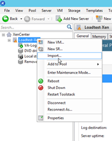

The prompts are all straigh forward so follow those through. More detail can be found [here](https://support.loginvsi.com/hc/en-us/articles/360004060880-Deploy-OVA-Template-on-Citrix-XenServer)

Once imported, start the appliance, you'll be prompted to login, use admin and admin as credentials.

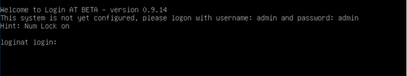

You'll now be prompted to enter some configuration information, enter a hostname and domain name, if you use a dynamic IP a DNS registration should take place, if its static though you must make sure you add a DNS entry manually for the appliance, **its required for the setup.**

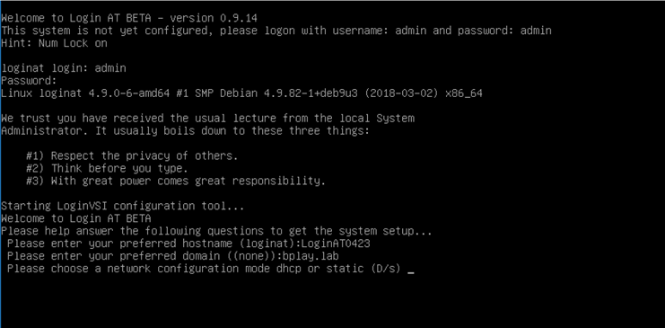

Place in the relevant details if you selected a static IP. You will then be prompted to change the password.

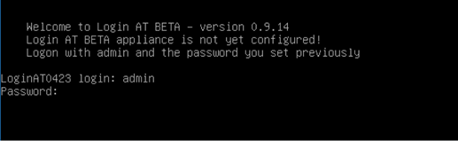

The appliance will then reboot and should be accessible by the name that you selected. Head over to Chrome or your favourite browser and type in the address [https://loginat0423.bplay.lab](https://loginat0423.bplay.lab) (where this address is what you selected)

**UI:**

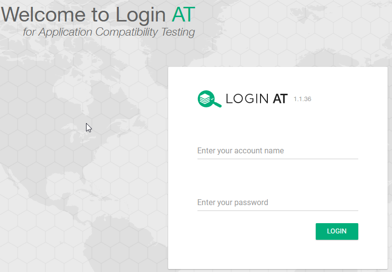

You'll be prompt to login to the appliance at this stage. Enter the details previously configured.

You'll see immediately that you are provided with an almost – step-by-step approach for configuration.

- Applications – Specify all the applications and command lines for the applications you wish to run.
- Recipes – Logically group a set of applications to run
- Results – Review results of screengrabs and configure your reference images
- Assignments – Assign which tests are run on which machines (Not scriptly necessary though)

We start off in applications.

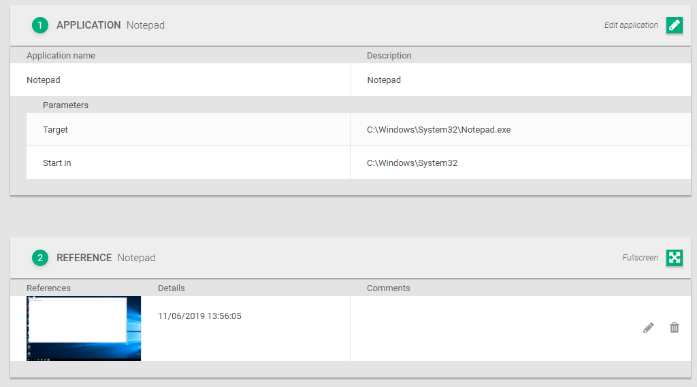

You can see here I've populated Notepad as an application.

Moving to Recipes.

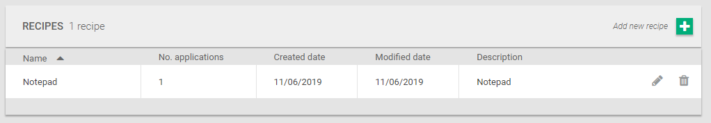

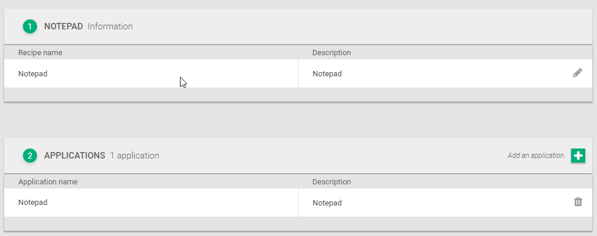

I've added Notepad to its very own recipe as that is what I intent to run.

We're now ready to run this recipe on a host. Let download the script package.

This will download a zip file for you which looks like this:

**Runtime:**

Hop onto a machine with your applications installed, the only requirements is that it can find the LoginAT server.

Extract the zip file into a folder like this:

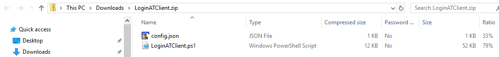

Fire up a powershell window and run the command as below.

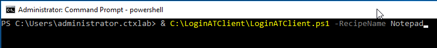

You will see the script start to run, don't interfere with the running of the script.

Run this a few more times, on one of the runs, interfere with the notepad window.

Once that is complete, head back over to LoginAT's Dashboard and select Results.

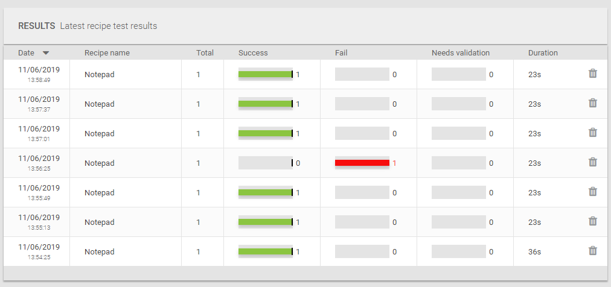

You can see here I have several successful runs and a failure. Let's take a look at the failure first.

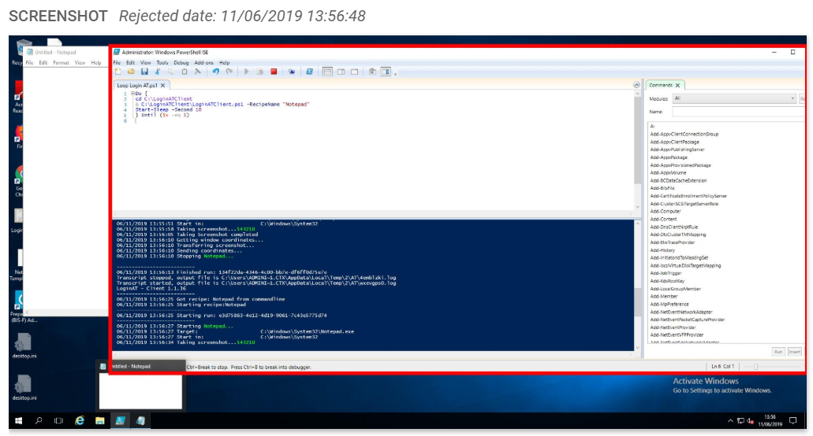

You can see here, I stuck the Powershell window directly in front of Notepad and its picked up that its an incorrect view of Notepad and therefore failed the validation.

But how does it know?

When you are viewing a failed run you have the option to accept this as a reference for future comparisons.

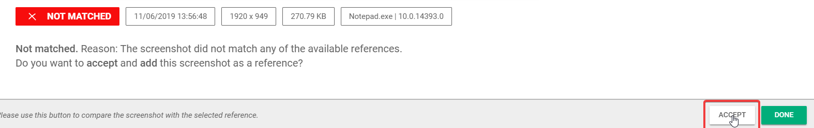

This then creates a reference image. When you first run the script the first image will fail validation (as there is no comparison).

Reference images can be found under Applications\\Notepad\\Reference:

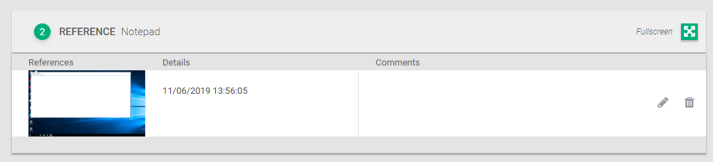

If Notepad does not open like the below, then the validation will fail and you will know your application is different from your previous build.

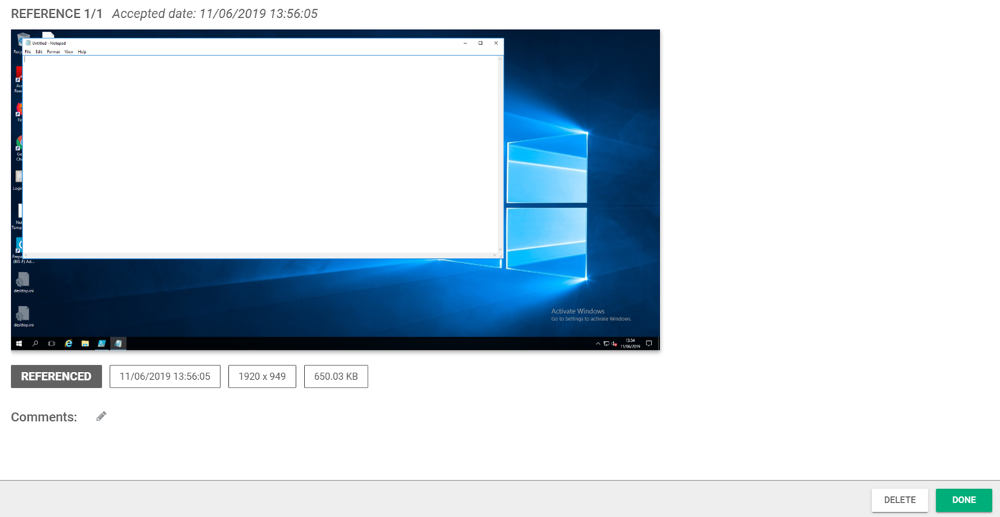

**Conclusion:**

The conclude, this tool is quite simple at present but the bare bones of the PowerShell is available and there are a lot of cool use cases which could be implemented in an Automation Framework that will validate applications sets quickly and easily allowing for very little user input.

If you coupled this with LoginPI and LoginVSI you have a complete circle of Load Testing, Validation and Predictive User Experience all in one package. I personally would really like to see a little more integration with these 3 products to allow users to easily achieve this lifecycle approach.

Thanks for reading as always, please feel free to ask any questions on Twitter, Linkedin or Slack.

**Request a free express license:**

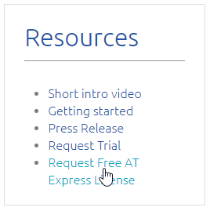

[https://www.loginvsi.com/968-login-at-express-application-compatibility#a](https://www.loginvsi.com/968-login-at-express-application-compatibility#a)
