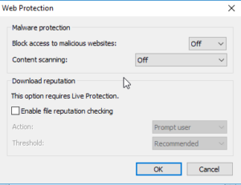

I had to write this blog post after a rather long haul in attempting to resolve an issue with a Sophos XG Firewall and its Web Filtering Policies.

The Web Filtering Policies on XG Firewalls are assigned to users based on them being logged into a windows machine via a certain IP. This is fine but when you're working with Server Based Computer solutions this can cause a bit of an issue due to multiple users per IP/Server.

Sophos have a small piece of software that deals with this and reports the correct information to the Firewall for the Web Filtering Policies for be applied correctly. This piece of software is called SATC.

After configuring everything necessary in this [Sophos SATC Walkthrough](https://community.sophos.com/kb/en-us/127157){:target="_blank"} I still had nothing working. The logs look good, the firewall sees the user login and its recorded but then any subsequent web request dont contain the user details.

After lengthly calls with Sophos and getting nowhere, I finally posted on Twitter. A quick response from Sophos prompted an arrangement for another call. Okay.....

This call was more productive, after an hour the Engineer managed to pinpoint it was a flag in Chrome "Runs network service in-process" and a problem with the A/V stopping it working.

**Sophos Anti-Virus breaks Sophos Firewall Authentication!!!**

Still, at least I had a way forward this time. So, lets split these two things out.

### Anti-Virus Policy Settings

If you are using Sophos Anti-Virus with SATC then you need the following configure (or not configured in this case) within your AV Policy within the Enterprise Management Console:

Web protection **Off** and content scanning **Off**, I dont know why this conflicts. Fingers crossed some of the folks at Sophos can work this one out.

### **Chrome Flags**

The setting in Chrome for the flag _chrome://flags/#network-service-in-process_ seems make chrome run its networking process in the same service as chrome.exe. From what I've read chrome is being made more modular and splitting certain tasks into seperate processes.

The get SATC to work correctly this needs to be enabled. The kicker! There is no way to enable this through the registry or through GPOs. I did this.


GPP - Registry
HKEY\_CLASSES_ROOT\ChromeHTML\shell\open\command\
Default - REG_SZ
"C:\Program Files (x86)\Google\Chrome\Application\chrome.exe" --enable-features=NetworkServiceInProcess "%1"

GPP - Shortcut:
"C:\Program Files (x86)\Google\Chrome\Application\chrome.exe" --enable-features=NetworkServiceInProcess

This bascially ensures that all shortcuts enable this flag when being run and also any links that kick off a chrome instance internally also enable the flag on launch.

I really hope this helps someone resolve this much more quickly.

I want to thank my client for their patience and I was to thank Sophos for the speedy support from the tweet.
