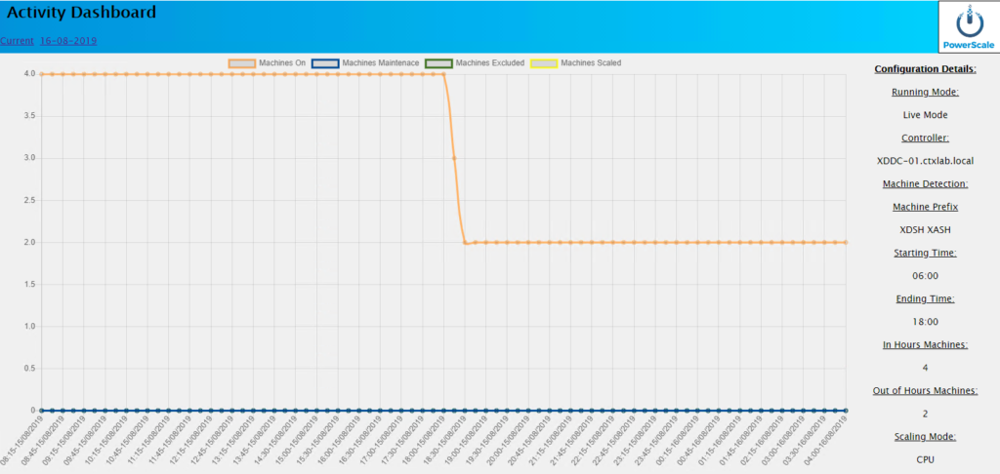

I've recently finished working on the latest release of PowerScale with some really large changes that were requested during the Webinar last week. If you didn't catch it please head over to CUCG and take a look at the [webinar recording](https://www.mycugc.org/viewdocument/user-share-08-08-19-bye-smartsca?CommunityKey=985b2901-30d5-47f8-a86d-5972ee9942ea&tab=librarydocuments){:target="_blank"}. We covered alot of config and setup as well as advanced configuration options and a general overview of what the script does.

Anyway, I've been working hard and have managed to pull alot into this release. The lastest features:

- **Highlights:**
    - Reduced script runtime and resource due to RunSpaces being implemented
    - CIM implemented for performance monitoring simplifying the setup and adding better compatibility
    - Bug fixes with regards to time comparisons
- **Bugs:**
    - Fixed a time comparison issue where out of hours would be an hour later than the config
    - Performance monitoring would spam the logs with hugs amount of error data during a failure
    - Memory percentage calculation incorrect
- **Features:**
    - Added additional machine classification options - Prefix, Delivery Group, Machine Catalog, Tags
        - Configuration script supports multiple entries of each classification type
    - Added additional information on the Dashboard
        - Machine detection type and details
        - Machine number configured inside and outside of hours
        - Dashboard recycling time
        - Dashboard and log retention numbers
        - Monitoring threads configured for parallel processing
    - Changed performance monitoring from Get-Counter/WMI based access to CIM
        - Each metric is automatically an average of the last minutes activity
        - Sample number and interval have been removed as options as they are no longer applicable
    - Changed performance monitoring to use RunSpaces to parallel process and reduce overhead
        - Script run times have reduced from minutes to seconds
        - Memory overhead is considerably lower - around 30%
    - Configurable monitoring threads
        - The maximum number of threads can be specified within the configuration for the RunSpace so jobs will either queue if resources are sparse or a higher number can be specified to allow a much larger number of machines to be processed.

The addition of RunSpaces has been a complete game changer, the script runs much quicker that it did with jobs and will be much more scalable.

I want to thank Guy Leech - [@guyrleech](https://twitter.com/guyrleech){:target="_blank"} for the pointers on RunSpaces, he helped me see the method in my madness after I stared at RunSpaces for about a day.

We've moved the chat over to the Slack workspace - come and join us there.

[https://worldofeuc.slack.com/messages/CLCSCA8LR](https://worldofeuc.slack.com/messages/CLCSCA8LR){:target="_blank"}
