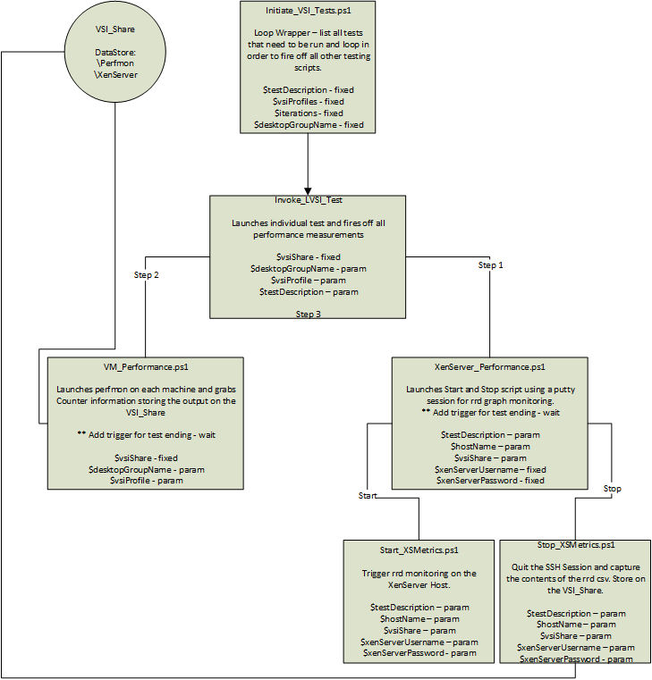
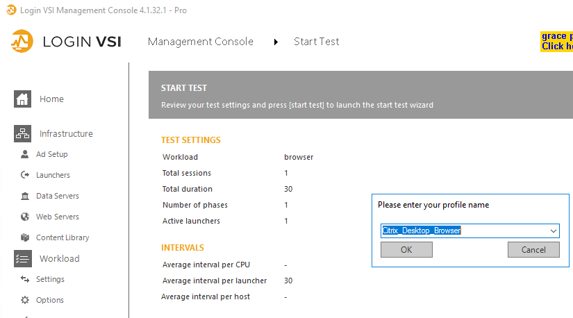

I've been working on a project recently where I'm going to be performance testing a new environment. As always in projects, timescales can be compressed due to issue and delays.

I've worked on automating the performance testing piece so that this can be completed unattended and in a faster space of time.

We need to do a few things during the load testing period.

- Capture XenServer performance metrics and store in a CSV
- Capture VM perfmon counters and store in a CSV
- Ensure all machines are registered with the Citrix Delivery Controller(s)
- Run the load test
- End XenServer performance capture
- End VM perfmon capture
- Reset the environment before the next load test begins

**Overview:**

These scripts are designed to run on your LoginVSI Management server. You will require Citrix Studio installed and a 3rd party module for SSH (will be included in the script pack).

The following diagram is an overview of how the scripts link together:

I'll split the remainder of the article into separate pieces, XenServer, Perfmon and Load Testing.

## XenServer:  

XenServer has a web API to capture performance but it's a bit slow and cumbersome to manage in this particular sense so I've gone down the SSH route.

The below process is completed by 3 separate scripts.

XenServer\_Performance.ps1 is responsible for running the start of the XenServer monitoring and when the LoginVSI test is complete, firing off the Stop script.

All parameters required are supplied by the main launch script. The script also installs the required SSH module.

## Perfmon:  

A list of servers can be specified for performance monitoring and the counters manually amended within the scripts where necessary.

The performance monitoring script using the PowerShell Get-Counter command, make sure the account you are running the script with is in the "Performance Monitor Users" group of the VM's being monitored.

The script will start the capturing before the test starts and will stop once the test completes.

## LoginVSI:  

The loginVSI test script passes all the necessary parameters to the LoginVSI command line tool.

You must manually generate your performance testing profiles within the LoginVSI console before you can run these scripts.

## Wrapper:  

The wrapper script or main launch script – Initiate\_VSI\_tests.ps1 is where you populate all your parameters.

This script will pass all required information to other scripts and is responsible for running the loops and ensuring the environment is ready before testing.

It watches the loginVSI log folder for the test to see if there are errors or if it is complete and amends a common logfile to all scripts. This indiciates to the other scripts that are also watching this logfile to stop recording metrics.

**Parameters:**

The following parameters must be set in the scripts in order for it to all function correctly:


###Common Details Section###  
[string] $vsishare = "\\loginvsi-01.ctxlab.local\VSI_Share" # \\servername\sharename used a base for other scripts  
[int] $testDuration = 30 # Number of minutes to run test  
[string] $desktopGroupName = "PowerScale" # Name of desktop delivery group  
[int] $testCycles = 3 # Number of cycles for each test  
[string[]]$testProfiles = "Citrix_Desktop_TW"  
###Common Details Section###

###LVSI Testing Section###  
[string] $lvsiScriptLocation = "C:\Scripts\LVSI\Invoke_LVSI_Test.ps1"  
[string] $DomainName = "ctxlab.local" #Domain of launcher account  
[string[]] $launchers = "loginvsi-01.ctxlab.local" #server name for LoginVSI launcher machine  
[string] $VSILogFile = "\\loginvsi-01.ctxlab.local\VSI_Share\My_Logs" # Path to log files \\servername\sharename  
###LVSI Testing Section###

###XenServer Monitoring Section###  
[string] $xenScriptLocation = "C:\Scripts\XenServer\XenServer_Performance.ps1" #Xen performance measurement start script  
[string] $xenStartScript = "C:\Scripts\XenServer\Start-XSMetrics.ps1" #Start monitoring script  
[string] $xenStopScript = "C:\Scripts\XenServer\Stop-XSMetrics.ps1" #Stop monitoring script  
[string[]] $xenHostNames = "192.168.101.202","192.168.101.204","192.168.101.206","192.168.101.208" #Hostname/IP of the XenServer to monitor  
[string] $xenServerUsername = "root" #XenServer username  
[string] $xenServerPassword = "xxxxxxx" # XenServer password  
###XenServer Monitoring Section###

###VM Perfmon Monitoring###  
[string] $citrixController = "XDDC-01.ctxlab.local" # Citrix Controller  
[string] $perScriptLocation = "C:\Scripts\VM_Perfmon\Perfmon.ps1"  
[string] $additionalMachines = "dc-01.ctxlab.local","loginvsi-01.ctxlab.local"  
###VM Perfmon Monitoring###  


**Download:**

You can download the script pack here.

[https://www.leeejeffries.com/wp-content/uploads/2019/10/LVSI\_Load\_Testing.zip](https://www.leeejeffries.com/wp-content/uploads/2019/10/LVSI_Load_Testing-1.zip)

**References**:

Daniel Feller - [https://virtualfeller.com/powershell/](https://virtualfeller.com/powershell/)

Logit Blog - [https://www.logitblog.com/capturing-citrix-xenserver-performance-data-with-powersh](https://www.logitblog.com/capturing-citrix-xenserver-performance-data-with-powershell/)[ell/](https://www.logitblog.com/capturing-citrix-xenserver-performance-data-with-powershell/)
