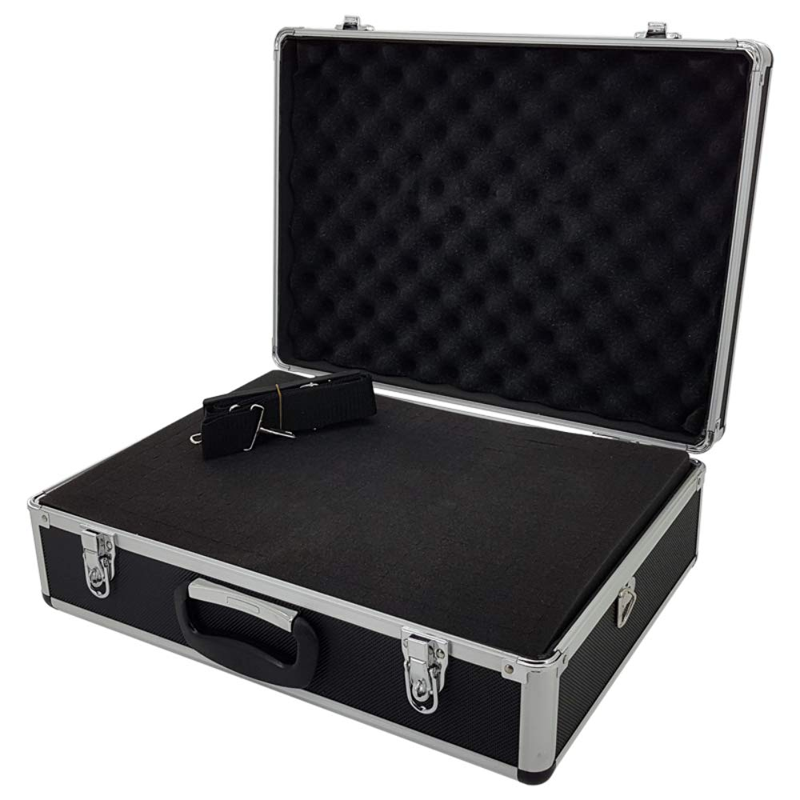
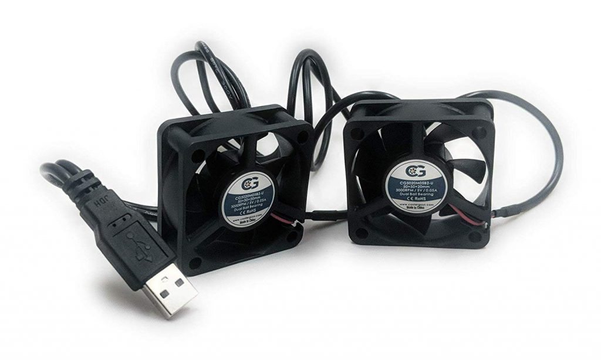
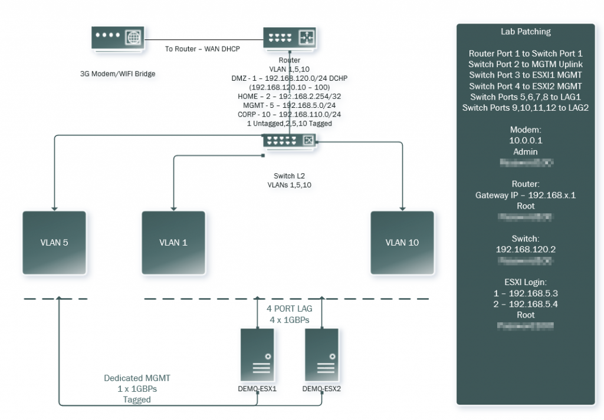
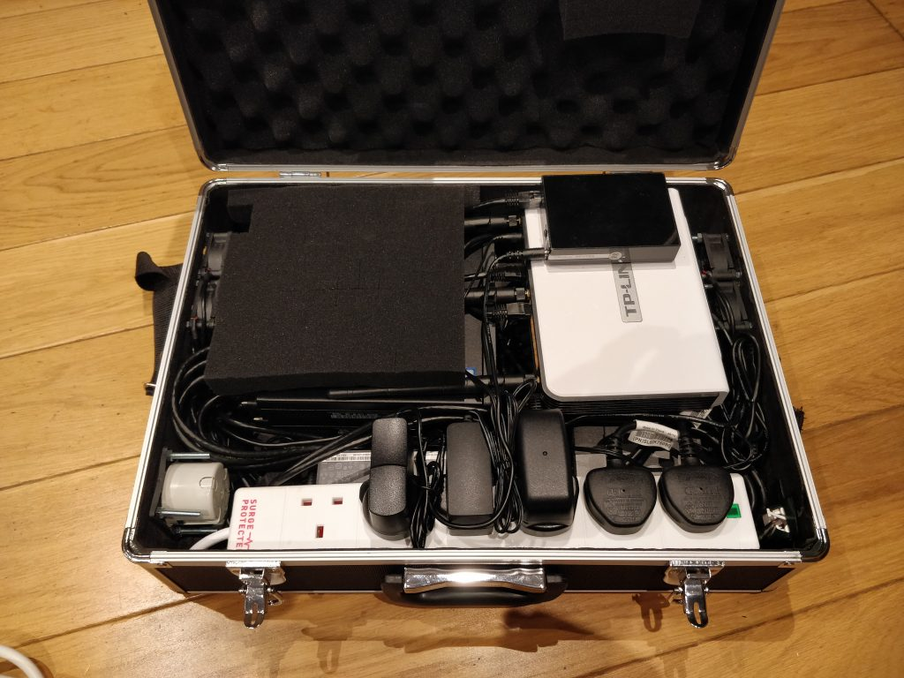
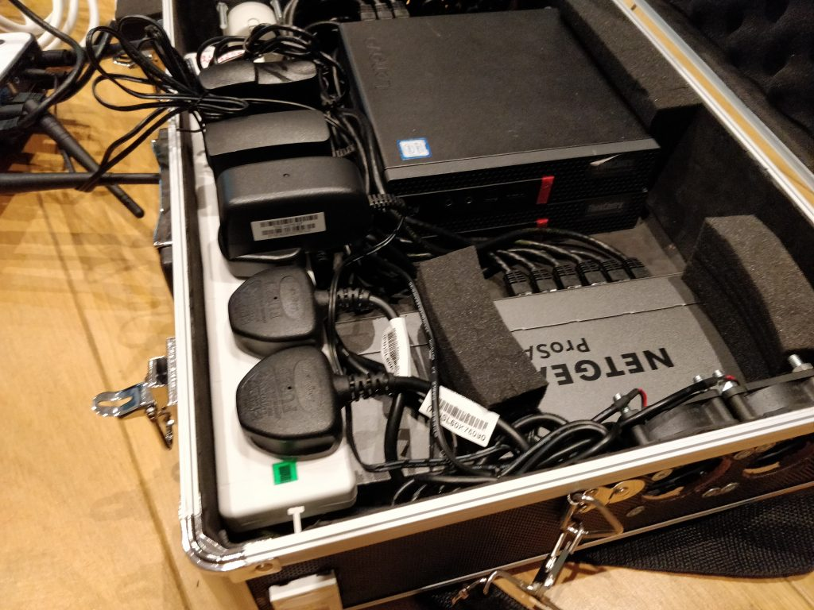
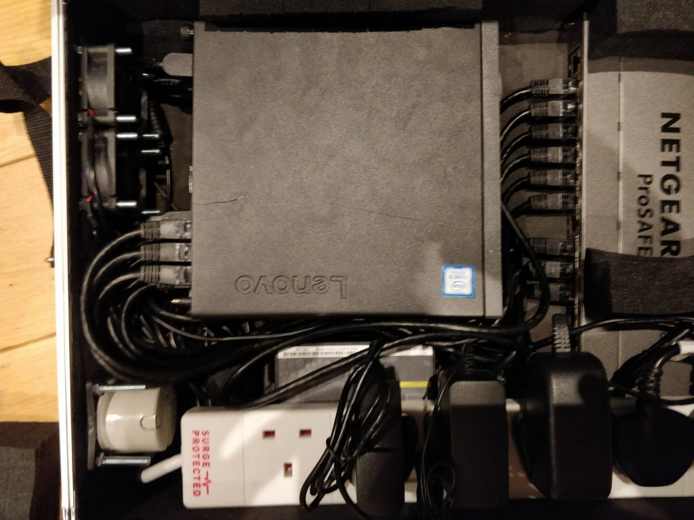
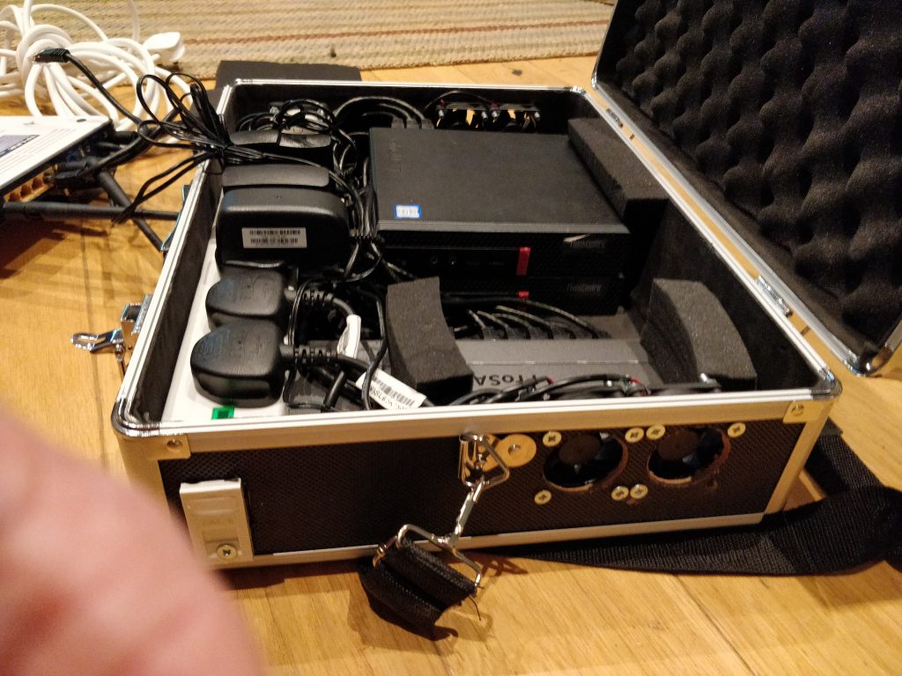
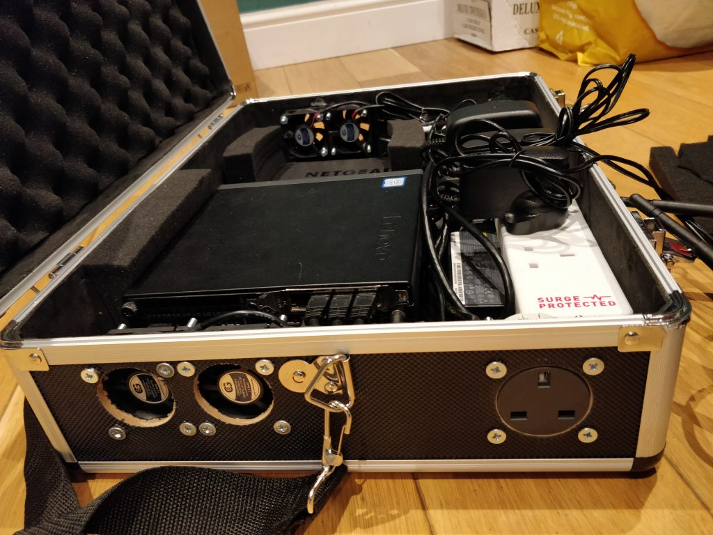
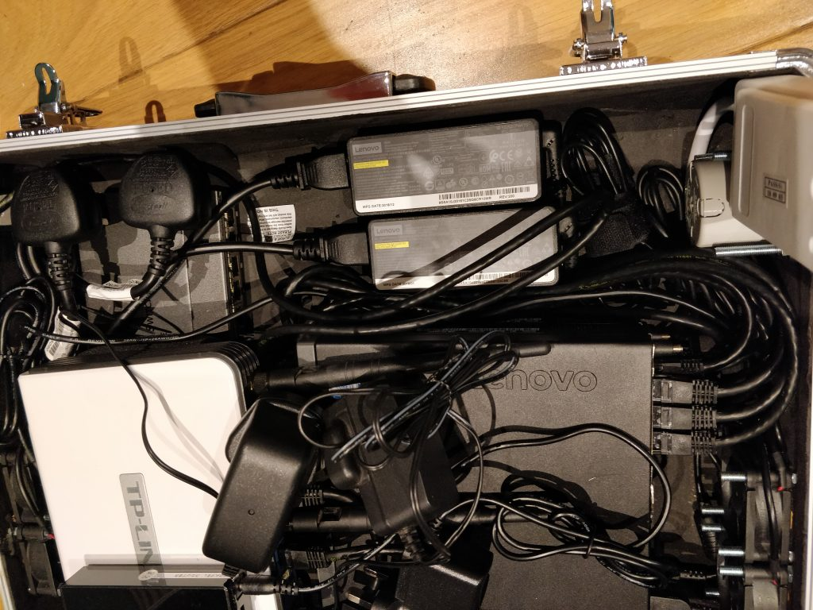
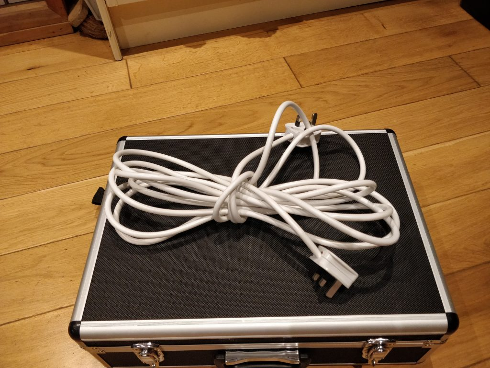

Recently I had the idea that it would be cool to build a small lab for demonstrations etc... in a suitcase. I've see quite a few people build a 4 node datacenter in a 1/2U rack flight box but I wanted something easily portable that I could take to events etc... and use in presentations.

I had a few demo units lying around that I'd use previously and I wanted to make this without really buying any additional hardware, maybe upgrades but no additional kit.

The hardware I had lying around:

- 2 x Lenovo M720q Desktop machines
    - Core i3 8100T (3.1Ghz quad core) (4 Threads)
    - 8GB Ram
    - 128GB NVMe
    - 5 x 1GB Ethernet Ports
- TPLink - WR1043ND WiFi Router
- NetGear GS116Ev2 - 16 Port Gigabit Managed Switch
- YOYORouter EE1 - 4G Router/WiFi Bridge

Looking at the specs above, this wasn't going to be enough in the way of CPU and memory for what I wanted. So I grabbed some additional parts to upgrade the host units.

I upgraded them with the following:

- Core i7 8700T (1.6GHz hexa core) (6 Threads)
- 32GB Ram
- 512GB NVMe

With these upgrades added I now have 24 vCPU and 64GB of Ram, good enough for a portable lab, I could swap these units out for E200-8D/E300-8D's later if I need additional capacity.

I needed to find a case that was suitable to cut holes in etc... and to fit all this equipment in with some airflow. This bit was more of a guess than anything else. I went on the hunt. The below picture is the actual suitcase I chose what was just about big enough for all the components.

I initially layed all the components in the case to make sure I had enough space for everything to properly fit. Once it was all fit in the nicely I marked the locations of all the fans and connectivity points with masking tape.

For this to be successful I did not at any point want to actually open the case. I just wanted to be able to "plug and play". I found a caravan socket fitting and had an old CAT6 module lying around. I decided that these would also be mounted into the case and exposed to the outside world for me to link into for demos. I selected specific fans which I knew would be quiet and that I had used before.

These 50mm fans from amazon are fairly silent and run directly from a USB port, ideal being as I have two desktop like machines in there with USB ports.

I also ordered some dust filters and vent guards but they have not arrived just yet so they wont be photgraphed I'm afraid. I'll include a parts list with links at the bottom of the article for anyone that is interested in doing something similar.

So what did we have here? Logically it looks like this:

I decided to use the onboard nic on the M720 units for management of the ESXi units and then aggregate the remaining 4 ports in a static LAG which the Netgear supports.

The Netgear is a simple layer 2 switch with VLAN 802.1Q tagging functionality. The trick for me was the router, I needed this to be my gateway for all VLAN's to firewall off what what I did need, I then added th YoYo Router which can bridge with an existing WiFi network for externaly connectivity, this connection is then NAT'ed through the WR1043ND Router.

So, what about that WR1043ND firmware? OpenWRT actually supports the router and also VLAN tagging is a function supported. I headed over to OpenWRT downloaded the firmware, I ran through the normal upload process, this wasn't working. Eventually I relented, cracked open the box and used the onboard serial header and flashed using UBoot command and a small TFTP server. This then let me setup the VLANs I was after and allow tagging to route everything the switch.

So what does it all look like?

Top down view with everything plugged in, the YoYoRouter is stuck to the TP-Link.

Without the router in place, the foam blocks are stick to the switch and raise the router to provide a space for airflow level with the tops of the fans to flow directly to the computer units.

All network cables snuggle in between powerblogs for the computer units.

As I mentioned the fan covers have not yet arrived so, missing a screw and quite naked at the moment (air intake). Notice the CAT6 module. For the record I hate this and will probably change it later.

This side is the electric hookup and the air exhaust, all air should flow directly through the ESXi hosts.

With the exension lifted, the only thing under the extension is the switch and power blocks. Its quite tight in there.

Notice the double plug extension so I can simply plug it in

So with travel in mind, I decided to test that everything will stay in place.

I ran around with the case like a crazy man shaking it, nothing moved! This is what I call progress.

The lab machines power on automatically and launch ESXi, VCenter is setup to power on automatically also. The router inside the case advertises a WiFi network for me so I can connect in either wired or wirelessly. I plan to use this mobile lab to provide demonstrations for Citrix SDWAN, ADC, Virtualisation and MDT automation.

## The Parts List:

- [Flight Case](https://selloscope.com/item/Aluminium-Flight-Case-460x330x150mm/B0-0C-BF-VO-FM){:target="_blank"}
- [Electric Socket](https://www.towsure.com/berker-13a-250v-socket-anthracite?gclid=CjwKCAiA66_xBRBhEiwAhrMuLRB8HR6vBjOHFp7Ca_GpcGKtEfACMzym7yQdd8h51a5pQCHY_dvRyBoCWK0QAvD_BwE){:target="_blank"}
    - [Backing Box](https://www.towsure.com/berker-single-backing-box){:target="_blank"}
- [Cooling Fans](https://www.amazon.co.uk/gp/product/B005QRMAJG/ref=ppx_yo_dt_b_asin_title_o02_s00?ie=UTF8&psc=1){:target="_blank"}
- [Lenovo Units](https://www.lenovo.com/gb/en/desktops-and-all-in-ones/thinkcentre/m-series-tiny/ThinkCentre-M720q/p/10T700A8UK){:target="_blank"}
- [NetGear Switch](https://www.netgear.com/support/product/GS116Ev2.aspx){:target="_blank"}
- [TP-Link WR1043ND (Newer Model)](https://www.tp-link.com/uk/home-networking/wifi-router/tl-wr1043nd/#qrcode){:target="_blank"}
- [YoYo Router](https://www.yoyomotion.com/Filer/YOYOCam3G/YOYORouter/YOYORouter_EE1_product_flyer_eng.pdf){:target="_blank"}
