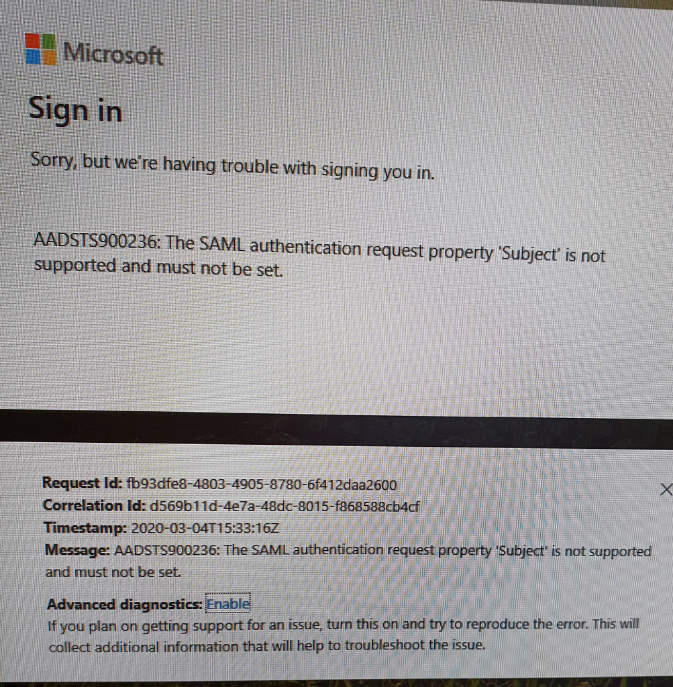

Recently i've been working on a project where the client wanted to seamlessly move users from the traditional 2FA pin code + token code to Azure MFA instead. I said of course that this would be seamless, Citrix ADC and Nfactor would take away all the hassle.

So the requirement was simple, the user puts in the samAccountName on the login page, group extraction is performed, dependent on the group membership you are either presented with the traditional login page (username, password, pin+token) or you are redirected off using SAML to O365 and you are presented with the standard prompts to sign in with MFA.

All of it was going so well until I got the SAML part. I received this error message.

"The SAML authentication request property 'Subject' is not supported and must not be set."

If I tested the SAML authentication without NFactor it worked absolutely fine. So.... whats the problem?

I reached out to my learned colleagues on slack and Mads Petersen was able to give me the answer to my question.

Microsoft states here: [https://docs.microsoft.com/en-us/azure/active-directory/develop/single-sign-on-saml-protocol](https://docs.microsoft.com/en-us/azure/active-directory/develop/single-sign-on-saml-protocol){:target="_blank"} Azure AD ignores the subject element of the AuthnRequest but it doesn't.

There is a way however to tell the ADC not to set the subject at all (even though Azure should ignore it).  
Putty in to the ADC and run the following command:

shell nsapimgr_wr.sh -ys call=ns_saml_dont_send_subject

This then enables the flow correctly without error. Should require this to be persistent across reboots, edit your /nsconfig/rc.netscaler file to add the line:  
nsapimgr\_wr.sh -ys call=ns\_saml\_dont\_send\_subject

I hope it saves someone else some time too.
