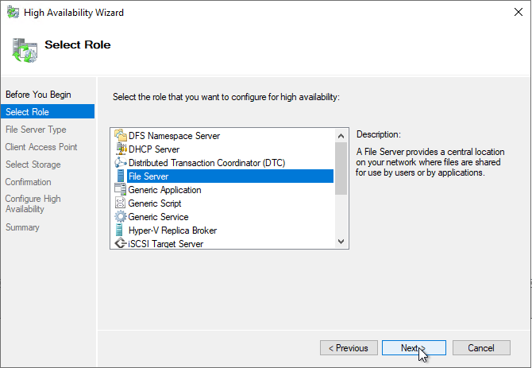

Many vendors have released profile disk solutions and since that time there has been a very large amount of people with queries about the kind of storage that's necessary in order to support user's profile disks. This blog post will aim to show you a potential solution in a scenario.

In general, if you have a Hypervisor cluster with some shared storage you can build a highly available fileserver solution very simply. The diagram below depicts my scenario. We will cover setting up this cluster and enabling high availability so that during a failover or maintenance period, users profile disks will not be disconnected, we'll also be able to failover during live production hours with no disconnections.

Bear in mind here, you must have storage that Hypervisor nodes can see. In my example it is VMWare with iSCSI storage.

1. [Configure virtual machine 1](#CVM1)
2. [Configure virtual machine 2](#CVM2)
3. [Build and Configure the Cluster](#BCN1)
4. [Summary](#Summary)

## Configure virtual machine 1

Before we get started please bear in mind that you will need the relevant active directory permissions in order to create cluster objects.

[https://docs.microsoft.com/en-us/windows-server/failover-clustering/prestage-cluster-adds](https://docs.microsoft.com/en-us/windows-server/failover-clustering/prestage-cluster-adds)

Firstly, I'm not installing Windows in this walkthrough, I deployed these VM's automatically and I'm using Windows Server 2019 Standard in this example.

You can see here I have a VM with a 40GB OS drive, I'm adding another SCSI controller that will support the sharing of an iSCSI volume between VM's.

It's very important here that we make sure SCSI Bus Sharing is Physical. We will add a second disk shortly.

Now add a secondary Network Adapter. This adapter will be used purely for cluster communications only. It's quite important that this is kept separate from standard traffic, so we don't hinder the cluster nodes being able to communicate with one another.

In my example I'm using a separate VLAN for cluster communications which I configured for this purpose with a name of Misc.

I'm now adding the storage that will be accessed by the cluster, RDM stands for Raw Device Mapping. This type of volume allows the VM to access the shared storage directly.

You see here we have two volumes. A 500GB volume and a 5GB volume. The 500GB will be used for VHDX storage whereas the other volume will be used as a disk witness to achieve Quorum in the cluster.

You can see here, I added the volume but note the changes, the location has been set to a shared storage datastore in VMWare. This datastore is accessible by all nodes, VMWare is creating a pointer file for the RDM volume. We are storing this on a shared datastore so that the other cluster node can access it later.

Sharing should be set to "No Sharing" as we do not want both nodes writing to this volume at the same time.

The Virtual Device Node is set to the additional SCSI controller we added, this controller enabled Physical Bus Sharing so the volume can be passed between VM's.

Repeat the same steps again for the 5GB volume also.

Now set the network for the second network adapter we added to sit on the communications VLAN I mentioned earlier.

You're done with node 1 now. It's ready to be configured.

## Configure Virtual Machine 2

We need to configure the second node so that it shares the same configuration from node 1, the steps are slightly different though.

Add the secondary network adapter as was specified in the previous steps as I won't add the same screenshots here.

First add a secondary ISCSI controller as before.

Set the bus sharing to Physical.

Add an existing disk. This is where we find the pointer file we created earlier when we initially added the RDM to node 1.

You see here that in the shared datastore we have a folder for node 1, inside there we can see the volume.

You can see above that I've configured it at the same location as was specified in node one at ISCSI 1:0.

Repeat this process for the 5GB volume also and add it to the identical position as before.

## Build and Configure the Cluster

Start-up both of your virtual machine nodes.

We'll now begin the configuration of Node 1 but most of the configuration is now done with just the windows roles to be configured. I've added all the necessary PowerShell commands here based on the example above. Please do be aware though, my PowerShell commands will always use the largest disk attached as the cluster store and the smallest disk for the disk witness.

Firstly, assign a private IP to the secondary network adapter, this IP does not need a gateway and will only be used for direct cluster to cluster communications. Because we've assigned these adapters to a separate VLAN this is effectively point to point.

Here is a screenshot of node 2 also just to confirm the opposite side configurate. I also renamed the network adapters, so it was clear in later screenshots and to anyone else what they were being used for.

I set the LAN interface for each node to static also, as per the above diagram 192.168.1.221 for MSFLCLS01 and 192.168.1.222 for MSFLCLS02.

Open Server Manager to add a role.

Select the File Server Role

Add Failover Clustering and all associated Features.

Powershell:

\[cc lang=powershell\]Install-WindowsFeature -Name FS-FileServer Install-WindowsFeature -Name Failover-Clustering -IncludeManagementTools Get-WindowsFeature -Name FS-FileServer Get-WindowsFeature -Name Failover-Clustering Restart-Computer – Force \[/cc\]

Repeat this step for node 2 also or use server manager to configure both nodes.

Validate the cluster configuration before creating the cluster, this will provide a health check on the servers to ensure they are ready for clustering.

Make sure both nodes are in this list

Run all tests so we can see if anything is missing

After the tests have run you should receive an output like the above. Note any warnings or errors here and rectify this before creating the cluster.

Powershell: \[cc lang=powershell\] Test-Cluster -Node "MSFLCLS01.ctxlab.local","MSFLCLS02.ctxlab.local" \[/cc\]

All being well now, we will Create the cluster within Failover Cluster Manager.

This IP address and name is the name that will be added to AD for the cluster, the IP Address added here is the IP address that will float between nodes during a failover. Bear in mind that each role we add to the cluster will also require an IP. This is done in this way so that the cluster can be managed using the above address and different roles can be run on separate nodes of a cluster but still enable a H/A setup.

Untick the box that adds all eligible storage, we will cover that later.

You can see the cluster is now created.

PowerShell: \[cc lang=powershell\] New-Cluster -Name CLUSTER -Node "MSFLCLS01.ctxlab.local"," MSFLCLS02.ctxlab.local " -StaticAddress 192.168.1.220 \[/cc\]

Now we need to configure the storage.

Open Disk Management and you'll see the two RDM volumes we added to the VM config.

Mark the disks as Online so we can use them.

Now Initialize both of the disks.

Select GPT as the Partition style or you'll be limited to 2TB volumes.

Create a New Simple Volume.

Note I am using ReFS for the file system and I'm giving each volume a name here. ReFS is being used because VHDX operations like compacting and merging are very fast on this file system type. Make sure both disks have the same configuration.

PowerShell: \[cc lang=powershell\] Get-Disk | Where-Object {$\_.OperationalStatus -eq "Offline"} | Set-Disk -IsOffline $false Get-Disk | Where-Object partitionstyle -eq "RAW" | Initialize-Disk -PartitionStyle GPT -PassThru | New-Partition -AssignDriveLetter -UseMaximumSize | Format-Volume -FileSystem REFS -Confirm:$false \[/cc\]

Now we will add these disks to the cluster, hop back to failover cluster manager. Navigate to the Storage section, Disks. Select Add Disk.

We're presented with the volumes we just formatted and put online.

They are now added. PowerShell:

\[cc lang=powershell\] $clusterDisks = Get-ClusterAvailableDisk | Sort Size -Descending | Add-ClusterDisk \[/cc\]

We will now configure the Quorum disk witness but first, what is Quorum?

"the minimum number of members of an assembly or society that must be present at any of its meetings to make the proceedings of that meeting valid."

In a cluster, each node will have a vote, the reason for the vote is so that the cluster can achieve Quorum, an agreement on which node(s) are active and if the cluster should be up and running. If we don't have this, we can have the cluster nodes fighting over the roles and that can cause outages and problems. In order to solve that problem, we add a disk witness. This is a shared volume that will automatically be passed to whichever node it up and running at the time, this disk witness acts as a vote giving the active live node a majority vote and therefore being able to keep the cluster active.

Note here that there are many types of witness available. You can also use a network location or just simply create a 3rd VM as a witness which is in the cluster but does not host the roles. A popular one in public cloud environments is to use a cloud witness.

We see here the quorum volume we setup earlier, if you see more than one disk just click the plus to see the volume size.

PowerShell: \[cc lang=powershell\] Set-ClusterQuorum -DiskWitness $($ClusterDisks | Select -Last 1) \[/cc\]

Now we're going to add the file server role.

You'll notice here that this is the IP for our file server role and the name too is the name that will be used to access the share

We're adding the larger volume of the two, although at this stage there should only be the one disk.

At this point we have now created the role; we just don't have any shares published. Let's sort that out next.

Here we are selecting "SMB Share – Applications" the reason here is that we are going to be storing VHDX volumes on the server, you should not select this option for standard file storage. You are likely to run into problems if you do select this type of volume for file storage. The reason, Continuous Availability is something we will be using to ensure no interruption of service to user during a cluster failover, this synchronises the SMB sessions and handles. If the cluster attempts to this on lots of small files performance will grind to a halt.

Give your share a name here that you want users to use to access it.

You will also note here that Continuous Availability is enabled already as we picked the correct role at the start of the wizard.

Set your permissions as required for your environment.

You should now see your share available. Browse to it to ensure you can see it.

PowerShell: \[cc lang=powershell\] Add-ClusterFileServerRole -Name MSFLCLS\_PD -Storage ($ClusterDisks | Select -first 1).Name -StaticAddress 192.168.1.223

$driverLetter = Get-Disk | Sort 'Total Size' | Select -First 1 | Get-Partition | Sort Size -Descending | Select -First 1 DriveLetter

New-SmbShare -Name Share -Path "$($driverLetter.DriveLetter):\\Shares\\Share" -ContinuouslyAvailable $true \[/cc\]

## Summary:

You now have a file cluster with continuous availability that can be used for any profile disk solution. I have also embedded a video below to demonstrate what happens to a real user during a failover.

\[embed\]https://youtu.be/2E7EVtkFXms\[/embed\]
