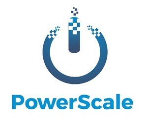

Incase you don't know what PowerScale is, here is an overview:

PowerScale enables businesses running Citrix workloads in a public cloud to manage their usage and capacity efficiently. Workload machines can be shut down and started on a scheduled basis and also scaled dynamically.  
The script is self-contained and easy to configure and also produces a static HTML dashboard with historical usage. This dashboard tracks machines, sessions and even performance Metrics across your entire farm.  
  
There was a Webinar last year which went over the configuration and demonstration of the tool and how to configure with myself and Jake Walsh.

<iframe width="560" height="315" src="https://www.youtube.com/embed/ThvEwn1SMFM" title="YouTube video player" frameborder="0" allow="accelerometer; autoplay; clipboard-write; encrypted-media; gyroscope; picture-in-picture; web-share" allowfullscreen></iframe>

I've left PowerScale alone for a little while as I've been quite busy but its been nice to pick it back up again.

I've had a few requests from people out there using it recently and wanted to support those requests. To that end, I've added a feature in the 2.6 release.

Firstly, there is a change in behaviour. PowerScale would always power on machines when scaling, its now been amended to favour machines in maintenance mode before powering on new instances. This is purely to save some pennies on the cloud spend.

Secondly, PowerScale has always been able to scale up machine dynamically based on performance metrics or triggers such as CPU, Memory, Session Count or Load Index; this works fine and works well during a steady state. I had a request for the machines to scale in the morning during peak login periods automatically, this works, but sometimes the machines do not power on fast enough based on your polling interval.  
I've added an additional scaling window, during a period specified you can choose to power on more than one instance at a time.

Thirdly, Business days have been added so you can specify with days the business runs on. Kudos to [https://github.com/mrieder](https://github.com/mrieder) for this contribution.

I also need to thank [https://github.com/PSlator](https://github.com/PSlator) (Phil Slator) for this contributions too.

As always, please let me know if you get this installed and then require any help. There is a slack channel right here or issue on GitHub.

Release:  
[https://github.com/leeej84/PowerScale/releases/tag/2.6](https://github.com/leeej84/PowerScale/releases/tag/2.6)

Slack:  
[https://worldofeuc.slack.com/messages/CLCSCA8LR](https://worldofeuc.slack.com/messages/CLCSCA8LR)
