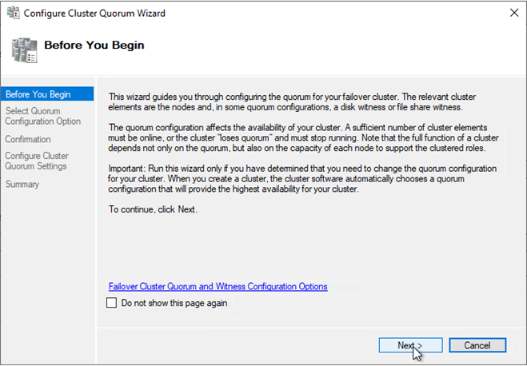

Many vendors have released profile disk solutions and since that time there has been a very large amount of people with queries about the kind of storage that's necessary in order to support user's profile disks. This blog post will aim to show you a potential solution in a scenario.

In general, if you have a Hypervisor cluster with only local or distributed shared storage you can build a highly available fileserver solution very simply. The diagram below depicts my scenario. We will cover setting up this scale-out-file-server solution and enabling high availability so that during a failover or maintenance period, users profile disks will not be disconnected, we'll also be able to failover during live production hours with no disconnections.

Bear in mind here, we are using local storage and Storage Spaces Direct will be providing replication between storage repositories. You need to ensure your network being used for cluster communication is dedicated and fast enough. Also, do not place standard file shares on a SOFS cluster, this will heavily impede performance due to the continuous availability feature used in SOFS to support a seamless failover.

- [Configure Virtual Machines](#configure-virtual-machines)
- [Build and Configure Cluster Nodes](#build-and-configure-cluster-nodes)

## Configure Virtual Machines

Firstly, I'm not installing Windows in this walkthrough, I deployed these VM's automatically and I'm using Windows Server 2019 Datacenter in this example.

**Datacenter licensing is a requirement for Storage Space Direct.**

You can see here I have a VM with a 40GB OS drive, I'm adding a network adapter that will be used for cluster communications.

This adapter should be kept segregated physically or at minimum placed on a separate vlan, so we don't hinder the cluster nodes being able to communicate with one another.

In my example I'm using a separate VLAN for cluster communications which I configured for this purpose with a name of Misc.

I'm now adding the storage that will be accessed by the cluster, we're simply adding local storage as an example I'm adding 2 x 40GB drives. Storage spaces will RAID these disks and present them to the cluster.

You see here we have three volumes. A 40GB volume for the OS and two 40GB volumes for the storage.

**Repeat the same steps for the second VM in the cluster.**

## Build and Configure Cluster Nodes

Start-up both of your virtual machine nodes.

We'll now begin the configuration of Node 1 but most of the configuration is now done with just the windows roles to be configured. I've added all the necessary PowerShell commands here based on the example above.

Firstly, assign a private IP to the secondary network adapter, this IP does not need a gateway and will only be used for direct cluster to cluster communications. Because we've assigned these adapters to a separate VLAN this is effectively point to point.

Here is a screenshot of node 2 also just to confirm the opposite side configuration. I also renamed the network adapters, so it was clear in later screenshots and to anyone else what they were being used for.

I set the LAN interface for each node to static also, as per the above diagram 192.168.1.231 for MSSOFS01 and 192.168.1.232 for MSSOFS02.

Open Server Manager to add a role.

Select the File Server Role

Add Failover Clustering and all associated Features.

**Powershell:**

Install-WindowsFeature -Name FS-FileServer Install-WindowsFeature -Name Failover-Clustering -IncludeManagementTools Get-WindowsFeature -Name FS-FileServer Get-WindowsFeature -Name Failover-Clustering Restart-Computer – Force

Repeat this step for node 2 also or use server manager to configure both nodes.

Validate the cluster configuration before creating the cluster, this will provide a health check on the servers to ensure they are ready for clustering.

Make sure both nodes are in this list

Run all tests so we can see if anything is missing

After the tests have run you should receive an output like the above. Note any warnings or errors here and rectify this before creating the cluster.

**Powershell:**

Test-Cluster -Node "NODE1","NODE2"


All being well now, we will Create the cluster within Failover Cluster Manager.

This IP address and name is the name that will be added to AD for the cluster, the IP Address added here is the IP address that will float between nodes during a failover.

You can see the cluster is now created.

**PowerShell:**

New-Cluster -Name CLUSTER -Node "MSFLCLS01.ctxlab.local"," MSFLCLS02.ctxlab.local " -StaticAddress 192.168.1.220

**Enable Storage Spaces Direct:**

I could only find a way of doing this using PowerShell

Enable-ClusterStorageSpacesDirect

This step is important because it adds the role that is cluster aware and when volumes are added it will create the replication between the nodes.

We will now configure the Quorum disk witness but first, what is Quorum?

"the minimum number of members of an assembly or society that must be present at any of its meetings to make the proceedings of that meeting valid."

In a cluster, each node will have a vote, the reason for the vote is so that the cluster can achieve Quorum, an agreement on which node(s) are active and if the cluster should be up and running. If we don't have this, we can have the cluster nodes fighting over the roles and that can cause outages and problems. In order to solve that problem, we add a disk witness. This is a shared volume that will automatically be passed to whichever node it up and running at the time, this disk witness acts as a vote giving the active live node a majority vote and therefore being able to keep the cluster active.

To configure the Quorum follow the above steps in failover cluster manager.

Select Next to move forwards.

Select Advanced so we can choose the option we want.

Select next as we want each cluster node to have a vote.

We don't want any reliance on shared storage for this cluster so we're going to be using a network SMB share for the quorum.

I built a cluster in a previous post so I've actually added a file share on this cluster for this purpose. You also have the ability here to specify a cloud witness in Azure.

Select Next to confirm.

We've now configured the quorum.

**PowerShell:**

Set-ClusterQuorum -NodeAndFileShareMajority \\\\MSFLCLS\_PD\\Quorum

We will now setup the clustered shared volume between the two nodes utilising local storage, we can now open server manager and navigate to the file and storage services tab.

Under storage pools we will right click on our S2D pool and select "New Virtual Disk"

Its automatically taken all the storage from the disks we specified and worked out what free space is available.

Select Next to move forward and configure the virtual disk.

Give it a name

Specify the volume size that you wish to use. Storage Spaces does eat a fair amount of storage for the overhead of the raid configuration and replication.

Select create.

All tasks should complete successfully.

We'll now move forward to create the logical volume that's presented to the cluster.

Here we're prompted for where this volume will be presented, we've selected the main cluster name and as cluster available storage. This is the part where the replication will be configured between the two nodes for us.

Select Next

Give the drive a letter.

I am using ReFS for this volume, VHD operations are much faster with ReFS due to the metadata operations instead of block allocation.

Read more here: [https://www.itprotoday.com/windows-8/refs-benefits-vhd](https://www.itprotoday.com/windows-8/refs-benefits-vhd){:target="_blank"}

Review the summary and select create.

With the volume provisioned manually (Not using PowerShell – we will need to add the disk in failover cluster manager)

**PowerShell:**

$volume = New-Volume -StoragePoolFriendlyName S2D\* -FriendlyName Disk1 -FileSystem CSVFS\_REFS -Size 60GB


Now we're going to add the file server role.

We're adding the larger volume of the two, although at this stage there should only be the one disk.

At this point we have now created the role; we just don't have any shares published. Let's sort that out next.

Here we are selecting "SMB Share – Applications" the reason here is that we are going to be storing VHDX volumes on the server, you should not select this option for standard file storage. You are likely to run into problems if you do select this type of volume for file storage. The reason, Continuous Availability is something we will be using to ensure no interruption of service to user during a cluster failover, this synchronises the SMB sessions and handles. If the cluster attempts to this on lots of small files performance will grind to a halt.

Give your share a name here that you want users to use to access it.

You will also note here that Continuous Availability is enabled already as we picked the correct role at the start of the wizard.

Set your permissions as required for your environment.

You should now see your share available. Browse to it to ensure you can see it.

**PowerShell:**

Add-ClusterScaleOutFileServerRole -Name MSSOFS\_UPD

New-Item -Path C:\\ClusterStorage\\$($volume.FileSystemLabel)\\Share -ItemType Directory

New-SmbShare -Name Share -Path C:\\ClusterStorage\\$($volume.FileSystemLabel)\\Share

Summary:

You now have a scale-out-file-server spreading the load of all access across the two VM's and being kept in sync using storage spaces direct. This can be used for any profile disk solution.
