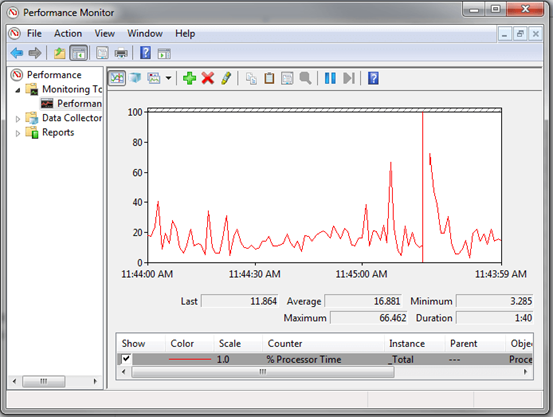

When running performance tests, it's imperative to be able to visualise any data available. As part of my LoginVSI test runs, I test to use a complete automated framework that I shared previously in another blog post - [Automating LoginVSI Load Testing and Performance Capture](https://www.leeejeffries.com/automating-loginvsi-load-testing-and-performance-capture/).

I wanted a solution to be able to create automatic graphs from my tests without having to do anything manually, thanks to [Ryan Ververs-Bijerk](https://www.linkedin.com/in/ryanbijkerk/) of [Logit Blog](https://www.logitblog.com/) and [Go-EUC](https://www.go-euc.com/index.html), there is an excellent simple solution.

Ryan has made a tool called PPD:

Binary:[https://www.logitblog.com/tooling/parse-performance-data/](https://www.logitblog.com/tooling/parse-performance-data/)

Source:[https://github.com/RyanBijkerk/ppd](https://github.com/RyanBijkerk/ppd)

This tool will take a Windows Performance Monitor CSV capture and convert that data directly into an Excel Graph. Tagging this into a Get-ChildItem and ForEach () is PowerShell means we can effectively convert all our CSV performance file in one swoop.

You'll need to have Excel installed for this to work as well as .Net 4.0. Let's dig in and see how we use this tool.

We'll loop over setting up perfmon manually:

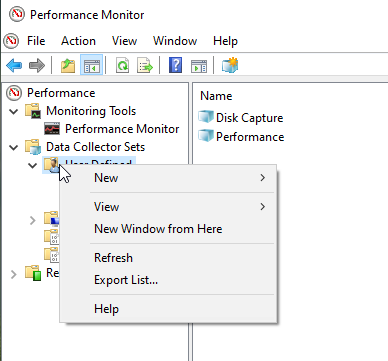

We'll create a new Data Set in Perfmon.

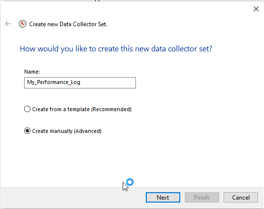

Let's just give is a name, we'll want to create a set manually because we don't have a template to start with.

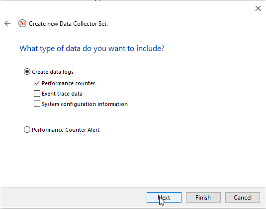

Performance counters are what we are looking to capture so, Next again.

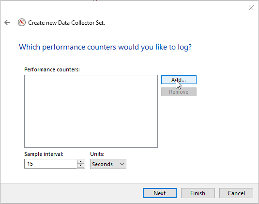

Select Add to pull in some performance counters.

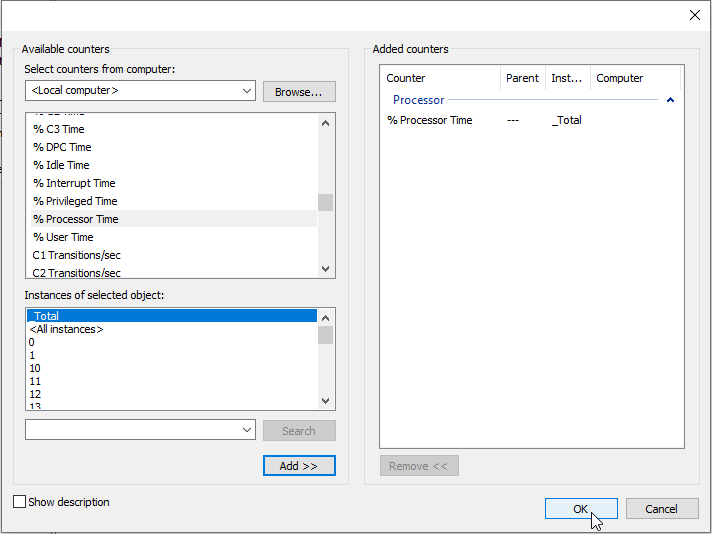

I'm selecting processor here, but you get the idea. Fill out a few different selections.

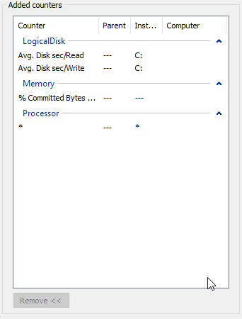

Select OK when you're done. Change the sample interval to every second, we like to make sure we're polling regularly.

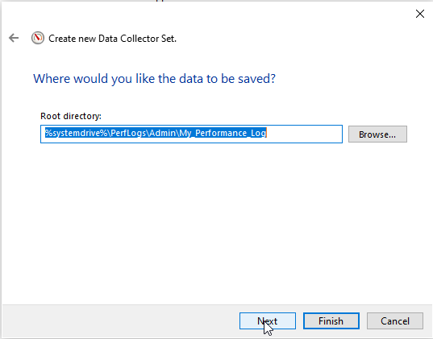

Pick a location and select Finish.

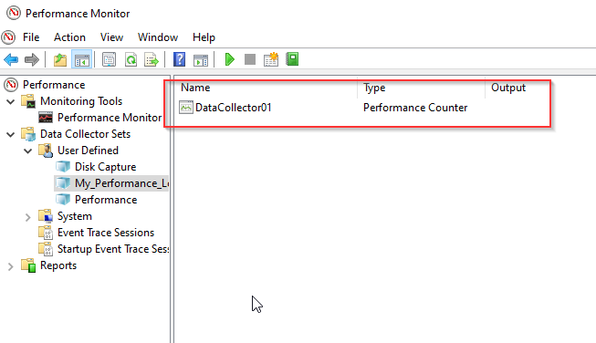

You'll now see a DataCollector set. Right click is and select Properties.

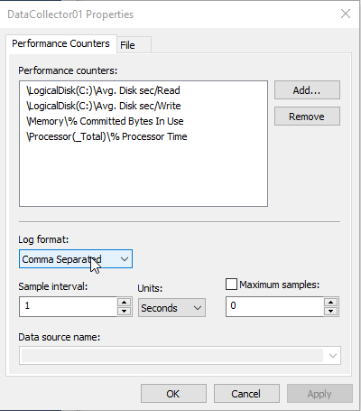

Change the Log Format to Comma Seperated and select OK.

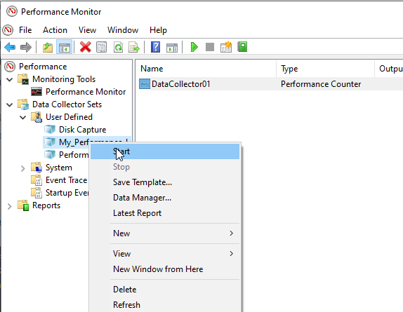

Right click your Collector Set and select Start.

That's is now, data is being collected. For the powershell lovers out there:


Get-Counter -Counter "\LogicalDisk(C:)\Avg. Disk sec/Read","\LogicalDisk(C:)\Avg. Disk sec/Write","\Memory\% Committed Bytes In Use","\Processor(_Total)\% Processor Time" -Continuous -SampleInterval 1 | Export-Counter -Path C:\Temp\Performance.csv -FileFormat CSV -Force


You can even run it remotely if you specify -ComputerName

So, it looks something a little like this:

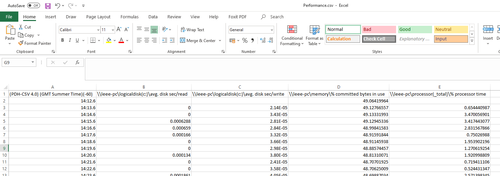

Not incredibly easy to read right now, in comes PPD. Lets convert our file we generated.

I wrote a powershell wrapper for PPD.exe so it will automatically look at column headers and convert the data into graphs.


################################################################################################# 
#PPD Graphing Script 
#Copyright: Free to use, please leave this header intact #Author: Leee Jeffries 
#Company: https://www.leeejeffries.com 
#Script help: https://www.leeejeffries.com, please supply any errors or issues you encounter #Purpose: Graph Windows Perfmon Captures automatically, uses PPD.exe written by Ryan Ververs-Bijkerk - https://www.logitblog.com/ 
#Enterprise users: This script is recommended for anyone wanting to produce graphs from Windows Perfmon Data ##################################################################################################

[CmdletBinding()] Param ( 
    [Parameter(Mandatory=$true, HelpMessage = "Specify the location of the folder containing CSV files to graph - C:\CSVFiles")] [ValidateNotNullOrEmpty()] [Alias("csvFiles")] $csvLocation, 
    [Parameter(Mandatory=$true, HelpMessage = "Specify the location of PPD.exe - C:\Temp\PPD.exe")] 
    [ValidateNotNullOrEmpty()] [Alias("ppdProgram")] $ppdLocation )

Function CreateMetricFile() {

    $ppdFolder = Split-Path $ppdLocation -Parent

    if (Test-Path "$ppdFolder\Metrics.txt") { Remove-Item "$ppdFolder\Metrics.txt" }

    foreach ($header in $columnHeaders) { 
        $header | Out-File "$ppdFolder\Metrics.txt" -Append} 
    }
    
    if ($null -eq $csvLocation) { 
        #There is no CSV location supplied, exit. 
        Exit-PSSession 
    } else { 
        $csvFiles = Get-ChildItem -File $csvLocation -Include '\*.csv' -Recurse
    }

foreach ($csvFile in $csvFiles) { 
    $columnHeaders = ((Get-Content $csvFile | Select -First 1).Split(",")) | Select -Skip 1

    #Create a Metrics File CreateMetricFile

    #Check for excel files already generated and remove them $excelCheck = "$(Split-Path -Path $csvFile -Parent)\$($csvFile.BaseName).xlsx" if (Test-Path $excelCheck) { Remove-Item $excelCheck }

    #Run PPD to create the charts from the performance data 
    $ppdProcess = Start-Process $ppdLocation -ArgumentList '/f ',"$($csvFile.FullName)" -Passthru -Wait -WindowStyle Hidden } 


I created a folder – C:\Temp\PPD
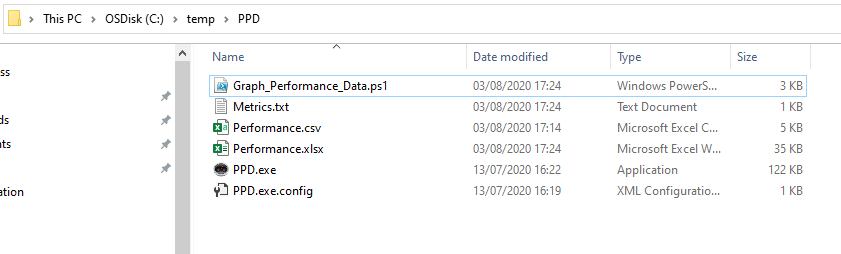

Graph_Performance_Data.ps1 -csvFiles C:\Temp\PPD -ppdProgram C:\Temp\PPD\PPD.exe

Once run and completed, this is what we get:

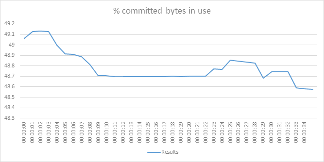

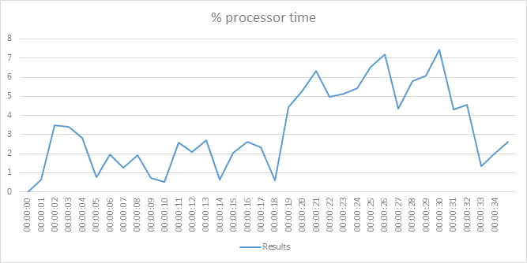

Feel free to take the script and use it as you wish. This saved me a ton of time.
