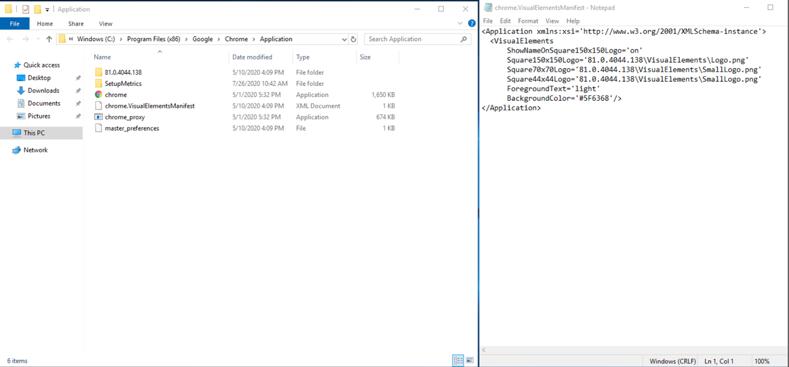

In Windows 10 and Server 2016/2019 you can pin items to the Start Menu as tiles. These tiles then show as large application shortcuts, I know we all know what they are but I'm showing an image below just to be clear on what it is I'm referring to.

We can pin any kind of app here and we can create custom shortcuts with custom icons. Below is another example:

I've just created a shortcut here for notepad and changed the icon, this is in my start menu and I've pinned it.

Let's create a start pin for chrome.

So, the icon on the chrome pin matches the icon I have in the start menu.

I've now created a shortcut for the BBC website that I want to open in chrome.

You can see that I've not done anything special here other than change the icon. What if I now want to pin this to start menu?

Hang on a moment, that's not right. That's going to confuse my users for sure.

So, what's the rub? Why does this happen?

Chrome ships with a .VisualElementsManifest file, this file tells windows which icon to use, it seems the start menu pins rested the entries you can see on the right-hand side.

We can remove this file, edit the shortcuts icon, change to another icon and then back again.

After resetting the icon on the shortcut and re-opening the start menu the icons appear correctly.

It seems that during the icon change the manifest file overrides your icon choice with the one listed inside the manifest file.

At each update of Chrome this file will be-reinstated, how do we manage that moving forwards? FSLogix to the rescue.

An easy way to get around this issue is simple to hide the .VisualElementsManifest file. Using FSLogix Rules Editor we can do this easily.

This rule will hide the .VisualElementsManifest file for all users of the machine.

With the rule applied you can see the manifest file is hidden. I can happily go in and edit my shortcuts again to reset their icons.

You could probably do a similar thing by simply editing permissions on that file so that nothing can access it.

Fingers crossed this helps a few people out as it was something that quite recently caught me out too.
