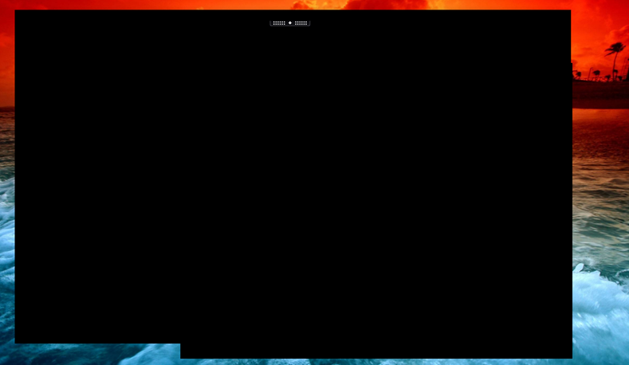
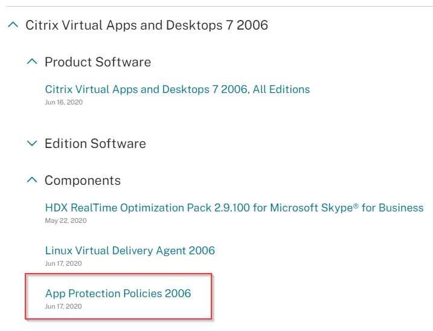

I've recently had some time to implement and play around with App Protection Policies. If you're not sure what this is, allow me to explain.

If you are allowing users to connect to your secure desktop environment using unmanaged endpoints, there is a risk that users may have some malicious software on their endpoints. To tackle this issue in our current climate, we can leverage something called Citrix App Protection Policies. What this feature does, is allow the Citrix Workspace App to be aware of potential Key Logging and Screenshot software and to block these actions. Any attempt to screenshot the Citrix Desktop view or intercept keystrokes into the session will be blocked.

This works by passing specific settings down to the Workspace App, which allows these actions to be detected and intercepted. Below is a screenshot of the session is blacked out.

This screenshot shows the workspace app logged in and the Citrix remote desktop session in the background. As soon as I hit Print Screen, these things are greyed out.

To configure this its reasonably simple, but there are some limitations.

- No anti-keylogging support inside HDX or RDP sessions. Endpoint protection is still active. This limitation applies to double-hop scenarios only.
- No feature support when using an unsupported version of the Citrix Workspace app or Citrix Receiver. In that case, resources are hidden.
- No feature support for Citrix Cloud services. App protection is supported only for on-premises Citrix Virtual Apps and Desktops deployments.
- **No feature support for StoreFront web stores. (This is the heavy hitter in my opinion)**

The solution is good, but with no support for web stores, it makes it more challenging to deliver.

To get this setup, you'll need a few things:

- Citrix App Protection license file (This is a purchasable add-on)
- Download the FeatureTable XML file from the Citrix download page

Assuming you have these things, we can get cracking.

- Import your Citrix App Protection Licenses
    
    - I won't cover doing this as its well documented on how to install licenses
        
        - [https://docs.citrix.com/en-us/licensing/licensing-guide-for-citrix-virtual-apps-desktops.html](https://docs.citrix.com/en-us/licensing/licensing-guide-for-citrix-virtual-apps-desktops.html){:target="_blank"}
    - Download the Feature Table XML file from Citrix Downloads
        
        
        
    - Import the XML file downloaded into your Farm
        
        - Open PowerShell on your delivery controller
        - Run the following code:
            
            - **Import-Module Citrix\***
            - **Import-ConfigFeatureTable –Path **_\<Path to your Feature Table XML>_\*\***
        - Now enable App Protection on your Delivery Groups
            
            - **Get-BrokerDesktopGroup -Name \*\*\<_Name of Delivery Group>_\*\* | Set-BrokerDesktopGroup -AppProtectionKeyLoggingRequired $true -AppProtectionScreenCaptureRequired $true**
            - **Warning: When I enabled this, my desktops stopped working on the web UI totally. Best to publish particular Apps as duplicates for app protection.**
    - Lastly – Create a package for the Citrix Workspace App
        
        - You need to specify the installation command line as follows
            
            - **CitrixWorkspaceApp.exe /includeappprotection**
        - This is as a minimum. You may want to do more and create a custom package to deploy to your users, you can customize the Receiver installation through command line using a tool:
            
            - [https://support.citrix.com/article/CTX227370](https://support.citrix.com/article/CTX227370){:target="_blank"}
            - An example string could be as follows:
                
                - **CitrixWorkspaceApp.exe /noreboot /rcu /forceinstall EnableCEIP=false /includeappprotection STORE0="AG;https://lab.leeejeffries.com#Store;On;External" STORE1="Local;https://storefront.ctxlab.local/Citrix/Store/discovery;On;Internal"**
            - If you wrap this, you can deploy the client directly to external endpoints.
                
                - An excellent tool for wrapping executables: [https://www.masterpackager.com/blog/when-and-why-should-you-repackage-an-exe-to-an-msi](https://www.masterpackager.com/blog/when-and-why-should-you-repackage-an-exe-to-an-msi){:target="_blank"}

You should now be in a place where you can configure the Workspace App to connect to Storefront and then attempt a screenshot. You should see the workspace app black the screen out and adjust.

Any questions or elaboration let me know and I'll follow-up.
