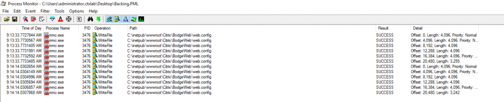

I'm working on a project where a few old Win7 Embedded Wyse devices are floating around. These devices login automatically and fire up an old Internet Explorer window controlled with VBS to hide all controls and restrict all menus. Unfortunately, in this scenario, the browser on the thin client doesn't support the javascript that's run in the newer StoreFront theme.

Previously before a 1912 upgrade we had the older green bubbles theme configured. During the upgrade from 7.6 LTSR to 1912 LTSR this is removed, and the StoreFront UI no longer has an option to set this. In the short term, though, I needed it back.

I installed an older version of StoreFront (7.18) and decided to run a capture with procmon whilst amending the UI values to see what settings were changing.

You can see here that the file being edited is the web.config file in the stores website. My friend and colleague [Guy Leech](https://twitter.com/guyrleech){:target="_blank"} had posted just this morning about a [script](https://github.com/guyrleech/General-Scripts/blob/master/Get%20chunk%20at%20offset.ps1){:target="_blank"} he had written that allows you to take the information from procmon and then retrieve the exact information in a logfile that has been written.


Check_File.ps1 -path C:\inetpub\wwwroot\Citrix\BodgeWeb\web.config -procmonDetail 'Offset: 12,288, Length: 4,096'


Running the above returns all the text amended in the file at that point in time, comparing the two outputs bought me to this:

The value for this text when the X1 Theme is active is as follows:

So, to restore your green bubbles just remove the **"receiver.html"** from **\<add value="receiver.html" />** to make it **\<add value="" />**

I hope this helps someone else down the line who trying to juggle a couple of different types of endpoint during a transition period.
