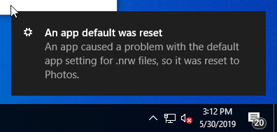
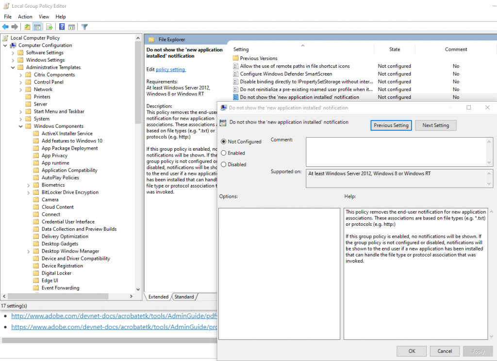
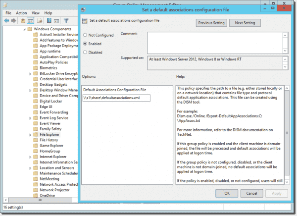
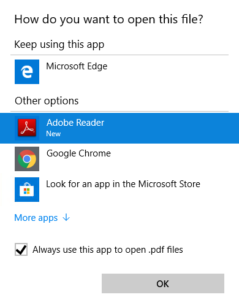

\-----------------------------------UPDATE 05.11.20-----------------------------------

Upon posting this blog on twitter I was greeted with a number of responses where people had found different solutions to this issue. A thank you [Rob Sheppard](https://twitter.com/RobSheppard){:target="_blank"} for this GPO entry that solves this issue also.  
Location: Computer Configuration\Administrative Templates\Windows Components\File Explorer  
Setting: Do not show the 'new application installed' notification

\-----------------------------------UPDATE 05.11.20-----------------------------------

So you've installed your shiny new Win10 machine, and you've configured your default app file associations by logging in as a user and using


Dism /Online /Export-DefaultAppAssociations:""


and then settings it via GPO as per the below.

Great right? Not quite, even though you have done this you still get notifications that app-defaults have been reset, so what gives?

Edge, that's what gives, specifically modern app hooks. I had an image whereby I could just not set Adobe Reader to be the default PDF viewer. I needed pdf's to open without showing any prompt for file type associations, and I could not set it individually for each user.

I kept seeing this each time I launched a PDF, no matter what I did. I checked and double-checked my XML file to make sure it was right. This is how I got around it.


Windows Registry Editor Version 5.00 
[HKEY_CURRENT_USER\SOFTWARE\Classes\AppXd4nrz8ff68srnhf9t5a8sbjyar1cr723] 
"NoOpenWith"="" 
"NoStaticDefaultVerb"=""


Implement the above registry settings via your preferred method. This will tell Edge to stop trying to grab file associations for PDF files.

Thanks to [Andy Martin](https://twitter.com/MartinAndyAm){:target="_blank"} for the assist in finding this [article](https://www.winhelponline.com/blog/windows-10-resetting-file-associations/){:target="_blank"} that explains the situation fully. There are also several other modern apps that can exhibit this behaviour; this is all specified in the article.

On top of this, Adobe Reader will then warn you that it doesn't necessarily own all PDF file associations. You can disable this prompt by implementing the below registry setting.

<table class="has-subtle-light-gray-background-color has-background"><tbody><tr><td>Registry&nbsp;Hive</td><td>HKEY_LOCAL_MACHINE</td></tr><tr><td>Registry&nbsp;Path</td><td>SOFTWARE\Policies\Adobe\Acrobat Reader\DC\FeatureLockdown</td></tr><tr><td>Value&nbsp;Name</td><td>bDisablePDFHandlerSwitching</td></tr><tr><td>Value&nbsp;Type</td><td>REG_DWORD</td></tr><tr><td>Enabled&nbsp;Value</td><td>1</td></tr><tr><td>Disabled&nbsp;Value</td><td>0</td></tr></tbody></table>

0 means adobe will prompt, 1 means adobe will not prompt

I hope this saves someone some time rather than searching around this rather vague subject for an answer.
