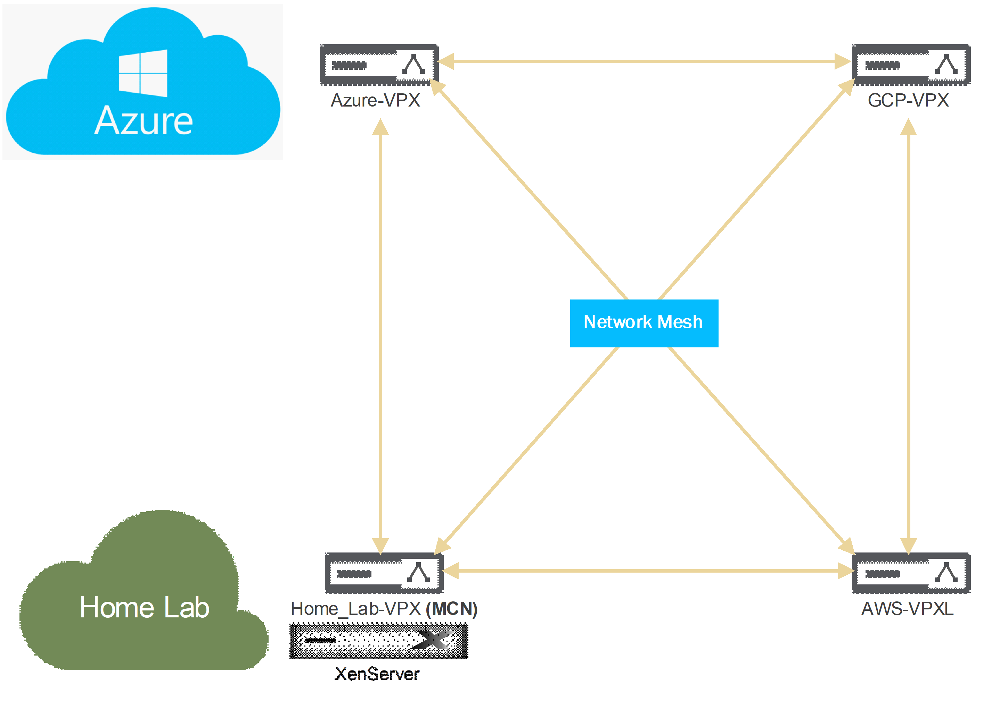
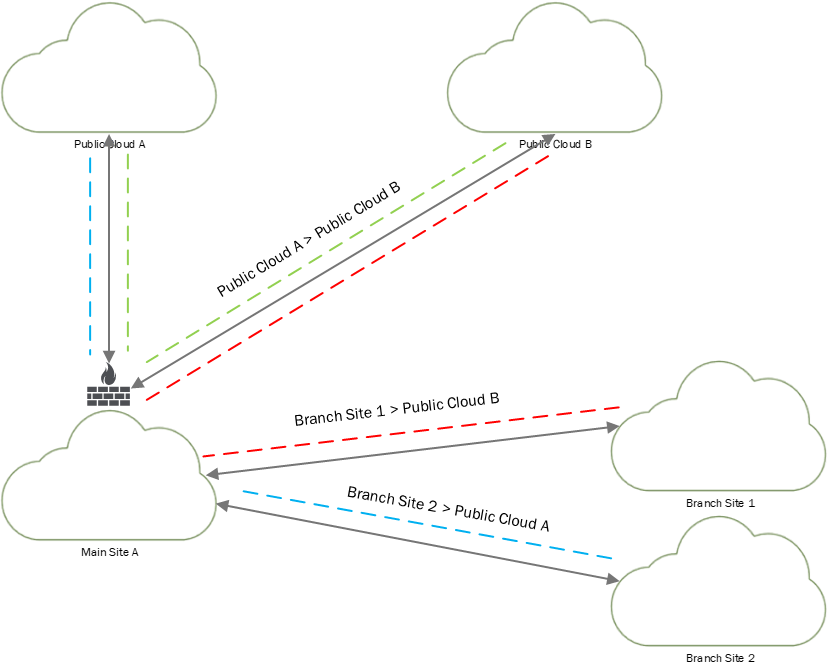
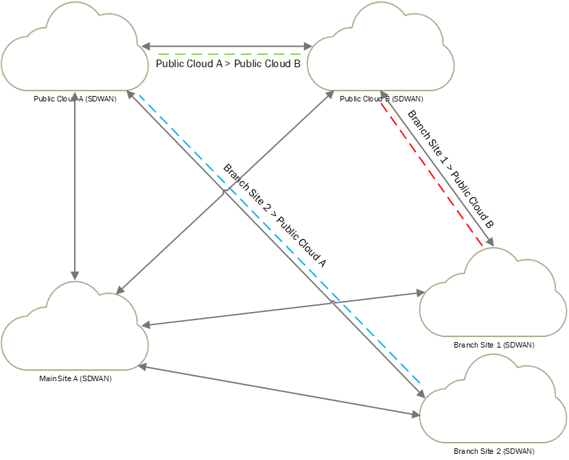

This series is a 6 part series all about SD-WAN and meshing cloud providers:

- [Citrix SD-WAN – Public Cloud Network Mesh – Master Control Node (Part 2)](https://www.leeejeffries.com/citrix-sd-wan-public-cloud-network-mesh-master-control-node-part-2/)
- [Citrix SD-WAN – Public Cloud Network Mesh – Azure (Part 3)](https://www.leeejeffries.com/citrix-sd-wan-public-cloud-network-mesh-azure-part-3/)
- [Citrix SD-WAN – Public Cloud Network Mesh – AWS (Part 4)](https://www.leeejeffries.com/citrix-sd-wan-public-cloud-network-mesh-aws-part-4/)
- [Citrix SD-WAN – Public Cloud Network Mesh – GCP (Part 5)](https://www.leeejeffries.com/citrix-sd-wan-public-cloud-network-mesh-gcp-part-5/)
- [Citrix SDWAN – Public Cloud Network Mesh – Creating a Full Mesh (Part 6)](https://www.leeejeffries.com/citrix-sdwan-public-cloud-network-mesh-creating-a-full-mesh-part-6/)

Let's talk about this term that's mentioned regularly; SDWAN. This stands for Software-Defined Wide Area Networking, okay great; what is it though?

We're essentially looking at SDN (Software Defined Networking) across a WAN (Wide Area Network). People usually confuse VPN (Virtual Private Networking) with SDWAN, VPN is just one of the attributes included in SDWAN. SDN isa term often used within a data centre, and this can also encompass routing, inspection and anti-virus. When we talk about SDWAN, we discuss extending those attributes to the WAN side and allowing our offices to connect in a seamless mesh. All the flexibility of your offices communicating will enable you to get visibility of the traffic flowing through those links. Couple this intelligence and visibility with failover and resilience, and you have SDWAN.

This blog post series will cover an example of using Citrix SDWAN to achieve a full mesh between 3 different public cloud providers and a physical datacenter.

The above scenario is what I will be working with, the idea here is to create a full working mesh between my lab, Azure, Amazon and GCP. At this point, I will have maximum visibility of traffic across the links and complete interoperability between public clouds and my resources in each location.

Why do this?

Many businesses have site-to-site VPN connections between external devices, but there is an added complexity when various public cloud providers are in play. Let's review some examples.

Here we have a few potential problems depending on how the network is planned out. In this example, the companies' primary firewall is responsible for handling all routing for traffic on the network's edge. Here we see a few issues:

- All branch sites must route through the primary office to access public cloud locations
    
    - This can create a bottleneck on the primary branch internet connection.
- Public cloud locations must route through the primary office to talk to each other
    
    - This adds to the bottleneck in the primary datacenter
- The external firewall devices can become quite expensive
    
    - Adding resilience and failover to the primary internet connection should be an extensive consideration

With an SDWAN solution, we can affect the traffic flows to remove some of these constraints; the below shows the same examples.

The branch offices have their own internet links and can establish direct connections to public cloud resources or the primary data centre. In this scenario, each sites internet connection does not stand to be a bottleneck when accessing resources.

During the different parts of this blog series, I will be documenting the following topics:

- Configure SDWAN On-Prem
- Configure SDWAN in Azure
- Configure SDWAN in AWS
- Configure SDWAN in GCP
- Meshing the network to optimise traffic flows

After all of this has been explored, I'll follow up with some more advanced topics: adding additional routes, adding internet breakout and managing traffic flows.
