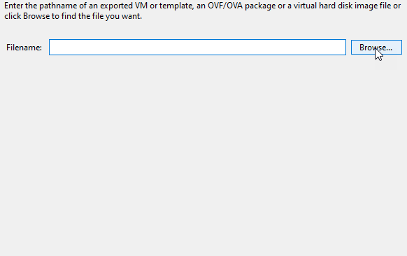

- [Citrix SDWAN – Public Cloud Network Mesh – Introduction (Part 1)](https://www.leeejeffries.com/citrix-sdwan-public-cloud-network-mesh-introduction-part-1/)
- [Citrix SD-WAN – Public Cloud Network Mesh – Azure (Part 3)](https://www.leeejeffries.com/citrix-sd-wan-public-cloud-network-mesh-azure-part-3/)
- [Citrix SD-WAN – Public Cloud Network Mesh – AWS (Part 4)](https://www.leeejeffries.com/citrix-sd-wan-public-cloud-network-mesh-aws-part-4/)
- [Citrix SD-WAN – Public Cloud Network Mesh – GCP (Part 5)](https://www.leeejeffries.com/citrix-sd-wan-public-cloud-network-mesh-gcp-part-5/)
- [Citrix SDWAN – Public Cloud Network Mesh – Creating a Full Mesh (Part 6)](https://www.leeejeffries.com/citrix-sdwan-public-cloud-network-mesh-creating-a-full-mesh-part-6/)

I provided an intro to this blog series in my last post; you can find this [here](mailto:https://www.leeejeffries.com/citrix-sdwan-public-cloud-network-mesh-introduction-part-1/) if you need a refresher on all these steps' overall outcome.

If you don't want to play around with the public cloud side of things but still want to get stuck into SD-WAN, there is a full lab blog [here – Getting Started with Citrix SD-WAN](https://www.leeejeffries.com/getting-started-with-citrix-sdwan/).

What we're doing here is setting up the MCN (Master Control Node) for SD-WAN. Your first step whenever you are deploying a Citrix SD-WAN solution. This node will become your configuration editor; these configurations get installed on each remote SD-WAN appliance.

Before be dive right into requirements etc.… lets first take a look at the below diagram. I explain in my original post about a cloud mesh; I'm going to get to that point but; here we are setting the traffic flow up so that the MCN is the hub. I'll be placing the configuration in for all my cloud locations, but the cloud locations are not yet available.

What about requirements for SD-WAN? What ports do we need to think about opening for our MCN?

<table style="border-collapse: collapse;" border="0"><colgroup><col style="width: 147px;"> <col style="width: 150px;"> <col style="width: 44px;"> <col style="width: 44px;"> <col style="width: 238px;"></colgroup><tbody valign="top"><tr><td style="padding-left: 7px; padding-right: 7px; border: solid #bfbfbf 0.5pt;"><strong>Source</strong></td><td style="padding-left: 7px; padding-right: 7px; border-top: solid #bfbfbf 0.5pt; border-left: none; border-bottom: solid #bfbfbf 0.5pt; border-right: solid #bfbfbf 0.5pt;"><strong>Destination</strong></td><td style="padding-left: 7px; padding-right: 7px; border-top: solid #bfbfbf 0.5pt; border-left: none; border-bottom: solid #bfbfbf 0.5pt; border-right: solid #bfbfbf 0.5pt;"><strong>Type</strong></td><td style="padding-left: 7px; padding-right: 7px; border-top: solid #bfbfbf 0.5pt; border-left: none; border-bottom: solid #bfbfbf 0.5pt; border-right: solid #bfbfbf 0.5pt;"><strong>Port</strong></td><td style="padding-left: 7px; padding-right: 7px; border-top: solid #bfbfbf 0.5pt; border-left: none; border-bottom: solid #bfbfbf 0.5pt; border-right: solid #bfbfbf 0.5pt;"><strong>Details</strong></td></tr><tr style="background: #f2f2f2;"><td style="padding-left: 7px; padding-right: 7px; border-top: none; border-left: solid #bfbfbf 0.5pt; border-bottom: solid #bfbfbf 0.5pt; border-right: solid #bfbfbf 0.5pt;"><strong>SD-WAN Standard and Enterprise Edition</strong></td><td style="padding-left: 7px; padding-right: 7px; border-top: none; border-left: none; border-bottom: solid #bfbfbf 0.5pt; border-right: solid #bfbfbf 0.5pt;">SD-WAN Standard and Enterprise Edition</td><td style="padding-left: 7px; padding-right: 7px; border-top: none; border-left: none; border-bottom: solid #bfbfbf 0.5pt; border-right: solid #bfbfbf 0.5pt;">UDP</td><td style="padding-left: 7px; padding-right: 7px; border-top: none; border-left: none; border-bottom: solid #bfbfbf 0.5pt; border-right: solid #bfbfbf 0.5pt;">4980</td><td style="padding-left: 7px; padding-right: 7px; border-top: none; border-left: none; border-bottom: solid #bfbfbf 0.5pt; border-right: solid #bfbfbf 0.5pt;">Static Virtual Path and Dynamic Virtual Path tunnels between SD-WAN SE/EE devices.</td></tr></tbody></table>

You will need port 4980 NAT'ed from your Firewall to your SD-WAN Appliance WAN IP as an absolute minimum.

There are ports for other SD-WAN areas, including Zero Touch deployment, a full list of ports can be found [here](https://docs.citrix.com/en-us/tech-zone/build/tech-papers/citrix-communication-ports.html); scroll to the Citrix SD-WAN section.

Your Virtual Machine specification should be a four core virtual machine with 4GB memory and 120GB of disk space.

The only other requirement is that you have a license for the appliance. [Check out all available options](https://docs.citrix.com/en-us/citrix-sd-wan/11/sd-wan-licensing.html) or contact sales / your partner for a demo license.

Head on over and download the latest **11.3.2** edition of the appliance here: **I had some issues with the latest 11.3 release half way through pulling this together. I'm working with Citrix on addressing the issues.**

[https://www.citrix.com/en-gb/downloads/citrix-sd-wan/citrix-sd-wan-standard-premium-advance-edition/](https://www.citrix.com/en-gb/downloads/citrix-sd-wan/citrix-sd-wan-standard-premium-advance-edition/)

**Also, grab the appliance firmware for the VPX and the VPX-L versions of the appliance, we will need those later on and this will save time.**

**So to clarify, the files required:**

1. **SD-WAN Appliance Download (For your HyperVisor)**
2. **SD-WAN VPX Firmware**
3. **SD-WAN VPX-L Firmware**

Let's get started on importing the appliance and starting to get it configured. I'm using XenServer to host my SDWAN appliance.

Hop on over to XenCenter and select "File", "Import".

Select your appliance download.

Select "Next" to start selecting the appropriate options.

Pick your XenServer to import the appliance too if you have more than one. Select "Next".

Select the relevant Storage Volume you wish to place the Virtual Machine on. Select "Import".

You now need to setup your network adapters for the SDWAN appliance. You will need three different connections:

- Management
- Internet Access
- Lan Access

In my example these are different VLANs

- Management – MGMT (101)
- Internet Access – LAN (2)
- Lan Access – LAB (110)

LAN would be my standard network where all the family suck the internet pipe dry and LAB is where my lab VM's sit; in this scenario for SDWAN is my server network.

Add three adapters and select "Next".

Wait for your VM to import and fireup.

We did not start the VM on import for a reason. We need to expand the default size of the disk to 120GB.

Select the VM, Select the "Storage" tab. Select the "Hard Disk", Select "Properties".

You are presented with a login screen in the console.

We login here with the default username and password of "admin" and "password".

You are prompted to change the password, do this now.

We're now ready to configure our management IP address to switch everything over to a browser and start getting the configuration punched in.

Type:

- management\_ip
- set interface <ip address> <subnet> <gateway>
- apply (Confirm you want to apply)
- main\_menu

In my case:

- management\_ip
- set interface 192.168.101.70 255.255.255.0 192.168.101.1
- apply (Confirm you want to apply)
- main\_menu

Open a browser and navigate to [https://192.168.101.70](https://192.168.101.70) (or whatever management IP you assigned). A certificate warning will appear, this is normal as the certificate that is supplied for managing the appliance is not trusted.

Log in with your configure details from the previous step.

You will notice we are currently unlicensed and there are a few options to configure.

Select Appliance Mode - "MCN" and Installation Mode - "Create New Package" and then select "Next".

This has now set the mode for the appliance to be the MCN, this means it will be the base for our configuration.

Select the "Configuration" tab at the top of screen. Select "Licensing" from the left hand menu.

You need a license generated based on the MAC address of the machines primary network adapter.

We'll be using the local licensing server on the appliance. Select "Local" for the License Configuration and click "Choose File" to upload your license.

Navigate to find your license and upload it.

You'll notice than the grace licensing warning has not disappeared and we have a different licensing state.

We'll now proceed to create a new configuration. Select "Virtual WAN" from the left hand menu and "Configuration Editor".

This is where the magic happens. We logically define the configuration for all sites here, this includes their IP information. The configuration is then split out into packages which are installed on each remote node.

We need to create a package for our MCN now, it needs to understand which IP addresses it should be utilizing for its WAN and LAN interfaces.

Select "New" in the configuration editor window.

We'll initially save this configuration and then I'll talk you through creating the configuration for the MCN (Master Control Node).

Select "Save As" and enter a name for the configuration. I like to put version information into my configurations.

We'll start by adding a Site, this is how you define the geographic location.

Select "+ Sites". Add the Site Name, Select he model as "VPX", Set the "Site\_Location" and click "Add".

You'll now be presented with your basic site configuration options to apply details to the interfaces of the MCN appliance.

Select the "+" symbol on the right-hand side section labelled "Interfaces".

I've setup my LAN interface with an IP-Address. I have selected interface 2 to match the way the interfaces are configure in XenServer (The management interface is not shown in this UI).

Select "Add".

Select the "+" symbol on the right-hand side section labelled "Interfaces".

I've setup my WAN interface with an IP-Address. I have selected interface 1 to match the way the interfaces are configure in XenServer (The management interface is not shown in this UI).

Untrusted as the security mode tells the SDWAN appliance that this is an external interface.

Select "Add".

At any point in time the configuration can be checked using the "Audit" button at the bottom of the screen. This checks the configuration to ensure its valid before being rolled out. This must pass without any issues.

Select the "+" symbol on the right-hand side section labelled "WAN Links".

Set the interface to match the "Untrusted" connection we defined earlier. Set an IP address and gateway, Set the speed of the internet connection being used.

**The Internet speed is very important here, make sure these numbers are correct, if you have any doubt; go lower than you expect. This is factored in SDWAN calculates congestion.**

Select "Add"

Now select the "+" symbol next to static routes.

You need to add a static route in for any network that is accessible through the devices LAN interface and you want remote sites to be able to connect with.

I've added a static route here for my home network so that my machines in remote locations can talk to machine on my home network.

**Note:** the gateway is reachable from the LAN interface of the SDWAN appliance.

As this is our MCN we now need to add the public IP of our SDWAN device to the WAN link section. It's something that isn't in the wizard but will stop nodes connecting in if it's not added.

Select the "Sites" tab, Select "WAN Links", on the right-hand-side, input your external IP for the WAN connection. If the device is behind a firewall then this would the IP you have opened port 4980 on.

Run an audit now and make sure you have no errors.

Save your configuration. Select "Save".

Select "Export", then "Change Management Inbox" and Select "Export".

You will see a green bar to state its been successful. Click the "Change Management" link on this bar.

Note: This is also available from the Left-hand side, "Virtual WAN\\Change Management".

This area is where we centrally manage our configuration releases to all SD-WAN appliances that we are managing. Select "Begin" to push the configuration we just made to the Master Control Node.

Before we can rollout any configuration, we need to also update the relevant firmware for our configuration. SD-WAN appliances are upgrade and maintained using the same interface and therefore the firmware needs to be uploaded so that appliances can all be bought up to the same level.

Select "Choose Files" and upload the firmware releases we downloaded right at the beginning.

You'll see here that our configuration is listed in the configuration dropdown. Select "Stage Appliances" to push the configuration to the appliance.

Accept the license agreement.

Wait for optimsation of the packages to complete.

You will be presented with a screen that will show you the staging process.

Once the package has been prepared (Its essentially a zip file with the appliance configuration in it) and sent to the appliance (This time its our MCN) we will be able to select "Next".

Now we are at the point where we can activate the staged configuration. We're at the point where the appliance has the configuration but its not active. Select "Activate Staged".

As this is our MCN a message will display, select OK on this and select "Activate Staged" again.

You will now have a little while to wait while the MCN initializes itself.

Wait for the countdown to complete. You will then be presented with a "Done" button. Select this.

That completes our Master Control Nodes configuration and gives us an excellent platform to add other remote locations.

In the next blog, I'll walk by adding a Site to the configuration and a remote Azure appliance.
