- [Citrix SDWAN – Public Cloud Network Mesh – Introduction (Part 1)]()
- [Citrix SD-WAN – Public Cloud Network Mesh – Master Control Node (Part 2)]()
- [Citrix SD-WAN – Public Cloud Network Mesh – AWS (Part 4)]()
- [Citrix SD-WAN – Public Cloud Network Mesh – GCP (Part 5)]()
- [Citrix SDWAN – Public Cloud Network Mesh – Creating a Full Mesh (Part 6)]()

This post will follow-on from the previous post; I already created the [Master Control Node on-prem](). If you've not yet setup the Master Control node, you will need to do this first.

Below is a diagram which shows the current progress of this blog series.

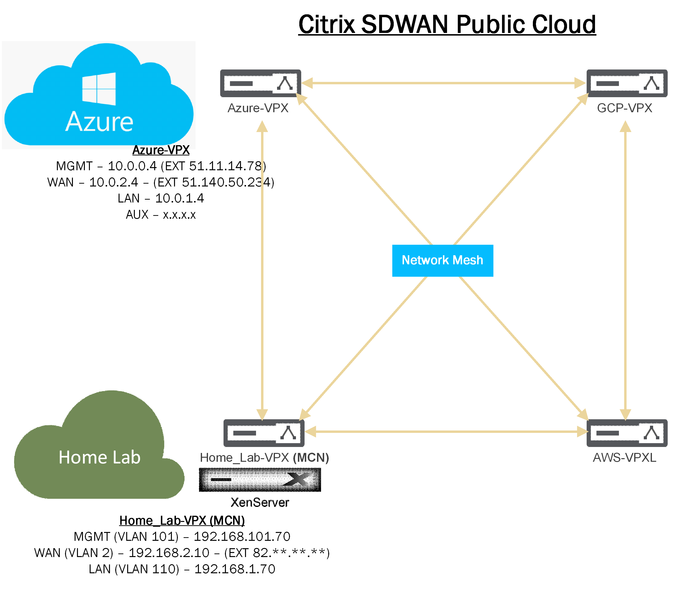

Luckily for us, Azure has a marketplace template for Citrix SD-WAN will configure the necessary resource group required.

We will start off by going over to Azure and running through the deployment of the appliance.

Go to the marketplace to deploy the template.

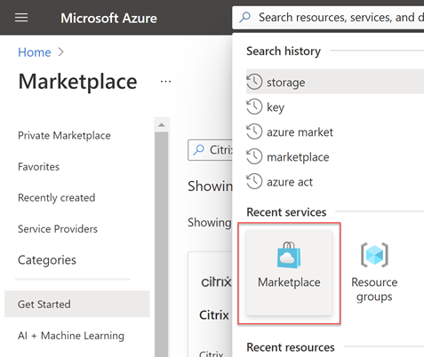

Search for "Citrix SD" and you will be presented with several options.

Select the "Citrix SD-WAN Standard Edition 11.2.3" option.

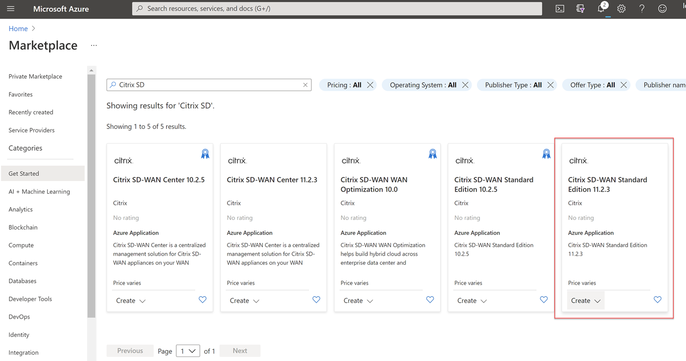

Select "Create" to start the provisioning process.

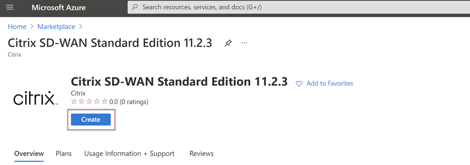

I have created a new resource group for this, the idea here is that all my networking components will be deployed within this resource group, In an Enterprise environment this may be in a separate subscription entirely.

Fill out the Region you want to deploy the device in. You can of course deploy multiple SD-WAN appliances in multiple regions. The idea here though is that we utilize the Azure backbone for resources in other regions.

Select "Next".

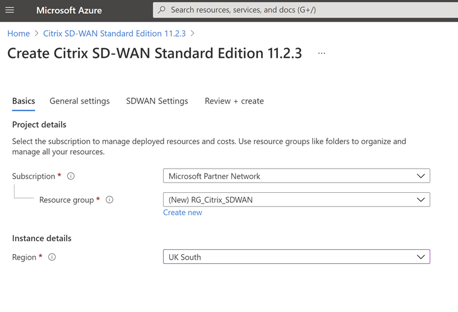

Complete the general settings for the appliance. Name of the VM, initial Username and Password for management. Select "Next".

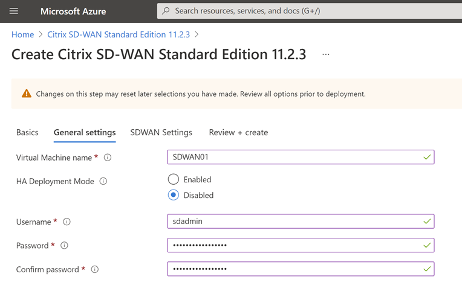

I have left the Virtual Machine at the recommended size. If you change this, remember you require 3 network adapters at a minimum on the VM.

I have created a new VNET and called this SDWAN. The IP ranges are fixed in the template, you can download the JSON at the end of this process if you need to change that and deploy your own template if necessary.

For the "Route Address Prefix" you need to put in the subnet of the on-prem network that you wish to route through the SDWAN device. This allows the Azure networking to understand where to send traffic for your on-prem network.

We will expand on routing later when we fully mesh the different public clouds.

Select "Next".

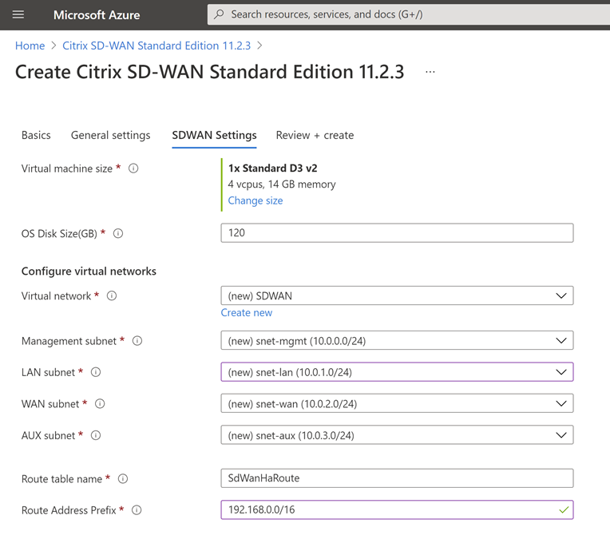

With some luck, all your details will now be valid, and you can proceed to create the resource group.

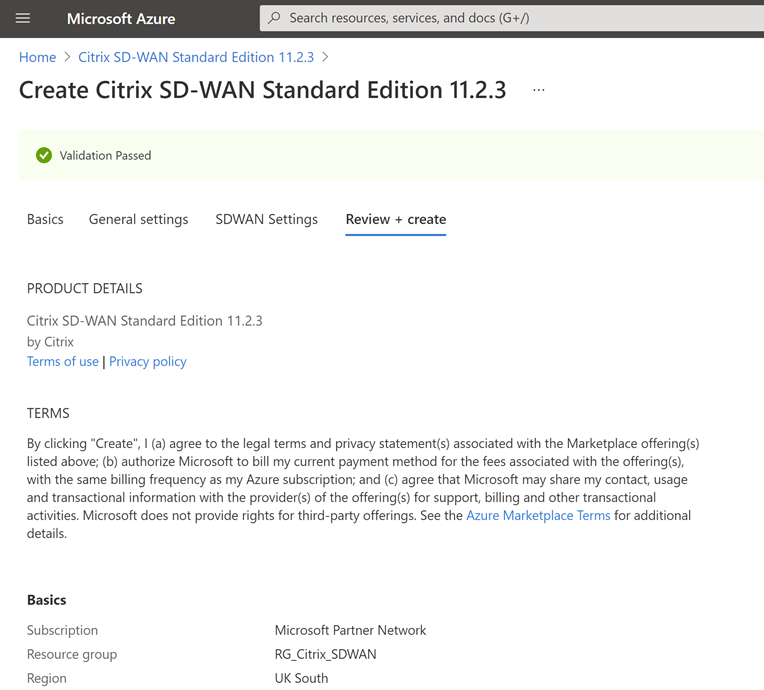

Select Create and wait for the creation process to complete.

Select "Go to resource group".

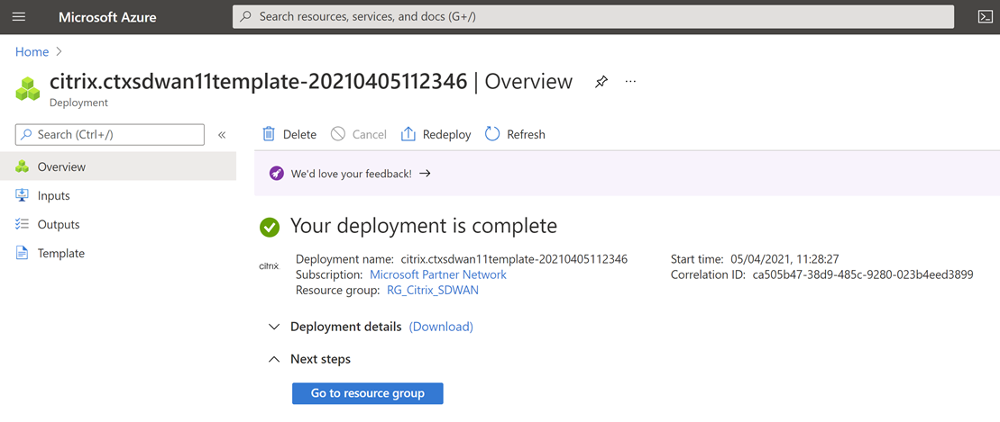

Now that we have jumped over to the resource group, we can see all the components that have been deployed. Select the VM "SDWAN01".

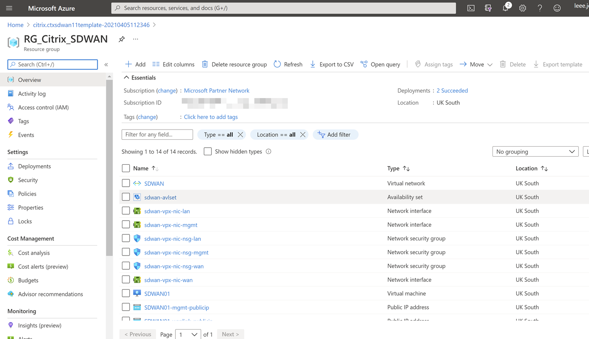

The VM is automatically assigned a public IP for management.

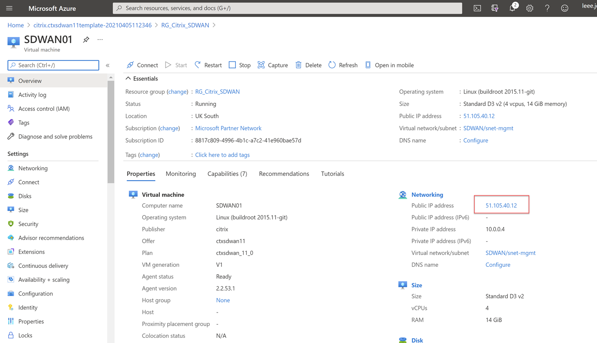

Navigating to that address gives us the login page for the SDWAN device. [https://51.105.40.12](https://51.105.40.12) in my example. Accept the certificate warning error.

Use the username and password created earlier to login to the device and we can get started with the setup.

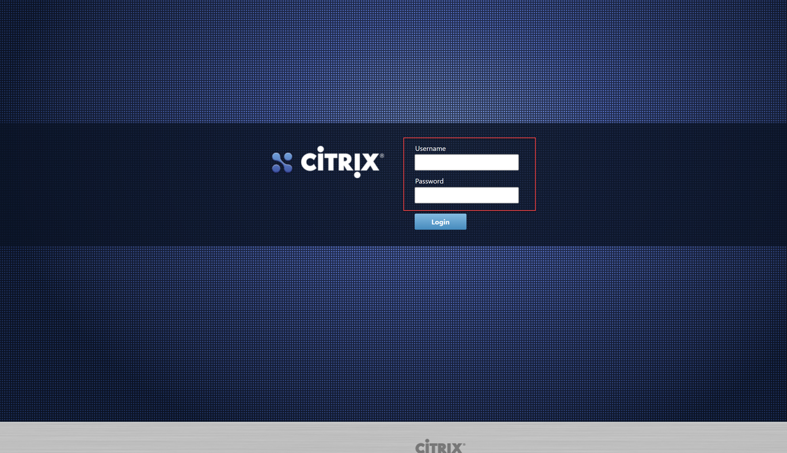

You are presented with some option now. We will need to get onto our on-prem MCN to create and download the configuration package for this node.

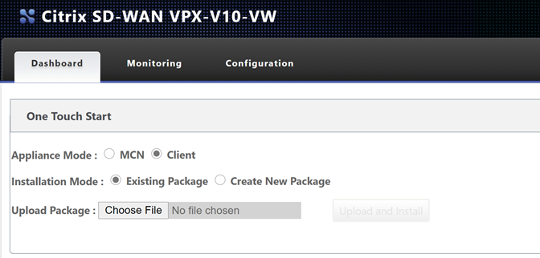

Before we proceed, I am going to navigate to my "Master Control Node" – in my lab I will login to the management page.

Navigate through the UI, "Configuration Tab" > "Virtual WAN – Side Menu" > "Configuration Editor".

Select "Open" and then open the initial configuration we created for the MCN in an earlier post.

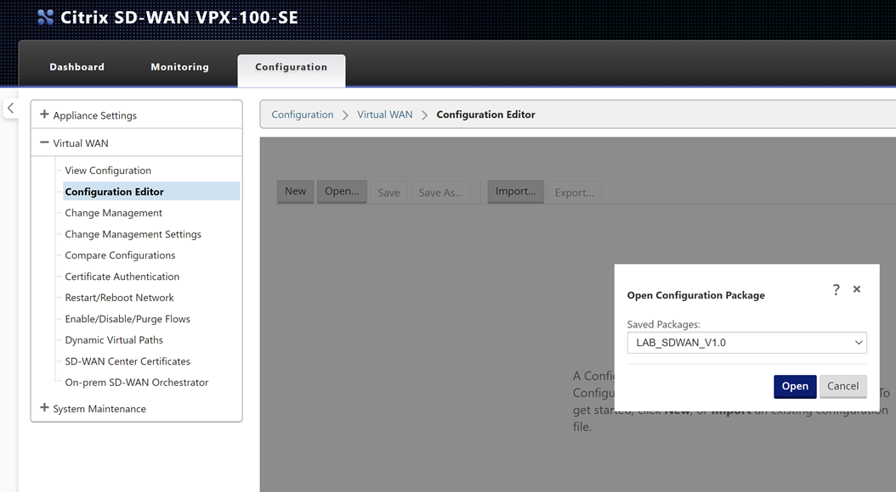

Now we will add another site – the Azure site. Select "Sites", "+ Site".

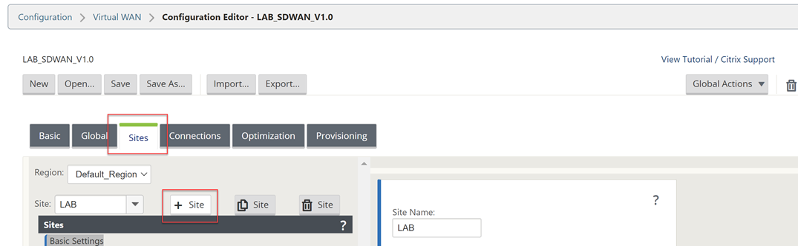

Fill out the details for your Azure VPX appliance. CPU and Memory, the import part is the model as that is what will dictate the options within the config editor.

Select "Add" once complete.

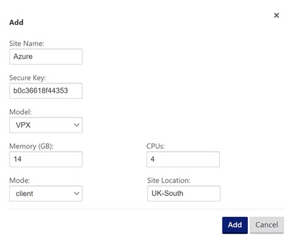

Select "Interface Groups" and then the "+" symbol to add an interface.

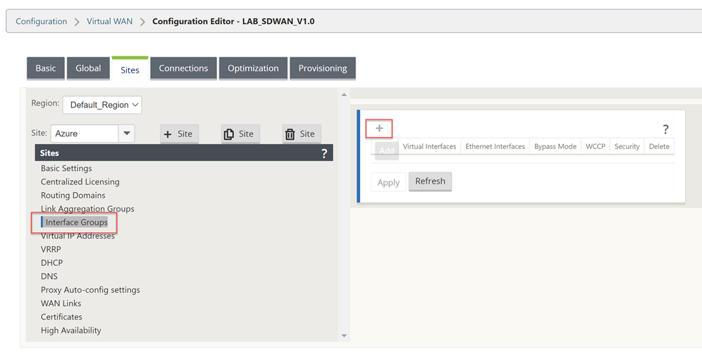

You will need to refer to your Azure Networking configuration for the VM during this next part of the work. Take a note of these settings.

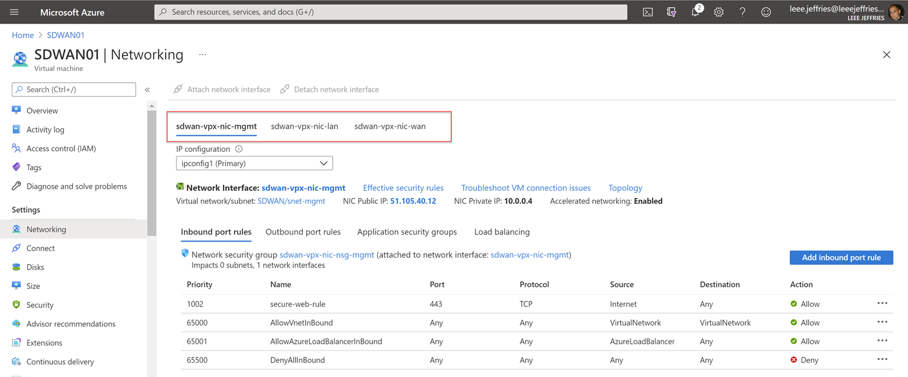

The management interface is not shown within the UI of the configuration Editor, so interface 1 is the LAN configuration in Azure.

Select the "+" symbol in the top left to add an interface.

Select interface "1", "Fail-to-Block" and "Trusted" on the top row.

Select "+" next to "Virtual Interface" and give the interface a name.

Select "Apply".

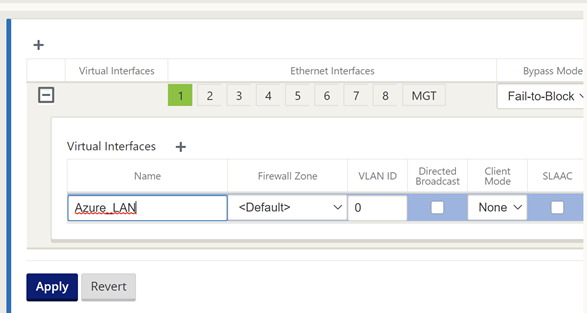

Now we will configure the WAN interface that will be used to create the secure tunnel to Azure.

Select the "+" symbol in the top left to add an interface.

Select interface "2", "Fail-to-Block" and "Untrusted" on the top row.

Select "+" next to "Virtual Interface" and give the interface a name.

Select "Apply".

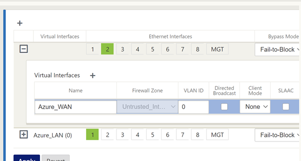

Select "Virtual IP Addresses" on the left-hand-side menu.

You will now assign an IP address for each of the interfaces.

Referring to the diagram above I am using the planned IP addressing from this. I have allowed "Inband Mgmt" from the LAN interface, so I do not need the external IP in Azure all the time.

Click "Apply" when you have completed the IP configuration information.

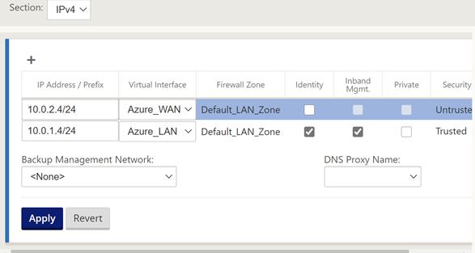

Now select "WAN Links" on the left-hand-side menu.

We will not configure the WAN interface for the external connectivity.

Select "+ Link", Select "Add".

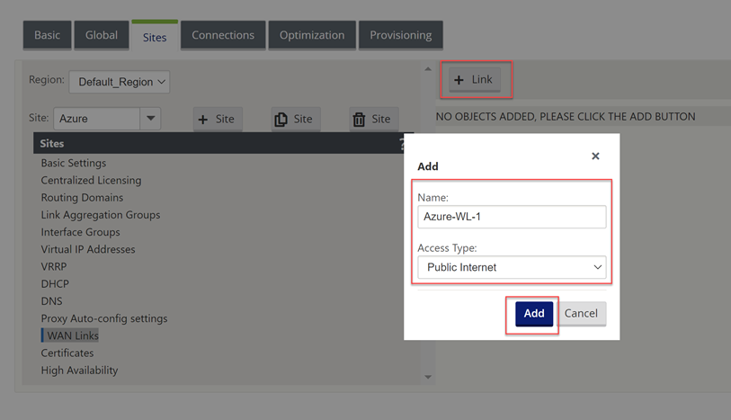

We can now specify the link speed; the WAN link can have "Autodetect Public IP" selected as it is a client node and not an MCN.

Fill in an accurate Upload and Download speed and tick "Autodetect Public IP", select "Apply" at the bottom of the screen.

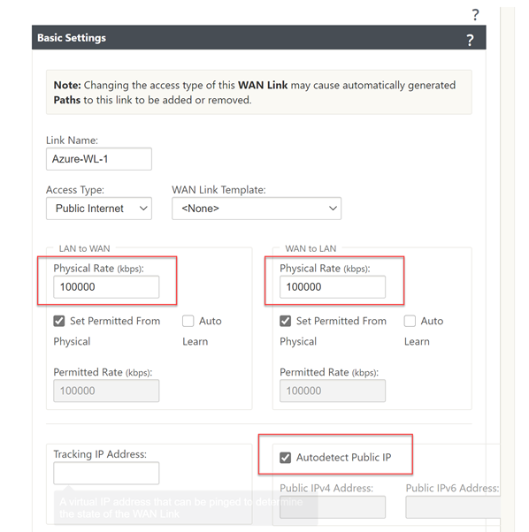

Now select "Settings" at the top of the window.

Select "Access Interfaces (IPV4)".

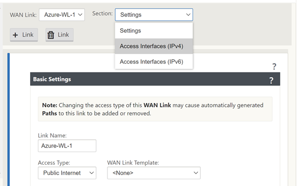

Select the "+" symbol in the top left of the window.

We will now populate the details of the WAN outside and WAN inside link.

Place the same IP in as we did earlier for the WAN interface.

Select "Apply".

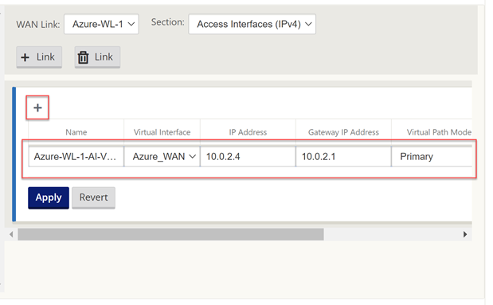

The configuration should now be complete. We will run an Audit just to be sure all is well.

Select "Audit Now" at the bottom of the configuration editor.

If there are no errors or warnings, then we have created the configuration for the Azure client node.

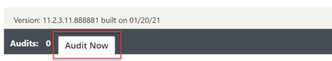

Select "Save As" at the very top of the configuration editor window.

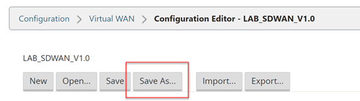

Add V1.1 into the name, adding revision numbers to the configuration can make it easier when rolling out updates.

Select "Save".

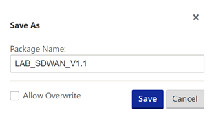

Now we will export the configuration to the Change Management function, this will provision a package that can be downloaded and applied to the client node.

Select "Export" at the very top of the configuration editor window.

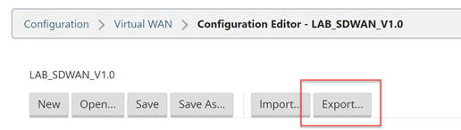

Select "Change Management" and select "Export".

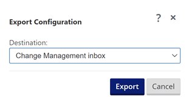

Select the "Change Management" link that appears.

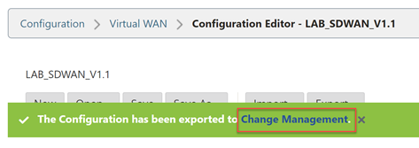

Select "Stage Appliances"

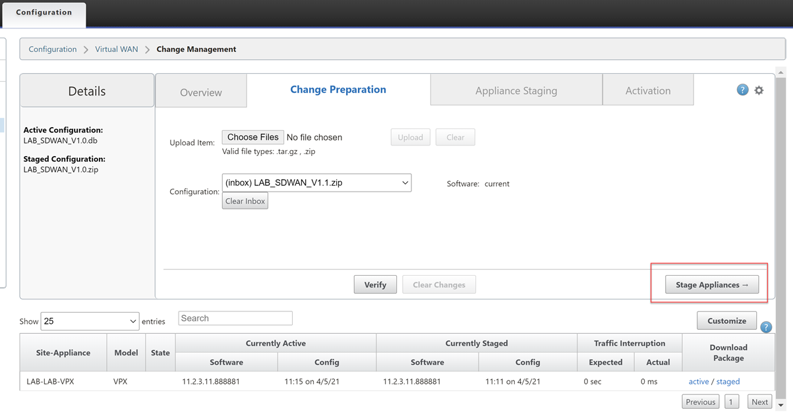

Wait until you see the completion screen. Select "Next".

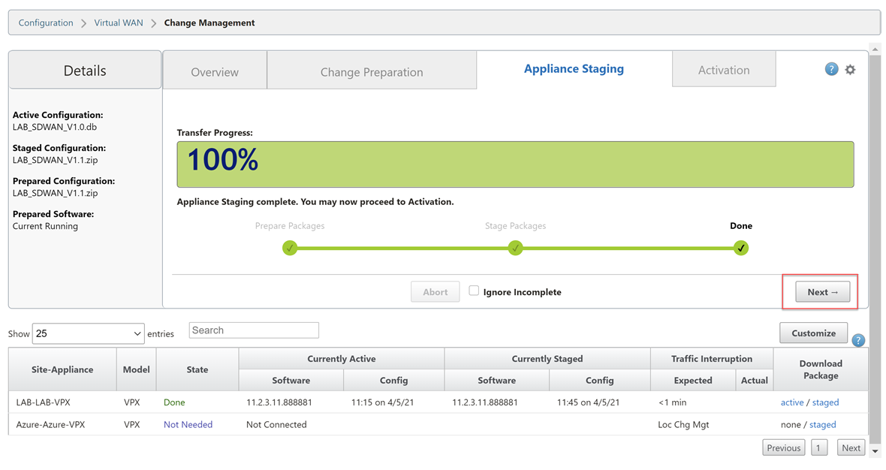

Select "Activate Staged".

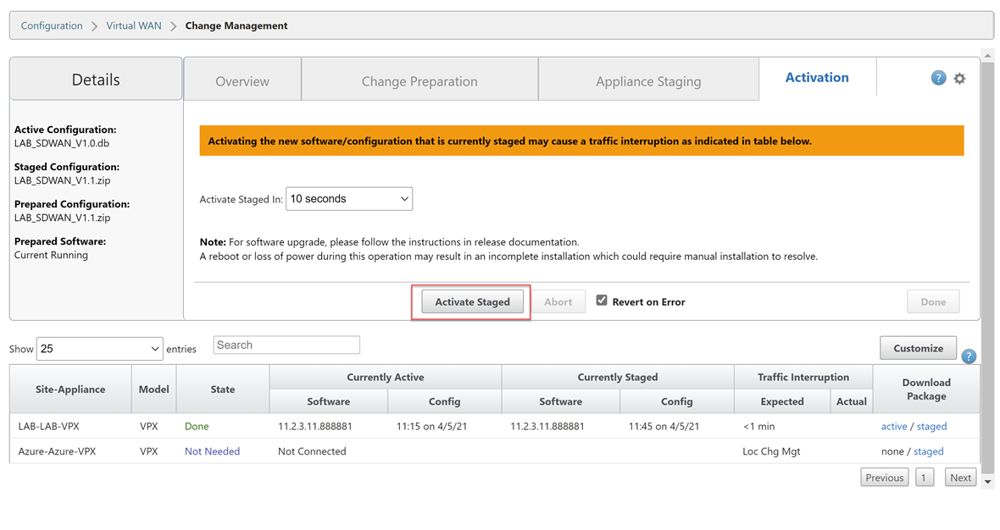

Wait for the configuration to activate. Select "Done" once this is complete.

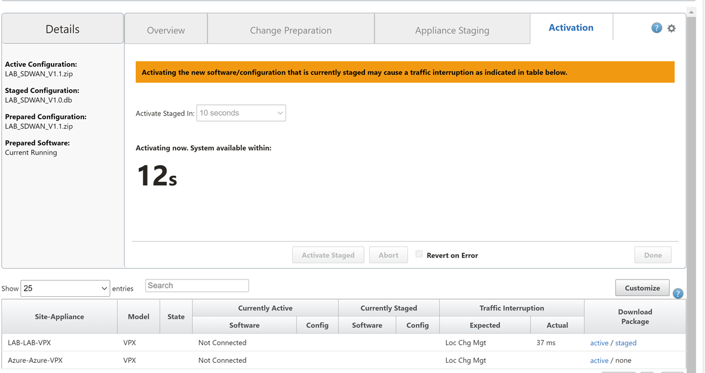

Now we are ready to download the package for the Azure appliance.

Navigate through the UI, "Configuration Tab" > "Virtual WAN – Side Menu" > "Change Management".

Select the "active" link on the right-hand-side of the Azure-VPX row. Be patient, it can take a while for the download to start.

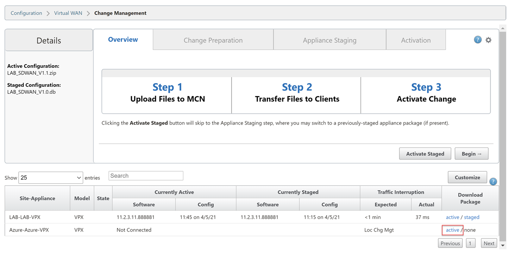

We now have a deployable configuration package for the Azure Appliance.

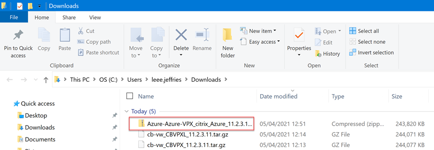

Let go back to the Azure appliance management interface.

Select "Choose File" and upload the configuration file. Select "Upload and Install".

**Be very patient at this point, it will seem like nothing is happening as there is no progress bar. Wait for the page to update on its own.**

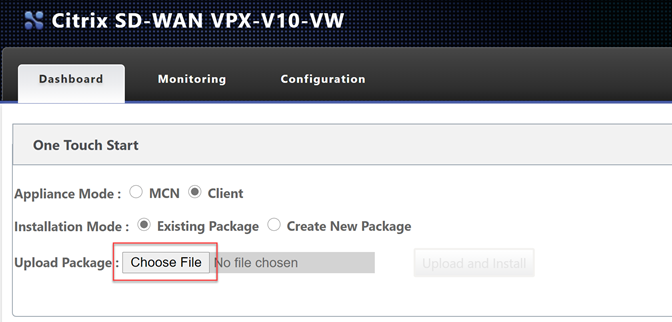

Depending on your plan selected you may be using a BYOL option or a PAYG license. To license a BYOL model just follow the necessary steps in the [MCN article](https://www.leeejeffries.com/citrix-sd-wan-public-cloud-network-mesh-master-control-node-part-2/).

To verify connectivity; Navigate through the UI, "Monitoring Tab".

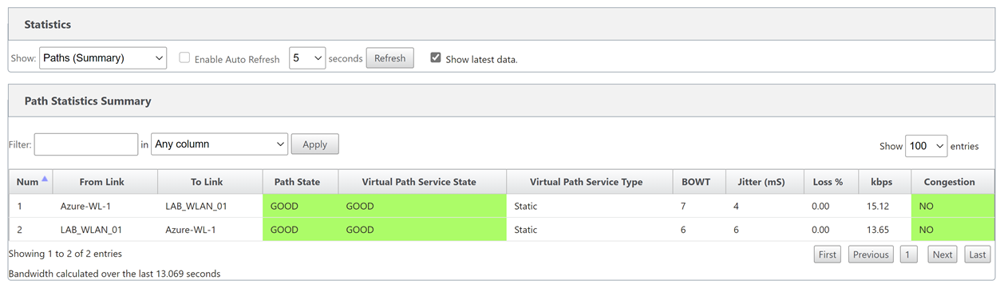

You can see that basic connectivity is now established between my lab and azure. I can ping the LAN IP address of the SDWAN device in Azure from my home network.

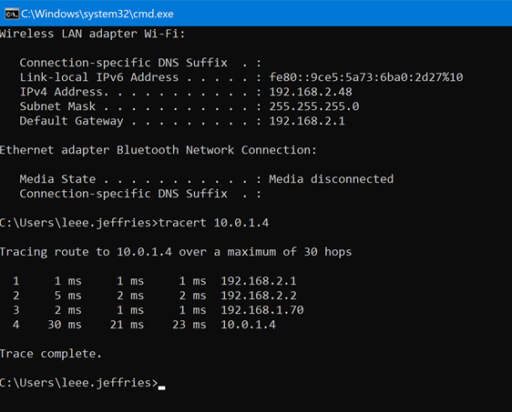

- 192.168.2.1 – Gateway of my main router
- 192.168.2.2 – Lab Router
- 192.168.1.70 – SDWAN LAB LAN IP
- 10.0.1.4 – Azure SDWAN LAN IP

That concludes the setup for the Azure SD-WAN device.

The next blog post will cover the exact same process but in AWS.
