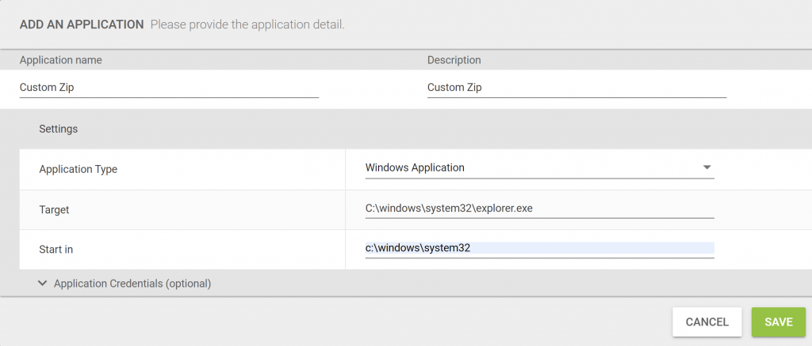

I've had the pleasure of working with LoginVSI many times in the past and am used to having the "out-of-the-box" workloads available to me; you know what I'm talking about. Taskworker, Officeworker etc.. All workloads that have been used again and again.

Unfortunately Login Enterprise does not have the same workloads. I'll tell you what it does have though! It has a snazzy new scripting language that you can do a lot more with.

I've been looking at coding up some additions to the workload templates that are stored on the website. You can find some examples for common applications on the [download pages](https://loginvsi.com/54-landing-pages/1240-workload-templates){:target="_blank"}.

Initially I wanted to add some decompression runs into the workload. I wrote about a script I created to generate some [random zip files with dummy content](){:target="_blank"}. I'm going to be using those zip files here.

Now, lets talk about the workload I created. The workload will loop a random number of times, it will select a random zip file for each run, copy that down to the machine and then extract it. The cleanup process runs are each loop to ensure all folders are clean for the next.

The application I've written time each copy operation, unzip operation and the whole process including all loops.

- A few things:
    - Amend "maxLoops" to be the maximum number of times you want the script to loop, a value is automatically calculated between 1 and "maxLoops".
    - Amend "maxZips" to the maximum number of zip files you have available to you.
    - Amend "zipPath" to the share location where you are storing your zip files.

I have pre-prepared 50 template zip files of varying sizes can be [downloaded here](https://leeejeffries-my.sharepoint.com/:u:/p/leee_jeffries/EVS76SWD9XBEg66w9sPPAK0B-0pOjuu6coQuqO33OlOR-Q?e=J7W2rQ){:target="_blank"}.

When you import the application into Login Enterprise you can input any application, the script does not actually launch the application specified.

}
using LoginPI.Engine.ScriptBase;

public class Unzip_1_0 : ScriptBase
{
    void Execute() 
    {   
        //Specify the maximum number of loops the script will run through
        var maxLoops = 10;
        
        //Capture all zip events
        StartTimer("All\_Zip\_Events");
        
        //Select a random number for a loop (working with multiple zip files)
        var looprnd = new System.Random(); 
        int loop = looprnd.Next(1, maxLoops);
        Log($"Number of zip files to process: {loop}");
        //foreach loop
        while (loop > 0) {
              
            //How many zip files do we have to work with
            var maxZips = 50;
        
            //Get the temp directory into a variable
            var temp = GetEnvironmentVariable("TEMP");
            
            //Tell the script where the zip files are located
            var zipPath = @"\\\\server.domain.local\\share\\folder\\Zip";
            
            //Select a random number
            var rnd = new System.Random(); 
            int zipNumber = rnd.Next(1, maxZips);
            
            //Set the source zip path
            var selectedZip = $"{zipPath}\\{zipNumber}.zip";
            Log($"Selected Zip File: {selectedZip}");
            
            //Set the copy to destination path
            var destinationZip = $"{temp}\\{zipNumber}.zip";
            
            //Copy the zip file to the temp folder and time the operation
            StartTimer(name:$"Copy_Zip_File_{loop}");
                CopyFile(sourcePath: selectedZip, destinationPath: destinationZip,continueOnError:true,overwrite:true);
            StopTimer(name:$"Copy_Zip_File_{loop}");
            
            //Set the destination folder for extraction
            var destinationFolder = $"{temp}\\tempUnZip";
            
            //Unzip the zip file and time the operation
            StartTimer(name:$"Unzip_Zip_File_{loop}");
                UnzipFile(sourcePath: destinationZip, destinationFolder: destinationFolder,continueOnError: true,overWrite: true);
            StopTimer(name:$"Unzip_Zip_File_{loop}");
            
            //Clean up after ourselves
            RemoveFile(destinationZip);
            RemoveFolder(destinationFolder);
            
            //Logout the loop and make sure we decrement the counter            
            Log(loop);            
            loop--;
       }
    StopTimer("All_Zip_Events");
    }
}

