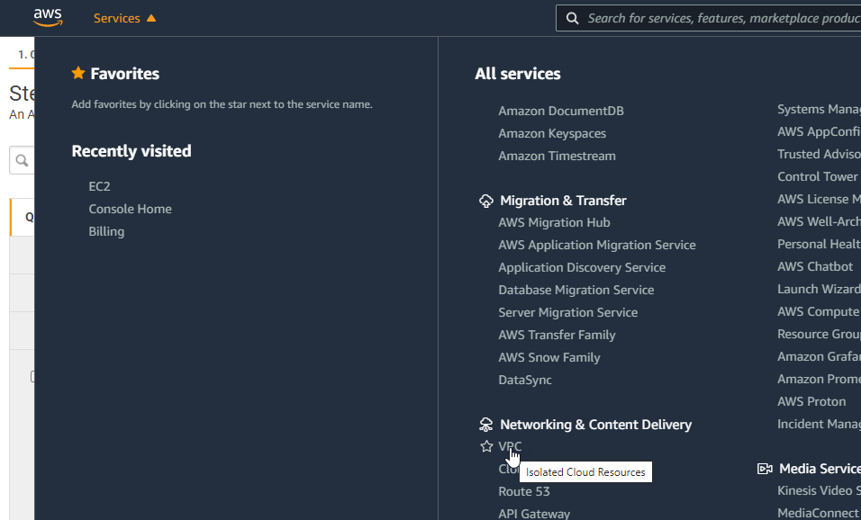
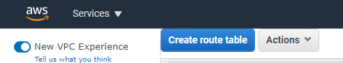
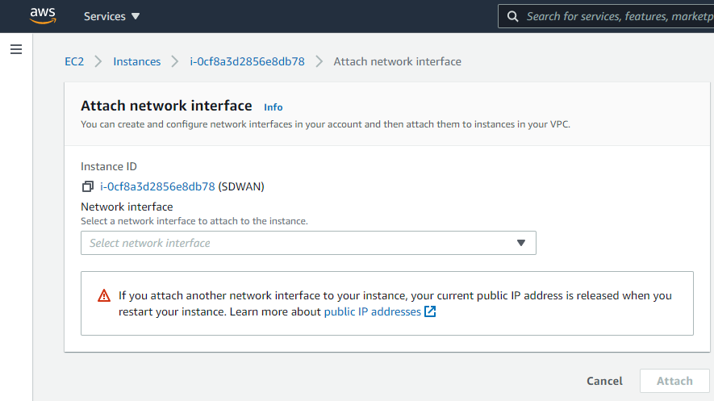
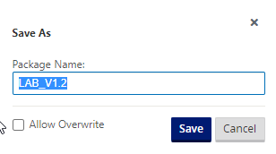

- [Citrix SDWAN – Public Cloud Network Mesh – Introduction (Part 1)]()
- [Citrix SD-WAN – Public Cloud Network Mesh – Master Control Node (Part 2)]()
- [Citrix SD-WAN – Public Cloud Network Mesh – Azure (Part 3)]()
- [Citrix SD-WAN – Public Cloud Network Mesh – GCP (Part 5)]()
- [Citrix SDWAN – Public Cloud Network Mesh – Creating a Full Mesh (Part 6)]()

This post will follow-on from the previous post; I already created the [Master Control Node on-prem](). If you've not yet set up the Master Control node, you will need to do this first.

Below is a diagram that shows the current progress of this blog series.

We need to do some infrastructure set-up before we can deploy SDWAN in AWS.

Firstly we need to define our networks. Login to your AWS Management Portal.

Navigate through the Services drop-down and select "VPC".

You will need to configure the VPC in the same region to deploy the Citrix SD-WAN appliance.

Select VPCs to get started.

Select "Create VPC" in the top right.

We'll now configure the main subnet block in AWS. This is shown in the diagram at the beginning of this article.

Enter a name and the network notation for your range in AWS. Mine is 11.0.0.0/16; we'll then split this network into subnets for different uses.

Select "Create VPC" when you are finished.

You'll now see your network created.

We now need an internet gateway. Select "Internet Gateways" from the left-hand-side menu.

Now select "Create Internet Gateway" from the top right.

Give this internet gateway a name and select "Create Internet Gateway".

You'll now see that created in the list, the next step is to attached this internet gateway to the network(VPC) we just created.

Select the "SDWAN\_INTERNET" gateway and the "Actions", "Attached to VPC". Follow the prompts to attach it to your SDWAN subnet.

Navigate to "Subnets" on the left hand-side menu. Select "Create subnet" in the top right.

You'll be presented with options to split the main network we created (the VPC) into smaller subnets.

I will repeat these steps to create 3 separate subnets:

- SDWAN\_SN\_LAN – 11.0.2.0/24
- SDWAN\_SN\_MGMT – 11.0.1.0/24
- SDWAN\_SN\_WAN – 11.0.3.0/24

**As per the diagram above and previous article, 3 networks are required for the SDWAN appliance.**

Now we need some route tables configured. Select "Route Tables" from the left-hand side menu.

Select "Create route table" from the top left.

A route table is required for each Subnet. Give the route table a name, in this example it's the LAN route table. Enter the name and the VPC the route table relates to. Create all 3 route tables.

Now you should see all your routing tables, and we can apply them to Subnets. Select each route table individually in turn, select "Edit subnet associations".

This example shows the MGMT Route table, so we'll be selecting the "SDWAN\_SN\_MGMT" subnet. Select "Save" when complete.

Repeat this for each Route Table to align with each subnet.

We will come back later to add additional routes once our appliance is setup.

Select the "Services" drop-down and then "Compute" > "EC2".

Select "Launch instance"

You can now search the Amazon Marketplace for a preconfigured appliance to launch.

Select "AWS Marketplace" on the left, Type "Citrix SD-WAN" in the search box. I am selecting "Citrix SD-WAN Standard Edition, Customer License" as I already have a license available.

Read and select "Continue" on the next screen.

I have selected the c5.xlarge instance as it's the cheapest option for a lab environment. Select "Next: Configure Instance Details"

Now we'll populate the options for the Virtual Machine.

- Instances should be set to 1 – we only need one appliance.
- Network – SDWAN
- Subnet – SDWAN\_SN\_MGMT (The management network needs to be out initial network we attach at VM creation)
- Auto-assign Public IP – Enable (This is so we can log in and manage the appliance when necessary)

An IP address should already be allocated for you. Select "Next: Add Storage" at the bottom of the screen.

Select the storage you wish to use; I went with general-purpose SSD disks. If AWS would be your master controller node, you would need to expand the hard disk up to 120GB.

Select "Review and Launch" at the bottom of the page.

Confirm all the details and select "Launch".

Firewall rules are now displayed for review. No additions should be necessary at this stage. Select "Review and Launch".

This next part is very important because this is how you will connect to the appliance via SSH.

Select "Download Key Pair" and keep this safe; we will come back to it later. Select "Launch Instances".

After a little while, navigate back to your instances in AWS, and you should see your SDWAN appliance ready to rock. Select the "Instance ID" of the VM.

We have a few more steps to do now. We need to shut down the appliance, add some additional interface, assign a public IP to the WAN interface and then add additional routes for the appliance to be able to talk to our home networks.

Shut down the instance by selecting it and changing the instance state to "Stop Instance".

Select "Network & Security" > "Network Interfaces".

Now select "Create network interface" in the top right.

You will need to create a network interface for the LAN and WAN of the SD-WAN appliance.

Give the interface a name and assign it to a subnet; I have set a custom IP for mine to match the diagram at the beginning of the document.

Repeat for the WAN interface.

Now your interfaces are created, set the "Change source/dest check" so that AWS will allow the traffic to pass for subnets that it does not own.

Select each interface in turn and untick "Enable" on the Source/Destination check dialog box.

Now we will navigate back to "Instances" > "Instances" on the left-hand side menu. Select the SDWAN appliance, select "Actions", "Networking", "Attach network interface".

Select the LAN and WAN network interfaces in order and select "Attach".

**Make a note of the WAN interface ID for later when we associate an elastic IP.**

We will now allocate an elastic IP to the WAN interface of the SDWAN appliance. Select "Network & Security", "Elastic IPs" from the left-hand side menu.

Select "Allocate Elastic IP address".

Leave all the options as default and select "Allocate".

Select the IP allocated and then select "Actions", "Associate Elastic IP address".

You will need the ID of the network adapter you remembered earlier, or you can work it out through the available IP addresses.

Select "Network interface", Select the relevant network interface for the WAN and then the private IP Address (There should only be one available).

Select "Associate".

We are almost complete with the setup here; we now need to add some routes to tell Amazon where to route our traffic.

Select "Route Tables" from the left-hand side menu.

You'll see a list of all the route tables. Select the MGMT route table, select "Edit routes".

You need to add a route to your MCN network. Mine is 192.168.0.0/16; assign this to the LAN network interface of the SDWAN device. And select "Save Routes". Repeat this for the LAN interface also.

This will ensure, any machines in AWS on the LAN subnet will forward traffic to the SDWAN device; the virtual tunnels created between sites will then be used to route the traffic.

Navigating to the external address gives us the login page for the SDWAN device. [https://3.11.187.154](https://3.11.187.154) in my example. Accept the certificate warning error.

Use the username for the device is "admin", and the password is the instance id of the interface (obviously, I will be changing the details of my environment as this is published publicly).

You are presented with some option now. We will need to get onto our on-prem MCN to create and download the configuration package for this node.

Before we proceed, I am going to navigate to my "Master Control Node" – in my lab I will login to the management page.

Navigate through the UI, "Configuration Tab" > "Virtual WAN – Side Menu" > "Configuration Editor".

Select "Open" and then open the latest configuration available (should be 1.1 from the last post).

Now we will add another site – the AWS site. Select "Sites", "+ Site".

Fill out the details for your AWS VPX appliance. CPU and Memory, the import part is the model as that will dictate the options within the config editor.

Select "Add" once complete.

Select "Interface Groups" and then the "+" symbol to add an interface.

You will need to refer to your AWS Networking configuration for the VM during this next part of the work. Take a note of these settings.

The management interface is not shown within the UI of the configuration Editor, so interface 1 is the LAN configuration in AWS.

Select the "+" symbol in the top left to add an interface.

Select interface "1", "Fail-to-Block", and "Trusted" on the top row.

Select "+" next to "Virtual Interface" and give the interface a name.

Select "Apply".

Now we will configure the WAN interface that will be used to create the secure tunnel to AWS.

Select the "+" symbol in the top left to add an interface.

Select interface "2", "Fail-to-Block", and "Untrusted" on the top row.

Select "+" next to "Virtual Interface" and give the interface a name.

Select "Apply".

Select "Virtual IP Addresses" on the left-hand-side menu.

You will now assign an IP address for each of the interfaces.

Referring to the diagram above, I am using the planned IP addressing from this. I have allowed "Inband Mgmt" from the LAN interface, so I do not need the external IP in AWS all the time.

Click "Apply" when you have completed the IP configuration information.

Now select "WAN Links" on the left-hand-side menu.

We will not configure the WAN interface for the external connectivity.

Select "+ Link", Select "Add".

We can now specify the link speed; the WAN link can have "Autodetect Public IP" selected as it is a client node and not an MCN.

Fill in an accurate Upload and Download speed and tick "Autodetect Public IP", select "Apply" at the bottom of the screen.

Now select "Settings" at the top of the window.

Select "Access Interfaces (IPV4)".

Select the "+" symbol in the top left of the window.

We will now populate the details of the WAN outside and WAN inside link.

Place the same IP in as we did earlier for the WAN interface.

Select "Apply".

The configuration should now be complete. We will run an Audit just to be sure all is well.

Select "Audit Now" at the bottom of the configuration editor.

If there are no errors or warnings, we have created the configuration for the AWS client node.

Select "Save As" at the very top of the configuration editor window.

Add V1.2 into the name; adding revision numbers to the configuration can make it easier when rolling out updates.

Select "Save".

Now we will export the configuration to the Change Management function, this will provision a package that can be downloaded and applied to the client node.

Select "Export" at the very top of the configuration editor window.

Select "Change Management" and select "Export".

Select the "Change Management" link that appears.

Select "Stage Appliances"

Wait until you see the completion screen. Select "Next".

Select "Activate Staged".

Wait for the configuration to activate. Select "Done" once this is complete.

Now we are ready to download the package for the AWS appliance.

Navigate through the UI, "Configuration Tab" > "Virtual WAN – Side Menu" > "Change Management".

Select the "active" link on the right-hand side of the AWS-VPX row. Be patient; it can take a while for the download to start.

We now have a deployable configuration package for the AWS Appliance.

Let go back to the AWS appliance management interface.

**Remember your login address is https://<AWS WAN EXTERNAL IP> - Your login name is admin, and your password is the instance ID in the console.**

Select "Choose File" and upload the configuration file. Select "Upload and Install".

**Be very patient at this point; it will seem like nothing is happening as there is no progress bar. Please wait for the page to update on its own.**

Depending on your plan selected, you may be using a BYOL option or a PAYG license. To license a BYOL model, just follow the necessary steps in the [MCN article](https://www.leeejeffries.com/citrix-sd-wan-public-cloud-network-mesh-master-control-node-part-2/).

To verify connectivity; Navigate through the UI, "Monitoring Tab".

You can see that basic connectivity is now established between my lab and AWS. I can ping the LAN IP address of the SDWAN device in AWS from my home network.

- 192.168.2.1 – Gateway of my main router
- 192.168.2.2 – Lab Router
- 192.168.1.70 – SDWAN LAB LAN IP
- 11.0.2.230 – AWS SDWAN LAN IP

That concludes the setup for the AWS SD-WAN device.

The following blog post will cover the same process but in GCP.
