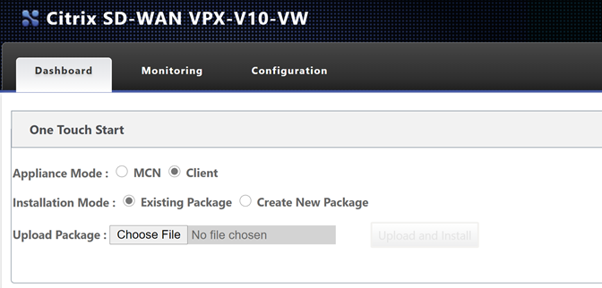
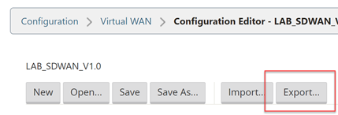

- [Citrix SDWAN – Public Cloud Network Mesh – Introduction (Part 1)]()
- [Citrix SD-WAN – Public Cloud Network Mesh – Master Control Node (Part 2)]()
- [Citrix SD-WAN – Public Cloud Network Mesh – Azure (Part 3)]()
- [Citrix SD-WAN – Public Cloud Network Mesh – AWS (Part 4)]()
- [Citrix SDWAN – Public Cloud Network Mesh – Creating a Full Mesh (Part 6)]()

This post will follow on from the previous post; I already created the [Master Control Node on-prem](). If you've not yet set up the Master Control node, you will need to do this first.

Below is a diagram that shows the current progress of this blog series.

We need to do some infrastructure set-up before we can deploy SDWAN in GCP.

Firstly, we need to create a project to store our environment in.

From the top menu bar, select the little drop down arrow and then "New Project".

Enter a name for your project and select "Create".

We need to define our networks. Navigate through the Services drop-down and select "VPC network", "VPC networks".

You will need to configure the VPC in the same region to deploy the Citrix SD-WAN appliance.

Select "Create VPC Network" to get started.

We'll need to create a VPC per type of network we want for the SD-WAN appliance. We will create a separate network for Management, LAN and then WAN traffic.

Fill in the name of the network, subnet range Mine is 12.0.1.0/24 for management, as listed above.

Select the network type as Regional. Select "Create" at the bottom of the page.

**Repeat this exercise for the LAN (12.0.2.0/24) and WAN (12.0.3.0/24) subnets.**

Select Regional as the network type.

Now we need to define some external addresses that will be attached to the appliance later.

Select "External IP addresses" from the left-hand menu.

Select "Reserve Statis Address" from the top menu bar.

Give the external IP address a name, we will need two. One for management and one for the WAN side of the SD-WAN appliance.

In my example this one is for WAN. Put your external IP in the same region as your VPC networks.

Select "Reserve".

**Repeat the same step for the management external IP.**

We now have everything ready to create the instance. Select "VM instances" from the left-hand menu.

Select "Create Instance" from the top menu bar.

Select "Marketplace" as the option to find the machine to deploy.

Type "SD-WAN" in the search bar and then select "Citrix SD-WAN Standard Edition" as the model you wish to deploy.

You are given all the details about the template before deploying it. Make sure you double check you're happy with the costs involved and select "Launch". 

Populare the deployment name and instance name, I went with the General-Purpose VM and google kindly calculates the cost right then in the window.

Make sure the region you select is the same and the VPC networks you deployed earlier. Attached the networks to the VPC's you created earlier in order.

Make sure you tick "useEXNet" on each adapter.

Network 1 – Mananagement

Network 2 – LAN

Network 3 – WAN

Select "Deploy" at the bottom.

The appliance will begin to deploy. Wait for the process to proceed and take note of the details that appear on the right-hand side.

You will see here the connection details that are relevant to the appliance.

We'll now assign our external IP to the WAN interface. Select the VM itself and we'll edit the network adapters to assign the external IP's we created earlier.

Select "Edit" in the top menu bar.

Scroll down to the network interface section. Select the little pencil icon for the WAN interface.

Under the "External IP" field, select the address you created earlier.

Scroll to the bottom of the screen and save your changes.

Now we'll enable the external connectivity for the virtual tunnel service.

Select "VPC Network" from the services dropdown, select "Firewall".

Select "Create Firewall Rule" from the top menu bar.

We are going to allow port 4980 in for Citrix SD-WAN to communicate with our MCN node.

Give the firewall rule a relevant name, fill in the same options as displayed below. Remember to assign this to the WAN Network you created earlier.

Select "Create" at the bottom of the page.

We will now add the necessary routes so that google knows where to send traffic for your MCN networks on-prem.

Select "Routes" from the left-hand side menu.

Select "Create Route" from the top menu bar.

Populate the IP range for your home network, the IP address for the next hop should be the internal IP of your LAN interface on the SD-WAN appliance.

My home networks are all contained within a 192.168.0.0/16 subnet so I am adding this here.

Select "Create".

That concludes the setup of the virtual appliance in GCP. We're now ready to start applying the Citrix SD-WAN configuration.

Navigating to the external address gives us the login page for the SDWAN device. [https://34.78.9.184](https://34.78.9.184) in my example. Accept the certificate warning error.

Use the username for the device is "admin", and the password pre-generated password that was provided once the appliance had finished provisioning (obviously, I will be changing the details of my environment as this is published publicly).

You are presented with some option now. We will need to get onto our on-prem MCN to create and download the configuration package for this node.

Before we proceed, I am going to navigate to my "Master Control Node" – in my lab I will login to the management page.

Navigate through the UI, "Configuration Tab" > "Virtual WAN – Side Menu" > "Configuration Editor".

Select "Open" and then open the latest configuration available (should be 1.2 from the last post).

Now we will add another site – the GCP site. Select "Sites", "+ Site".

Fill out the details for your GCP VPX appliance. CPU and Memory, the import part is the model as that will dictate the options within the config editor.

Select "Add" once complete.

Select "Interface Groups" and then the "+" symbol to add an interface.

You will need to refer to your GCP Networking configuration for the VM during this next part of the work. Take a note of these settings.

The management interface is not shown within the UI of the configuration Editor, so interface 1 is the LAN configuration in GCP.

Select the "+" symbol in the top left to add an interface.

Select interface "1", "Fail-to-Block", and "Trusted" on the top row.

Select "+" next to "Virtual Interface" and give the interface a name.

Select "Apply".

Now we will configure the WAN interface that will be used to create the secure tunnel to GCP.

Select the "+" symbol in the top left to add an interface.

Select interface "2", "Fail-to-Block", and "Untrusted" on the top row.

Select "+" next to "Virtual Interface" and give the interface a name.

Select "Apply".

Select "Virtual IP Addresses" on the left-hand-side menu.

You will now assign an IP address for each of the interfaces.

Referring to the diagram above, I am using the planned IP addressing from this. I have allowed "Inband Mgmt" from the LAN interface, so I do not need the external IP in GCP all the time.

Click "Apply" when you have completed the IP configuration information.

Now select "WAN Links" on the left-hand-side menu.

We will not configure the WAN interface for the external connectivity.

Select "+ Link", Select "Add".

We can now specify the link speed; the WAN link can have "Autodetect Public IP" selected as it is a client node and not an MCN.

Fill in an accurate Upload and Download speed and tick "Autodetect Public IP", select "Apply" at the bottom of the screen.

Now select "Settings" at the top of the window.

Select "Access Interfaces (IPV4)".

Select the "+" symbol in the top left of the window.

We will now populate the details of the WAN outside and WAN inside link.

Place the same IP in as we did earlier for the WAN interface.

Select "Apply".

The configuration should now be complete. We will run an Audit just to be sure all is well.

Select "Audit Now" at the bottom of the configuration editor.

If there are no errors or warnings, we have created the configuration for the GCP client node.

Select "Save As" at the very top of the configuration editor window.

Add V1.3 into the name; adding revision numbers to the configuration can make it easier when rolling out updates.

Select "Save".

Now we will export the configuration to the Change Management function, this will provision a package that can be downloaded and applied to the client node.

Select "Export" at the very top of the configuration editor window.

Select "Change Management" and select "Export".

Select the "Change Management" link that appears.

Select "Stage Appliances"

Wait until you see the completion screen. Select "Next".

Select "Activate Staged".

Wait for the configuration to activate. Select "Done" once this is complete.

Now we are ready to download the package for the GCP appliance.

Navigate through the UI, "Configuration Tab" > "Virtual WAN – Side Menu" > "Change Management".

Select the "active" link on the right-hand side of the GCP-VPX row. Be patient; it can take a while for the download to start.

We now have a deployable configuration package for the GCP Appliance.

Let go back to the GCP appliance management interface.

**Remember your login address is https://<GCP WAN EXTERNAL IP> - Your login name is admin, and your password was provided on deployment of the instance.**

Select "Choose File" and upload the configuration file. Select "Upload and Install".

**Be very patient at this point; it will seem like nothing is happening as there is no progress bar. Please wait for the page to update on its own.**

Depending on your plan selected, you may be using a BYOL option or a PAYG license. To license a BYOL model, just follow the necessary steps in the [MCN article](https://www.leeejeffries.com/citrix-sd-wan-public-cloud-network-mesh-master-control-node-part-2/).

To verify connectivity; Navigate through the UI, "Monitoring Tab".

You can see that basic connectivity is now established between my lab and GCP. I can ping the LAN IP address of the SDWAN device in GCP from my home network.

- 192.168.2.1 – Gateway of my main router
- 192.168.2.2 – Lab Router
- 192.168.1.70 – SDWAN LAB LAN IP
- 12.0.2.2 – GCP SDWAN LAN IP

That concludes the setup for the GCP SD-WAN device.

The following blog post will cover how we mesh all our network together with different cloud providers.
