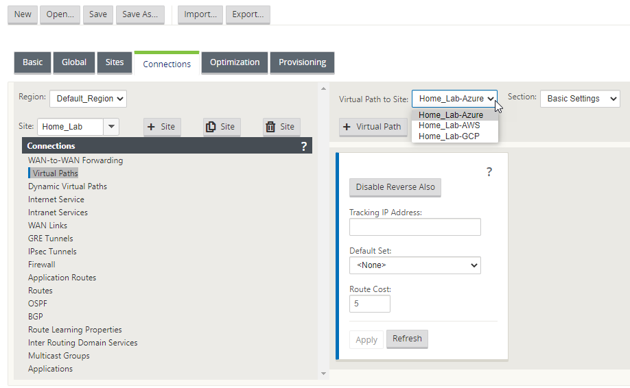

So far in this series, we've set up the following:

- [Citrix SDWAN – Public Cloud Network Mesh – Introduction (Part 1)]()
- [Citrix SD-WAN – Public Cloud Network Mesh – Master Control Node (Part 2)]()
- [Citrix SD-WAN – Public Cloud Network Mesh – Azure (Part 3)]()
- [Citrix SD-WAN – Public Cloud Network Mesh – AWS (Part 4)]()
- [Citrix SD-WAN – Public Cloud Network Mesh – GCP (Part 5)]()

These appliances have provided connectivity to my on-prem environment and allowed me to utilise my existing infrastructure and branch out my network. In addition, the flexibility to be able to add cloud services to your current lab setup is pretty great.

The whole point of this series was to provide a fully meshed network between your different cloud regions. In this series, I've selected to top 3 cloud service providers. The below diagram explains the overall layout.

Up to now, all routing would have forced communication from cloud providers through the On-Prem Master Control Node; we're now going to make the SD-WAN appliances talk with all the other appliances in the different cloud environments.

In this blog, we'll overview how to set up the routing, amending the SD-WAN network and testing the configuration.

Let's take a look at our Virtual Paths under the Monitoring tab on the Master Control Node.

You can see here that connections are all up and running and in good condition. The MCN has a link to each site; it's an intermediary node.

If we log in to the Azure appliance and check the same Monitoring tab, we see that this appliance only connects to the MCN node On-Prem.

We're going to amend the config so that this node can talk to all the other cloud providers independently of the MCN.

I'm not going through a complete step-by-step in this guide as we've already covered a majority of the steps required in the previous articles.

Log in to your Master Control Node On-Prem and open the Configuration Editor; Import your very latest configuration and save it with a different revision ID.

Once you have it open – Navigate to the "Connections" tab, then select your On-Prem environment in the "Site" drop-down.

Select "Virtual Paths".

You can see that the Home\_Lab has three connections, Azure, AWS and GCP. We're now going to change the site and add connections.

Change the "Site" drop-down to the Azure site. Then, select "Virtual Paths".

You'll see here that the drop-down only contains one site.

Select the "+ Virtual Path" button.

You will now be presented with a small popup showing the available options. First, select one of the other sites available.

Make sure you tick the "Reverse" box, which will make sure that the configuration is also applied in the opposite direction.

You will only see available connections. Select "Add" to create the link.

**Repeat these steps for each site available to create a path from each node to each node.**

All required now is to save your configuration, push it to "Change Management, " and activate it.

The next step is routing; we need to make all the cloud providers aware of the IP ranges of all the other cloud providers.

Checking the interface on the Azure appliance after activating the config will show a path to all other cloud providers.

**Azure Routing:**

Hop onto your Azure portal and search for "Route Table", find your SD-WAN LAN route table.

Select "Routes" on the left.

Select "Add" to add a route.

Here I am adding a route for the Google Cloud LAN subnet.

Note that I am sending the traffic to the LAN interface of the SD-WAN appliance in Azure.

**Repeat this for the AWS subnet also.**

**AWS Routing:**

Select "Network and Content Delivery", "VPC" from the services drop-down.

Select "Route Tables" from the left-hand side.

Select your SD-WAN LAN route table.

Select "Edit Routes" on the right-hand side of the screen.

Add your Azure and GCP Routes – again, we direct the traffic to the LAN IP of the AWS SD-WAN appliance. Select "Save Changes". 

**GCP Routing:**

In the GCP portal, Select "Networking", "VPC Network", "Routes" from the drop-down service menu.

Select "Create Route" from the top of the screen.

Populate the relevant details and ensure it's assigned to your SD-WAN LAN network. Select "Create" when you are done.

The below is an example for AWS. **Repeat the step for Azure.**

**Results:**

It's essential to have some analysis on the before and after when we talk about this traffic efficiency.

Before we put the mesh in place, this is what the latency looked like.

The below depicts a traceroute from the Azure Appliance to the other locations.

You can see here that 192.168.2.10 is the intermediary hop point for all traffic, that the On-Prem SD-WAN instance.

Let's see what it looks like when we've meshed the network.

You can see here that we've halved the time it takes for the different cloud providers to communicate with each other.

This sort of flexibility to create new pathways in your network with minimal effort is excellent. Citrix SD-WAN allows this all the be done with ease.
