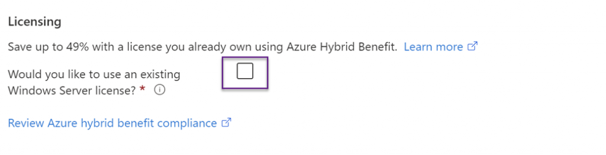

If you have on-prem windows server or desktop licenses, these licenses can be utilized in Azure to save yourself some money.

  
Here is a link that explains about this in detail.

  
[Explore Azure Hybrid Benefit for Windows VMs - Azure Virtual Machines \| Microsoft Learn](https://learn.microsoft.com/en-us/azure/virtual-machines/windows/hybrid-use-benefit-licensing)
  
If you’ve been creating VM’s manually you may have missed this tick box, if its terraform then this is the line you are looking for, powershell also.  
**Azure:**

**Terraform:**


resource "azurerm_virtual_machine" "my_virtual_machine" {
    name = "myvm"
    location = "location"
    resource_group_name = "group" 
    network_interface_ids = ["id"]
    vm_size = "Standard_F2"
    license_type = "Windows_Server"
}


**PowerShell:**

 
New-AzVm -ResourceGroupName "myResourceGroup" `
-Name "myvm" `
-Location "UK South" `
-ImageName "Win2016Datacenter" `
-LicenseType "Windows_Server"


The license type parameter in both terraform and PowerShell is used to designate that you have a pre-existing license.

That being said, you’ve got a bunch of VM’s in Azure; how do you see which ones are using hybrid license rights and which ones are not?  
Here’s a script for you; this script will run through all your VM’s find ones without a hybrid license assigned and then give you the option to select the VMs and apply a hybrid license to them.  
The only draw-back to this script is that it’s not always able to automatically discover which type of OS is running on the VM (depending on how the VM is built) and therefore I’ve left this section out. You need to make sure you are selecting server OSes for server hybrid licenses and Desktop Oses for client hybrid licenses.


#Loop through resource groups to find the VM 
#Note - Only select server VMs when the variable for $license_type is set to server 
#Note - Only select desktop VMs when the variable for $license_type is set to client 
#Note - Setting $license_type to none will clear hybrid rights and make the VM PAYG 

param ( 
    [Parameter(Mandatory)] 
    [ValidateSet("server","client","none")] 
    $license_type
) 
    
#Login to Azure 
if (!($azConnected)) { 
    $azConnected = Connect-AzAccount 
} 
    
#Get all subscriptions available 
$allSubscriptons = Get-AzSubscription 
Write-Host "All subscriptions available" 
Write-Host $allSubscriptons 

#Loop through all subscriptions and hostpools looking for our wvd vm 
$allSubscriptons = Get-AzSubscription 
$vmDetails = foreach ($subscription in $allSubscriptons) { 
$temp = Set-AzContext -Subscription $subscription.Name 
$allResourceGroups = Get-AzResourceGroup 
Write-Host "Searching subscription - $subscription" 
foreach ($rg in $allResourceGroups) { 
    Write-Host "Searching resource group $($rg.ResourceGroupName)" 
    $vms = Get-AzVM -ResourceGroupName $($rg.ResourceGroupName) | Select Name, LicenseType, ResourceGroupName, Tags 
    if ($vms) { 
        foreach ($vm in $vms) { 
            Write-Host "Looking at VM $($vm.Name)" 
            [PSCustomObject]@{ 
                vmName = $vm.Name 
                vmRG = $vm.ResourceGroupName 
                vmSub = $subscription.Name 
                vmLicense = $vm.LicenseType 
                } 
            } 
        } 
    } 
} 
$vmDetails | Export-Csv -Path "C:\\Temp\\VMs\_Licenses.csv" -NoTypeInformation 
$selectedVMs = $vmDetails | ogv -PassThru 
Switch ($license_type) { 
    "server" {$licenseSet = "Windows\_Server"} 
    "client" {$licenseSet = "Windows\_Client"} 
    "none" {$licenseSet = ""} 
} 
Write-Host "License type selected and being applied to selected VM's is $licenseSet" -ForegroundColor Green 
forEach ($vm in $selectedVMs) { 
    Write-Host "Setting $($vm.vmName) to $licenseSet" -ForegroundColor Green 
    $null = Set-AzContext -Subscription $vm.vmSub 
    $tempVM = Get-AzVm -ResourceGroupName $vm.vmRG -Name $vm.vmName 
    $tempVM.LicenseType = $licenseSet 
    Update-AzVM -ResourceGroupName $vm.vmRG -VM $tempVM 
}
